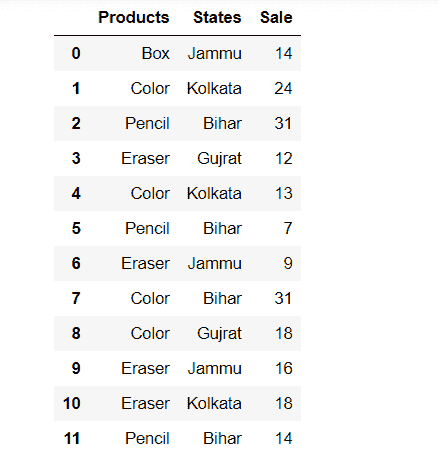
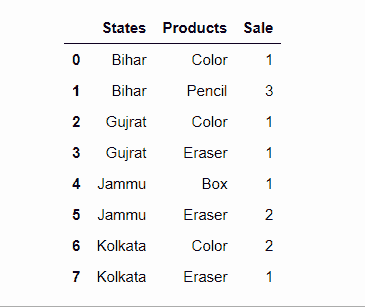
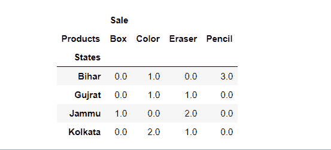

# 熊猫分组-统计每个组合的出现次数

> 原文:[https://www . geeksforgeeks . org/pandas-group by-计算每个组合的出现次数/](https://www.geeksforgeeks.org/pandas-groupby-count-the-occurrences-of-each-combination/)

在本文中，我们将按两列分组，并统计熊猫中每个组合的出现次数。

[**DataFrame . group by()**](https://www.geeksforgeeks.org/python-pandas-dataframe-groupby/)**方法用于将 data frame 分成组。它将生成数据帧的特定列中出现的相似数据计数的数量。**

> ****语法:**data frame . group by(by =无，轴=0，级别=无)**
> 
>  ****参数:**
> 
> *   **by:** 映射、函数、字符串、标签或可迭代来分组元素。
> *   **轴:**按行(轴=0)或列(轴=1)分组。
> *   **级别:**整数。按特定级别给组赋值。**

**为了理解这个概念，我们将使用下面给出的简单数据集:**

## **蟒蛇 3**

```
# Import library
import pandas as pd
import numpy as np

# initialise data of lists.
Data = {'Products':['Box','Color','Pencil','Eraser','Color',
                    'Pencil','Eraser','Color','Color','Eraser','Eraser','Pencil'],

       'States':['Jammu','Kolkata','Bihar','Gujrat','Kolkata',
                 'Bihar','Jammu','Bihar','Gujrat','Jammu','Kolkata','Bihar'],

       'Sale':[14,24,31,12,13,7,9,31,18,16,18,14]}

# Create DataFrame
df = pd.DataFrame(Data, columns=['Products','States','Sale'])

# Display the Output
display(df)
```

****输出:****

****

****方法 1:使用熊猫数据框大小()****

**它返回元素的总数，通过将 shape 方法返回的行和列相乘进行比较。**

> ****语法:**数据帧大小**

## **蟒蛇 3**

```
new = df.groupby(['States','Products']).size()
display(new)
```

****输出:****

****

****方法 2:使用熊猫数据帧计数()****

**它用于计算给定轴上非 NA/null 观测值的数量。它也可以处理非浮动类型的数据。**

> *****语法:**数据帧计数(轴=0，级别=无，仅数值=假)***
> 
> *****参数:*****
> 
> *   *****轴:** 0 或“索引”表示行方向，1 或“列”表示列方向***
> *   *****级别:**如果轴是多索引(分层)，沿着特定级别计数，折叠成数据框***
> *   *****仅限数值:**仅包含浮点、整数、布尔数据***
> 
> *****返回:**计数:序列(或数据帧，如果指定了级别)***

## **蟒蛇 3**

```
new = df.groupby(['States','Products'])['Sale'].count()
display(new)
```

****输出:****

****

****方法三:使用熊猫 reset_index()****

**这是一种重置数据框索引的方法。reset_index()方法将从 0 到数据长度的整数列表设置为索引。**

> *****语法:**data frame . reset _ index(level = None，drop=False，inplace=False，col_level=0，col _ fill =)***
> 
> *****参数:*****
> 
> *   *****级别:** int、string 或列表，用于从索引中选择和移除传递的列。***
> *   *****删除:**布尔值，如果为假，则将替换的索引列添加到数据中。***
> *   *****替换:**布尔值，如果为真，则对原始数据框本身进行更改。***
> *   *****col_level:** 选择在哪个列级别插入标签。***
> *   *****col_fill:** Object，确定其他关卡的命名方式。***
> 
> *****返回类型:**数据框***

## **蟒蛇 3**

```
new = df.groupby(['States','Products'])['Sale'].agg('count').reset_index()
display(new)
```

****输出:****

****

****方法四:使用 pandas.pivot()功能****

**它基于数据框的 3 列生成一个透视表。使用索引/列中的唯一值并用值填充。**

> *****语法:*** pandas.pivot(索引、列、值)**
> 
> *****参数:*****
> 
> *   *****索引【ndarray】:**用于制作新帧索引的标签***
> *   *****列【ndarray】:**标签用于制作新框架的列***
> *   *****值【ndarray】:**用于填充新帧值的值***
> 
> *****返回:**重塑的数据框*
> ***异常:**如果有重复，将引发值错误。***

## **蟒蛇 3**

```
new = df.groupby(['States','Products'],as_index = False
                ).count().pivot('States','Products').fillna(0)
display(new)
```

****输出:****

****