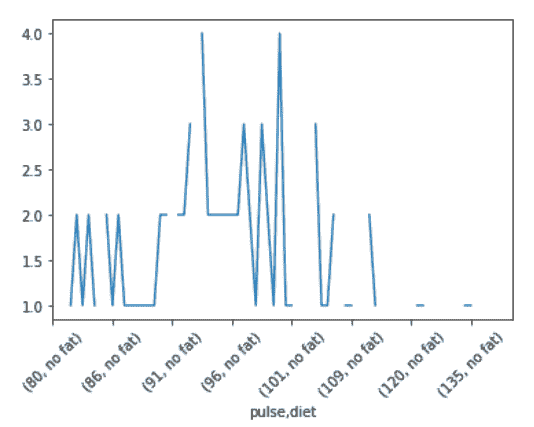
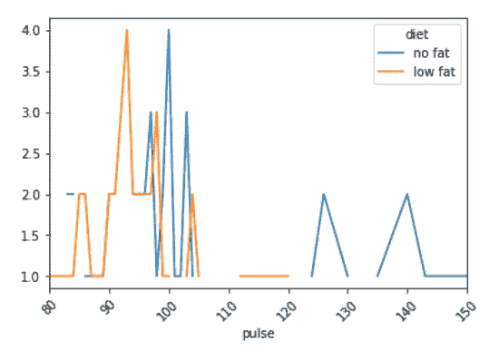
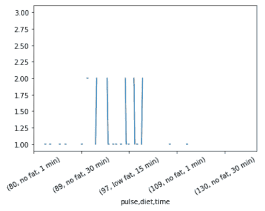
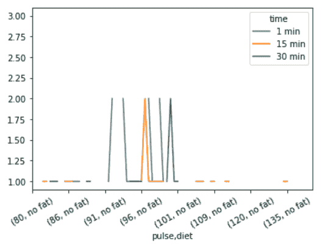

# 熊猫–按多个值分组并绘制结果

> 原文:[https://www . geesforgeks . org/pandas-group by-multi-values-and-标绘-results/](https://www.geeksforgeeks.org/pandas-groupby-multiple-values-and-plotting-results/)

在本文中，我们将学习如何通过多个值对[进行分组，并一次性绘制结果。在这里，我们从](https://www.geeksforgeeks.org/python-pandas-dataframe-groupby/#:~:text=groupby()%20function%20is%20used,of%20labels%20to%20group%20names.) [seaborn](https://www.geeksforgeeks.org/introduction-to-seaborn-python/) 库中获取一个数据集的“excercise.csv”文件，然后形成不同的分组数据，并将结果可视化。

对于该程序，所需步骤如下:

*   数据及其可视化的导入库。
*   创建并导入多列数据。
*   通过对多个值进行分组来形成 grouby 对象。
*   可视化分组数据。

下面是一些示例的实现:

**例 1 :**

在这个例子中，我们从 seaborn library 中获取数据集的“excercise.csv”文件，然后通过在“时间”列的基础上将“脉搏”和“饮食”两列组合在一起形成 groupby 数据，最后可视化结果。

## 蟒蛇 3

```py
# importing packages
import seaborn

# load dataset and view
data = seaborn.load_dataset('exercise')
print(data)

# multiple groupby (pulse and diet both)
df = data.groupby(['pulse', 'diet']).count()['time']
print(df)

# plot the result
df.plot()
plt.xticks(rotation=45)
plt.show()
```

**输出:**

```py
    Unnamed: 0  id     diet  pulse    time     kind
0            0   1  low fat     85   1 min     rest
1            1   1  low fat     85  15 min     rest
2            2   1  low fat     88  30 min     rest
3            3   2  low fat     90   1 min     rest
4            4   2  low fat     92  15 min     rest
..         ...  ..      ...    ...     ...      ...
85          85  29   no fat    135  15 min  running
86          86  29   no fat    130  30 min  running
87          87  30   no fat     99   1 min  running
88          88  30   no fat    111  15 min  running
89          89  30   no fat    150  30 min  running

[90 rows x 6 columns]
pulse  diet   
80     no fat     NaN
       low fat    1.0
82     no fat     NaN
       low fat    1.0
83     no fat     2.0
                 ... 
140    low fat    NaN
143    no fat     1.0
       low fat    NaN
150    no fat     1.0
       low fat    NaN
Name: time, Length: 78, dtype: float64

```



**示例 2:** 这个示例是上面示例的修改，为了更好的可视化。

## 蟒蛇 3

```py
# importing packages
import seaborn

# load dataset
data = seaborn.load_dataset('exercise')

# multiple groupby (pulse and diet both)
df = data.groupby(['pulse', 'diet']).count()['time']

# plot the result
df.unstack().plot()
plt.xticks(rotation=45)
plt.show()
```

**输出:**



**例 3:**

在本例中，我们从 seaborn library 中获取数据集的“exception se . CSV”文件，然后通过将“脉搏”、“饮食”和“时间”三列在“种类”列的基础上组合在一起形成 groupby 数据，最后将结果可视化。

## 蟒蛇 3

```py
# importing packages
import seaborn

# load dataset and view
data = seaborn.load_dataset('exercise')
print(data)

# multiple groupby (pulse, diet and time)
df = data.groupby(['pulse', 'diet', 'time']).count()['kind']
print(df)

# plot the result
df.plot()
plt.xticks(rotation=30)
plt.show()
```

**输出:**

```py
Unnamed: 0  id     diet  pulse    time     kind
0            0   1  low fat     85   1 min     rest
1            1   1  low fat     85  15 min     rest
2            2   1  low fat     88  30 min     rest
3            3   2  low fat     90   1 min     rest
4            4   2  low fat     92  15 min     rest
..         ...  ..      ...    ...     ...      ...
85          85  29   no fat    135  15 min  running
86          86  29   no fat    130  30 min  running
87          87  30   no fat     99   1 min  running
88          88  30   no fat    111  15 min  running
89          89  30   no fat    150  30 min  running

[90 rows x 6 columns]
pulse  diet     time  
80     no fat   1 min     NaN
                15 min    NaN
                30 min    NaN
       low fat  1 min     1.0
                15 min    NaN
                         ... 
150    no fat   15 min    NaN
                30 min    1.0
       low fat  1 min     NaN
                15 min    NaN
                30 min    NaN
Name: kind, Length: 234, dtype: float64

```



**示例 4:** 该示例是对上述示例的修改，以便更好地可视化。

## 蟒蛇 3

```py
# importing packages
import seaborn

# load dataset
data = seaborn.load_dataset('exercise')

# multiple groupby (pulse, diet, and time)
df = data.groupby(['pulse', 'diet', 'time']).count()['kind']

# plot the result
df.unsatck().plot()
plt.xticks(rotation=30)
plt.show()
```

**输出:**

