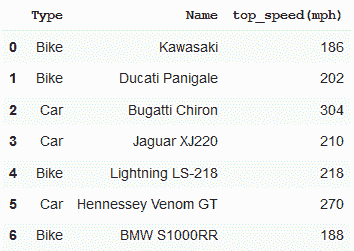
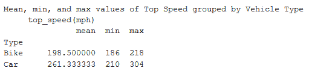
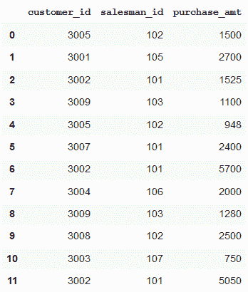
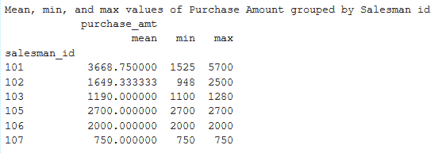
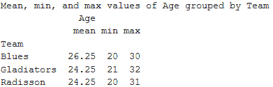

# 熊猫–按一列分组，获得平均值、最小值和最大值

> 原文:[https://www . geesforgeks . org/pandas-group by-one-column-get-mean-min-max-values/](https://www.geeksforgeeks.org/pandas-groupby-one-column-and-get-mean-min-and-max-values/)

我们可以使用 Groupby 函数将数据帧拆分成组，并对其应用不同的操作。其中之一就是聚合。聚合，即计算创建的每个组的统计参数，例如平均值、最小值、最大值或总和。

让我们看一下如何按一列对数据帧进行分组，并获得它们的平均值、最小值和最大值。

**例 1:**

```
import pandas as pd

# creating a dataframe
df = pd.DataFrame([('Bike', 'Kawasaki', 186),
                   ('Bike', 'Ducati Panigale', 202),
                   ('Car', 'Bugatti Chiron', 304), 
                   ('Car', 'Jaguar XJ220', 210),
                   ('Bike', 'Lightning LS-218', 218), 
                   ('Car', 'Hennessey Venom GT', 270),
                   ('Bike', 'BMW S1000RR', 188)],
                  columns =('Type', 'Name', 'top_speed(mph)'))

df
```

**输出:**


寻找平均值、最小值和最大值。

```
# using groupby function with aggregation
# to get mean, min and max values
result = df.groupby('Type').agg({'top_speed(mph)': ['mean', 'min', 'max']})

print("Mean, min, and max values of Top Speed grouped by Vehicle Type")
print(result)
```

**输出:**


**例 2:**

```
import pandas as pd

# creating a dataframe
sales_data = pd.DataFrame({
'customer_id':[3005, 3001, 3002, 3009, 3005, 3007,
               3002, 3004, 3009, 3008, 3003, 3002],

'salesman_id': [102, 105, 101, 103, 102, 101, 101,
                106, 103, 102, 107, 101],

'purchase_amt':[1500, 2700, 1525, 1100, 948, 2400,
                5700, 2000, 1280, 2500, 750, 5050]})

sales_data
```

**输出:**


寻找平均值、最小值和最大值。

```
# using groupby function with aggregation 
# to get mean, min and max values
result = sales_data.groupby('salesman_id').agg({'purchase_amt': ['mean', 'min', 'max']})

print("Mean, min, and max values of Purchase Amount grouped by Salesman id")
print(result)
```

**输出:**


**例 3:**

```
import pandas as pd

# creating a dataframe
df = pd.DataFrame({"Team": ["Radisson", "Radisson", "Gladiators",
                            "Blues", "Gladiators", "Blues", 
                            "Gladiators", "Gladiators", "Blues", 
                            "Blues", "Radisson", "Radisson"],

        "Position": ["Player", "Extras", "Player", "Extras",
                     "Extras", "Player", "Player", "Player",
                     "Extras", "Player", "Player", "Extras"],

        "Age": [22, 24, 21, 29, 32, 20, 21, 23, 30, 26, 20, 31]})
df
```

**输出:**


寻找平均值、最小值和最大值。

```
# using groupby function with aggregation 
# to get mean, min and max values
result = df.groupby('Team').agg({'Age': ['mean', 'min', 'max']})

print("Mean, min, and max values of Age grouped by Team")
print(result)
```

**输出:**
