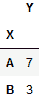
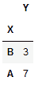
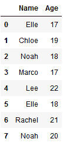
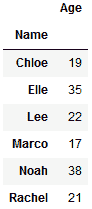
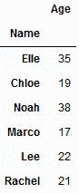
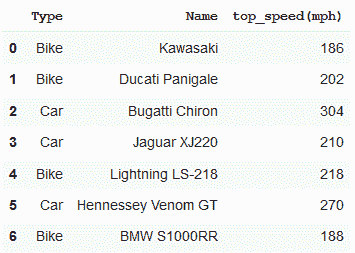
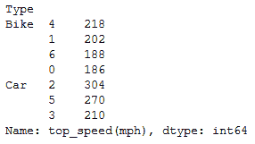

# 熊猫分组–分组排序

> 原文:[https://www . geesforgeks . org/pandas-group by-sort-in-group/](https://www.geeksforgeeks.org/pandas-groupby-sort-within-groups/)

[Pandas Groupby](https://www.geeksforgeeks.org/pandas-groupby/) 用于我们想要将数据拆分并设置为组的情况，以便我们可以对这些组进行各种操作，例如–数据聚合、通过一些组计算进行转换或根据应用于组的特定条件进行过滤。

以类似的方式，我们可以在这些组中执行排序。

**示例 1:** 让我们以数据帧为例:

```py
df = pd.DataFrame({'X': ['B', 'B', 'A', 'A'],
                   'Y': [1, 2, 3, 4]})

# using groupby function
df.groupby('X').sum()
```

**输出:**


让我们将排序参数作为 False 传递。

```py
# using groupby function 
# with sort
df.groupby('X', sort = False).sum()
```

**输出:**


在这里，我们看到一个数据框，其中包含组内的排序值。

**示例 2:**
现在，让我们举一个不同人的年龄的数据框的例子。使用 sort 和 groupby 函数将根据键传递来排列转换后的数据帧，以实现潜在的加速。

```py
data = {'Name':['Elle', 'Chloe', 'Noah', 'Marco',  
                 'Lee', 'Elle', 'Rachel', 'Noah'],  
        'Age':[17, 19, 18, 17,  
               22, 18, 21, 20]}   

df = pd.DataFrame(data) 
df
```

**输出:**


让我们根据名称将上面的数据框分组

```py
# using groupby without sort
df.groupby(['Name']).sum()
```

**输出:**


将排序参数作为 False 传递

```py
# using groupby function 
# with sort
df.groupby(['Name'], sort = False).sum()
```

**输出:**


**示例 3:**
我们再举一个由各种汽车和自行车的最高速度组成的数据框的例子。
我们将尝试在车型组中获得最高速度。

```py
import pandas as pd

df = pd.DataFrame([('Bike', 'Kawasaki', 186),
                   ('Bike', 'Ducati Panigale', 202),
                   ('Car', 'Bugatti Chiron', 304), 
                   ('Car', 'Jaguar XJ220', 210),
                   ('Bike', 'Lightning LS-218', 218), 
                   ('Car', 'Hennessey Venom GT', 270),
                   ('Bike', 'BMW S1000RR', 188)], 
                  columns =('Type', 'Name', 'top_speed(mph)'))

df
```

**输出:**


使用 groupby 函数后

```py
# Using groupby function
grouped = df.groupby(['Type'])['top_speed(mph)'].nlargest()

# using nlargest() function will get the 
# largest values of top_speed(mph) within
# groups created
print(grouped)
```

**输出:**
