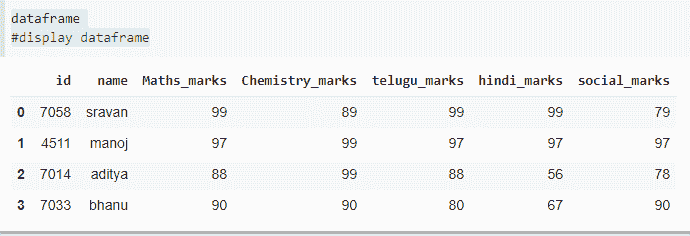
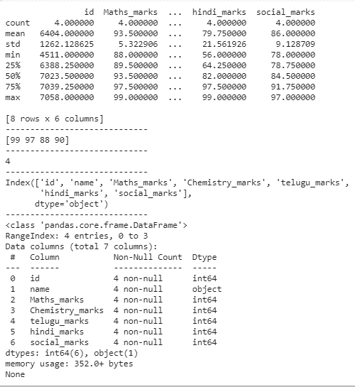
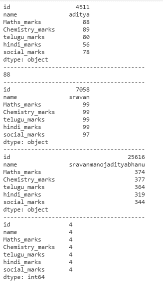
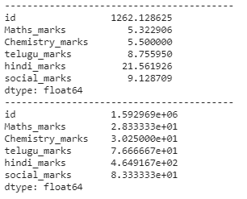
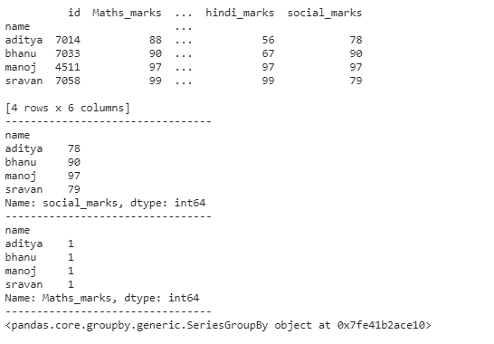
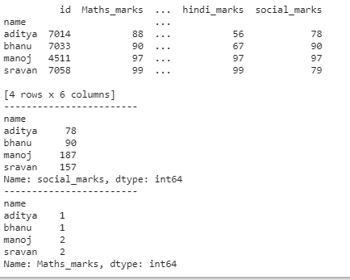

# 熊猫分组:用 Python 汇总、聚合和分组数据

> 原文:[https://www . geesforgeks . org/pandas-group by-summary-aggregate-and-group-data-in-python/](https://www.geeksforgeeks.org/pandas-groupby-summarising-aggregating-and-grouping-data-in-python/)

[**GroupBy**](https://www.geeksforgeeks.org/pandas-groupby/) 是一个相当简单的概念。我们可以创建一组类别，并对这些类别应用一个函数。这是一个简单的概念，但它是一种在数据科学中广泛使用的极其有价值的技术。在真正的数据科学项目中，您将处理大量数据，并一遍又一遍地尝试，因此为了提高效率，我们使用 Groupby 概念。Groupby 概念确实很重要，因为它能够**总结、** **聚合**、**高效分组**数据。

## **总结**

摘要包括计数，描述数据帧中存在的所有数据。我们可以使用 description()方法总结数据框中的数据。此方法用于从数据框中获取最小值、最大值、总和、计数值以及特定列的数据类型。

*   **description():**该方法阐述了数据的类型及其属性。

语法:

> data frame _ name . description()

*   **unique():** 此方法用于获取给定列的所有唯一值。

语法:

> dataframe['column_name]。唯一的()

*   **nunique():** 这个方法类似于 unique，但是它将返回唯一值的计数。

语法:

> dataframe_name['column_name]。努尼克(法国)

*   **info():** 此命令用于获取数据类型和列信息

语法:

> 数据帧. info()

*   **列:**该命令用于显示数据框中出现的所有列名

语法:

> dataframe.columns

**示例:**

我们将在这个例子中分析学生成绩数据。

## 蟒蛇 3

```py
# importing pandas as pd for using data frame
import pandas as pd

# creating dataframe with student details
dataframe = pd.DataFrame({'id': [7058, 4511, 7014, 7033],
                          'name': ['sravan', 'manoj', 'aditya', 'bhanu'],
                          'Maths_marks': [99, 97, 88, 90],
                          'Chemistry_marks': [89, 99, 99, 90],
                          'telugu_marks': [99, 97, 88, 80],
                          'hindi_marks': [99, 97, 56, 67],
                          'social_marks': [79, 97, 78, 90], })

# display dataframe
dataframe
```

**输出:**



## 蟒蛇 3

```py
# describing the data frame
print(dataframe.describe())

print("-----------------------------")
# finding unique values
print(dataframe['Maths_marks'].unique())

print("-----------------------------")
# counting unique values
print(dataframe['Maths_marks'].nunique())

print("-----------------------------")
# display the columns in the data frame
print(dataframe.columns)

print("-----------------------------")
# information about dataframe
print(dataframe.info())
```

**输出:**



## **聚合**

聚合用于获取数据框中所有列或数据框中特定列的平均值、平均值、方差和标准差。

*   **sum():** 返回数据帧的总和

语法:

> dataframe['列]。总和()

*   **mean():** 返回数据帧中特定列的平均值

语法:

> dataframe['列]。平均值()

*   **std():** 返回该列的标准差。

语法:

> dataframe['列]。标准()

*   **var():** 返回该列的方差

> 数据帧[“column”]var()

*   **min():** 返回列中的最小值

语法:

> dataframe['column']。最小值()

*   **max():** 它返回列中的最大值

语法:

> dataframe['column']。最大值()

**示例:**

在下面的程序中，我们将汇总数据。

## 蟒蛇 3

```py
# importing pandas as pd for using data frame
import pandas as pd

# creating dataframe with student details
dataframe = pd.DataFrame({'id': [7058, 4511, 7014, 7033],
                          'name': ['sravan', 'manoj', 'aditya', 'bhanu'],
                          'Maths_marks': [99, 97, 88, 90],
                          'Chemistry_marks': [89, 99, 99, 90],
                          'telugu_marks': [99, 97, 88, 80],
                          'hindi_marks': [99, 97, 56, 67],
                          'social_marks': [79, 97, 78, 90], })

# display dataframe
dataframe
```

**输出:**


## 蟒蛇 3

```py
# getting all minimum values from 
# all columns in a dataframe
print(dataframe.min())
print("-----------------------------------------")

# minimum value from a particular 
# column in a data frame
print(dataframe['Maths_marks'].min())
print("-----------------------------------------")

# computing maximum values
print(dataframe.max())
print("-----------------------------------------")

# computing sum
print(dataframe.sum())
print("-----------------------------------------")

# finding count
print(dataframe.count())
print("-----------------------------------------")

# computing standard deviation
print(dataframe.std())
print("-----------------------------------------")

# computing variance
print(dataframe.var())
```

**输出:**

 

## **分组**

它用于通过使用 [groupby()](https://www.geeksforgeeks.org/pandas-groupby/) 方法对数据帧中的一列或多列进行分组。Groupby 主要指涉及以下一个或多个步骤的过程:

*   **拆分:**是我们通过对数据集应用一些条件，将数据拆分成组的过程。
*   **应用:**是我们对每组独立应用一个函数的过程
*   **组合:**这是一个过程，在应用 groupby 后，我们组合不同的数据集，并产生一个数据结构

**例 1:**

## 蟒蛇 3

```py
# importing pandas as pd for using data frame
import pandas as pd

# creating dataframe with student details
dataframe = pd.DataFrame({'id': [7058, 4511, 7014, 7033],
                          'name': ['sravan', 'manoj', 'aditya', 'bhanu'],
                          'Maths_marks': [99, 97, 88, 90],
                          'Chemistry_marks': [89, 99, 99, 90],
                          'telugu_marks': [99, 97, 88, 80],
                          'hindi_marks': [99, 97, 56, 67],
                          'social_marks': [79, 97, 78, 90], })

# group by name
print(dataframe.groupby('name').first())

print("---------------------------------")
# group by name with soxial_marks sum
print(dataframe.groupby('name')['social_marks'].sum())
print("---------------------------------")

# group by name with maths_marks count
print(dataframe.groupby('name')['Maths_marks'].count())
print("---------------------------------")

# group by name with maths_marks
print(dataframe.groupby('name')['Maths_marks'])
```

**输出:**



**例 2:**

## 蟒蛇 3

```py
# importing pandas as pd for using data frame
import pandas as pd

# creating dataframe with student details
dataframe = pd.DataFrame({'id': [7058, 4511, 7014, 7033],
                          'name': ['sravan', 'manoj', 'aditya', 'bhanu'],
                          'Maths_marks': [99, 97, 88, 90],
                          'Chemistry_marks': [89, 99, 99, 90],
                          'telugu_marks': [99, 97, 88, 80],
                          'hindi_marks': [99, 97, 56, 67],
                          'social_marks': [79, 97, 78, 90], })

# group by name
print(dataframe.groupby('name').first())

print("------------------------")
# group by name with soxial_marks sum
print(dataframe.groupby('name')['social_marks'].sum())
print("------------------------")
# group by name with maths_marks count
print(dataframe.groupby('name')['Maths_marks'].count())
```

**输出:**

