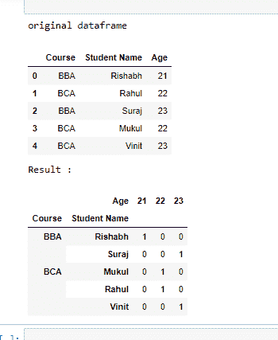
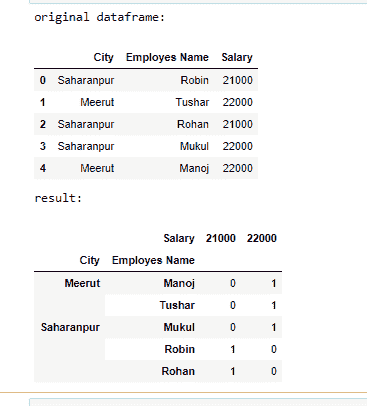

# 熊猫–数据框上的分组值计数

> 原文:[https://www . geesforgeks . org/pandas-group by-value-counts-on-the-data frame/](https://www.geeksforgeeks.org/pandas-groupby-value-counts-on-the-dataframe/)

**先决条件:**T2】熊猫

**熊猫**可以用来分别统计数据帧中每个值的频率。让我们看看如何在熊猫数据帧上计算 Groupby 值。为了计算熊猫数据帧中的 Groupby 值，我们将使用 groupby() size()和 unstack()方法。

### 使用的功能:

*   [**group by():**](https://www.geeksforgeeks.org/pandas-groupby/)group by()函数用于根据一些标准将数据拆分成组。熊猫的物体可以在它们的任何一个轴上分开。分组的抽象定义是提供标签到组名的映射

> ***语法:***
> 
> *data frame . group by(by =无，轴=0，级别=无，as _ index =真，排序=真，group _ keys =真，挤压=假，**kwargs)*
> 
> ***参数:***
> 
> *   ***通过:**映射、函数、字符串或可迭代*
> *   ***轴:** int，默认 0*
> *   ***级别:**如果轴是一个多索引(分层)，则按一个或多个特定级别分组*
> *   ***as_index :** 对于聚合输出，返回以组标签为索引的对象。仅与数据帧输入相关。as_index=False 实际上是“SQL 风格”的分组输出*
> *   ***排序:**排序组键。关闭此功能可以获得更好的性能。请注意，这不会影响各组内的观察顺序。groupby 保留每个组中的行顺序。*
> *   ***组合键:**调用 apply 时，将组合键添加到索引中以识别棋子*
> *   ***挤压:**如果可能的话减少返回类型的维度，否则返回一致类型*
> 
> ***返回:**分组对象*

*   **size():** size 方法用于获取表示对象中元素个数的整数。size 方法是返回行数乘以列数。

> **语法:**
> 
> Dataframe.size()

*   **unstack():** unstack 方法处理数据框中的 MultiIndex 对象，生成一个具有新的最内层列标签的重塑数据框。

> **语法:**
> 
> Dataframe.unstack()

### 方法

*   导入模块
*   创建或加载数据
*   创建数据框
*   每个值出现的计数值
*   打印结果数据框

**示例 1:**

## 计算机编程语言

```
# import pandas
import pandas as pd

# create dataframe
df = pd.DataFrame({
    'Course': ['BBA', 'BCA', 'BBA', 'BCA', 'BCA'],
    'Student Name': ['Rishabh', 'Rahul', 'Suraj', 'Mukul', 'Vinit'],
    'Age': [21, 22, 23, 22, 23]})

# print original dataframe
print("original dataframe")
display(df)

# counts Groupby value
df = df.groupby(['Course', 'Student Name', 'Age']).size().unstack(fill_value=0)

# print dataframe
print("Result :")
display(df)
```

**输出:**



**例 2:**

## 计算机编程语言

```
# import pandas
import pandas as pd

# create dataframe
df = pd.DataFrame({
    'City': ['Saharanpur', 'Meerut', 'Saharanpur', 'Saharanpur', 'Meerut'],
    'Employes Name': ['Robin', 'Tushar', 'Rohan', 'Mukul', 'Manoj'],
    'Salary': [21000, 22000, 21000, 22000, 22000]})

# print original dataframe
print("original dataframe: ")
display(df)

# counts Groupby value
df = df.groupby(['City', 'Employes Name', 'Salary']
                ).size().unstack(fill_value=0)

# print dataframe
print("result: ")
display(df)
```

**输出:**

