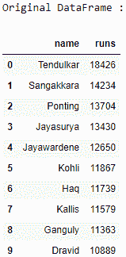
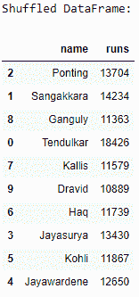

# 熊猫–如何将数据帧排错位置

> 原文:[https://www . geesforgeks . org/pandas-how-shuffle-a-data frame-rows/](https://www.geeksforgeeks.org/pandas-how-to-shuffle-a-dataframe-rows/)

让我们看看如何打乱数据帧的行。我们将使用熊猫模块的`[sample()](https://www.geeksforgeeks.org/python-pandas-dataframe-sample/)`方法来随机打乱熊猫中的数据帧行。

**算法:**

1.  导入`pandas` 和`numpy` 模块。
2.  创建一个数据帧。
3.  使用参数`frac`为 1 的`sample()`方法对数据帧的行进行洗牌，它确定需要返回的实例总数的比例。
4.  打印原稿和混洗的数据帧。

```
# import the modules
import pandas as pd
import numpy as np

# create a DataFrame
ODI_runs = {'name': ['Tendulkar', 'Sangakkara', 'Ponting',
                      'Jayasurya', 'Jayawardene', 'Kohli',
                      'Haq', 'Kallis', 'Ganguly', 'Dravid'],
            'runs': [18426, 14234, 13704, 13430, 12650,
                     11867, 11739, 11579, 11363, 10889]}
df = pd.DataFrame(ODI_runs)

# print the original DataFrame
print("Original DataFrame :")
print(df)

# shuffle the DataFrame rows
df = df.sample(frac = 1)

# print the shuffled DataFrame
print("\nShuffled DataFrame:")
print(df)
```

**输出:**

