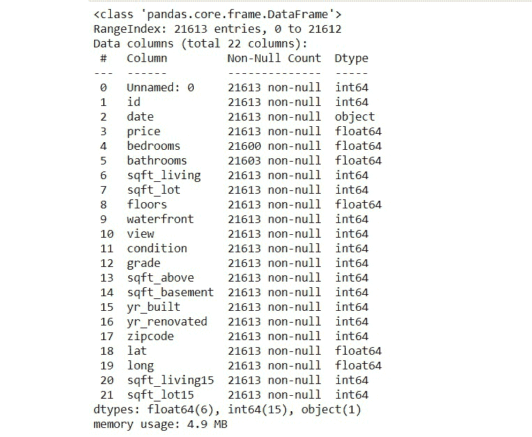
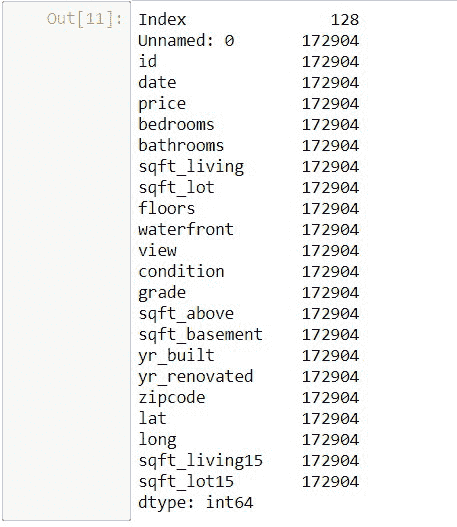
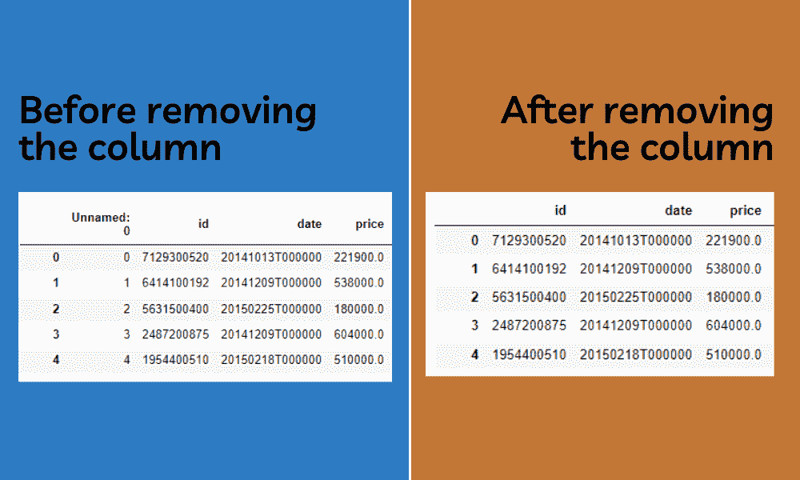
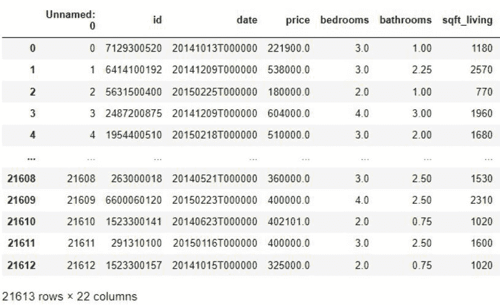

# 熊猫记忆管理

> 原文:[https://www.geeksforgeeks.org/pandas-memory-management/](https://www.geeksforgeeks.org/pandas-memory-management/)

在这篇文章中，我们将学习熊猫的记忆管理。

当我们与熊猫合作时，毫无疑问，您将始终存储大数据以进行更好的分析。在处理更大的数据时，我们应该更关心我们使用的内存。使用小数据集时没有问题。它不会引起任何问题。但是我们可以在不处理较大数据集内存问题的情况下进行编程。

现在我们将了解如何减少错误和内存消耗。它通过加快计算速度使我们的工作变得更容易。

## 查找内存使用情况

### **信息():**

Info()方法返回数据帧的摘要。

> **语法:**data frame . info(verbose =无，buf =无，max _ cols =无，memory _ usage =无，show _ counts =无，null _ counts =无)

这将打印数据帧的简短摘要。当我们提到数据帧作为参数时，它还会给出数据帧占用的内存。对于参数，我们应该提到 memory_usage 为“deep”。

## 蟒蛇 3

```py
import pandas as pd

df = pd.read_csv(data.csv)
df.info(memory_usage="deep")
```

**输出:**



### **Memory_usage():**

函数的作用是:返回索引的内存使用情况。它返回索引中所有单个标签使用的内存总和。

> **语法:** DataFrame.memory_usage(索引=True，深度=False)

但是，Info()只给出了数据使用的总内存。此函数以字节为单位返回每列的内存使用情况。在数据框中查找哪一列使用更多内存可能是更有效的方法。

## 蟒蛇 3

```py
import pandas as pd

df = pd.read_csv(data.csv)
df.memory_usage()
```

**输出:**



## 熊猫优化记忆的方法

### 将数值列更改为较小的数据类型:

这是保存程序使用的内存的一个非常简单的方法。Pandas 默认将整数值存储为 int64，将浮点值存储为 float64。这实际上需要更多的内存。相反，我们可以向下转换数据类型。只需将 int64 值转换为 int8，将 float64 转换为 float8。这将减少内存使用。通过不做任何妥协地转换数据类型，我们可以直接将内存使用减少到接近一半。

> **语法:**column name . a type(' float 16 ')
> 
> **注意:**不能存储 int16 或 float16 下的每个值。一些较大的数字仍然需要存储为较大的数据类型

**代码:**

## 蟒蛇 3

```py
import pandas as pd
df = pd.read_csv('data.csv')

# Downcasting float64 to float16
df['price'].memory_usage()

df['price'] = df['price'].astype('float16')
df['price'].memory_usage()
```

**输出:**

```py
173032
43354
```

### 停止加载整个列

我们通常使用较大的数据集，但是不需要加载整个数据集。相反，我们可以加载您将要处理的特定列。通过这样做，我们可以将消耗的内存量限制在一个非常低的值。

为此，只需形成一个临时数据集，其中只包含您要处理的值。

## 蟒蛇 3

```py
df.info(verbose = False, memory_usage = 'deep')
df = df[['price', 'sqft_living]]
df.info(verbose = False, memory_usage = 'deep')
```

**输出:**

```py
<class 'pandas.core.frame.DataFrame'>
RangeIndex: 21613 entries, 0 to 21612
Columns: 22 entries, Unnamed: 0 to sqft_lot15
dtypes: float16(1), float64(5), int64(15), object(1)
memory usage: 4.8 MB
```

```py
<class 'pandas.core.frame.DataFrame'>
RangeIndex: 21613 entries, 0 to 21612
Columns: 2 entries, price to sqft_living
dtypes: float16(1), int64(1)
memory usage: 211.2 KB
```

在上面的示例中，我们可以清楚地看到，将特定的列加载到数据框中会减少内存使用。

### 删除

删除是节省空间的方法之一。这可能是解决任何记忆问题的最好办法。我们可能会在不知情的情况下保存许多数据帧用于训练和测试，这在此过程中也不会用到。我们还可以删除未使用的列。通过删除这些可以节省更多的空间。我们还可以删除数据框中的空列，这也可以节省更多空间。我们可以使用 [del 关键字](https://www.geeksforgeeks.org/python-del-to-delete-objects/)，后跟您想要删除的项目。这将删除该项目。

## 蟒蛇 3

```py
# importing the modules
import pandas as pd
import numpy

# Reading the csv file
df = pd.read_csv('data.csv')

# Deleting unwanted columns
del df["Unnamed: 0"]
```



### 更改分类列

当处理一些数据集时，我们可能会有一些分类列，其中整个列只由一组固定的重复值组成。这种类型的数据称为分类值，基本上是一大组行具有相似分类值的分类或组。在处理这些类型的数据时，我们可以简单地将每个分类值分配给某个字母表或整数[基本上是编码]。这种方法可以成倍地减少程序使用的内存量。

> **语法:** df['column_name']。替换('大数值'，'字母'，在原地=真)

## 蟒蛇 3

```py
# importing the modules
import pandas
import numpy

# Reading the csv file
df = pd.read_csv('data.csv')

# Memory usage before replacing
df['bedrooms'].memory_usage()
# output--> 314640

# Replacing the categorical values
df['bedrooms'].replace('more than 2', 1, inplace=True)
df['bedrooms'].replace('less than 2', 0, inplace=True)

# Memory usage after replacing
df['bedrooms'].memory_usage()
# output--> 173032
```

**输出:**

```py
314640
173032
```

将列卧室的分类值替换为 1 和 0 后，可以看到内存使用量减少了一半。

### 分块导入数据

在处理数据时，很明显，在某些情况下，我们需要处理通常以千兆字节为单位的大数据。你的机器可能加载了大量的计算能力，也就是一个内存，一次将所有这些数据加载到内存中几乎是不可能的。在这种情况下，熊猫有一个非常方便的方法来分块加载数据，这将基本上帮助我们迭代数据集并分块加载，而不是一次加载所有数据，并将您的机器推向极致。

为此，我们需要在读取数据时传递名为块大小的参数。这将为我们提供大量数据，我们需要将这些数据连接成一个完整的数据集。这样，我们可以一下子减少机器的内存使用。给它一些时间来恢复它的计算能力来处理这个流。

> **语法**:pandas . read _ CSV(' filename . CSV '，chunksize=1000)

此方法将返回数据集的可迭代对象。

## 蟒蛇 3

```py
# importing the mmodule
import pandas

# Reading the data in chunks
data = pandas.read_csv('data.csv', chunksize=1000)

# Concatenating the chunks together
df = pandas.concat(data)
```

**输出:**

