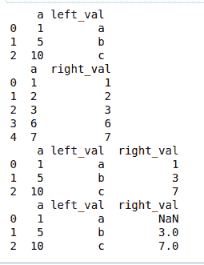
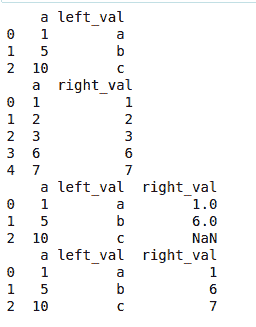
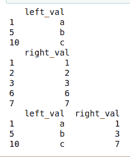

# pandas.merge_asof()函数在 Python 中

> 原文:[https://www . geesforgeks . org/pandas-merge _ asof-function-in-python/](https://www.geeksforgeeks.org/pandas-merge_asof-function-in-python/)

此方法用于执行 asof 合并。这类似于左连接，只是我们匹配最近的键而不是相等的键。两个数据帧都必须按关键字排序。

> **语法:** pandas.merge_asof(左，右，on=无，left _ on =无，right _ on =无，left _ index =假，right _ index =假，by =无，left _ by =无，right _ by =无，后缀=('_x '，' _y ')，容差=无，allow _ exact _ matches =真，方向= '向后'，)
> 
> **参数:**
> 
> *   **左，右:**数据框
> *   **on :** 标签，要加入的字段名。必须在两个数据帧中找到。
> *   **左侧 _on :** 标签，要在左侧数据框中加入的字段名。
> *   **右侧 _on :** 标签，要加入右侧数据框的字段名。
> *   **left_index :** boolean，使用左侧 DataFrame 的索引作为连接键。
> *   **right_index :** boolean，使用右侧 DataFrame 的索引作为连接键。

下面是上述方法的实现，并附有一些例子:

**例 1 :**

## 蟒蛇 3

```py
# importing package
import pandas

# creating data
left = pandas.DataFrame({'a': [1, 5, 10], 
                         'left_val': ['a', 'b', 'c']})

right = pandas.DataFrame({'a': [1, 2, 3, 6, 7],
                          'right_val': [1, 2, 3, 6, 7]})

# view data
print(left)
print(right)

# applying merge_asof on data
print(pandas.merge_asof(left, right, on='a'))
print(pandas.merge_asof(left, right, on='a', 
                        allow_exact_matches=False))
```

**输出:**



**例 2 :**

## 蟒蛇 3

```py
# importing package
import pandas

# creating data
left = pandas.DataFrame({'a': [1, 5, 10], 
                         'left_val': ['a', 'b', 'c']})

right = pandas.DataFrame({'a': [1, 2, 3, 6, 7],
                          'right_val': [1, 2, 3, 6, 7]})

# view data
print(left)
print(right)

# applying merge_asof on data
print(pandas.merge_asof(left, right, on='a', 
                        direction='forward'))
print(pandas.merge_asof(left, right, on='a',
                        direction='nearest'))
```

**输出:**



**例 3 :**

## 蟒蛇 3

```py
# importing package
import pandas

# creating data
left = pandas.DataFrame({'left_val': ['a', 'b', 'c']}, 
                        index=[1, 5, 10])

right = pandas.DataFrame({'right_val': [1, 2, 3, 6, 7]}, 
                         index=[1, 2, 3, 6, 7])

# view data
print(left)
print(right)

# applying merge_asof on data
print(pandas.merge_asof(left, right, left_index=True, 
                        right_index=True))
```

**输出:**

