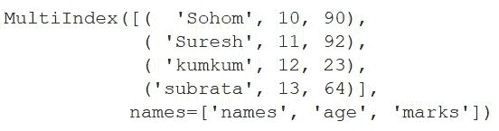
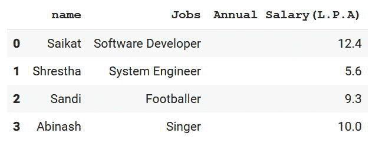
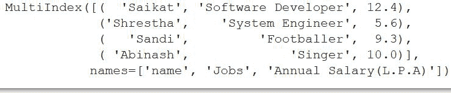
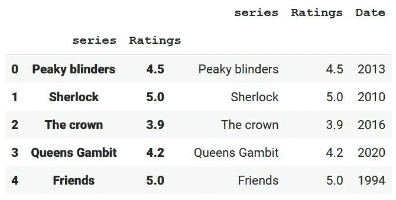
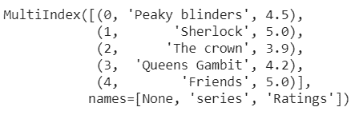
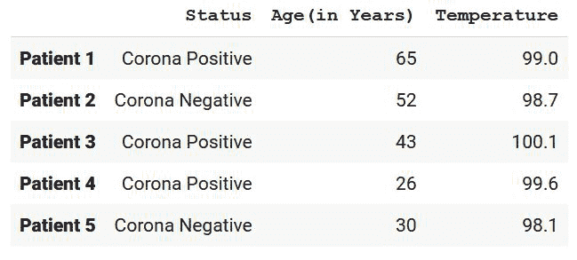
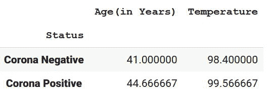

# 熊猫——多指数和群体

> 原文:[https://www . geesforgeks . org/pandas-multi-index-and-group by/](https://www.geeksforgeeks.org/pandas-multi-index-and-groupbys/)

在本文中，我们将讨论熊猫数据帧的多索引和分组操作。

**多索引**允许您在索引中选择多行多列。它是熊猫对象的多级或层次对象。现在使用的多索引方法多种多样，如 **MultiIndex.from_arrays、**T4【multi index . from _ 元组、 **MultiIndex.from_product、****multi index . from _ frame**、等，帮助我们从数组、元组、数据帧等创建多个索引。

> **语法:**熊猫。多索引(级别=无，代码=无，排序顺序=无，名称=无，数据类型=无，复制=假，名称=无，验证完整性=真)
> 
> *   **级别**:这是一个数组序列，显示了每个级别的唯一标签。
> *   **代码**:也是数组的序列，每一级的整数帮助我们指定那个位置的标签。
> *   **排序顺序**:可选 int。它帮助我们按字母顺序排列等级。
> *   **数据类型**:数据类型(数据大小可以是 32 位或 64 位)
> *   **复制**:为布尔型参数，默认值为 False。它帮助我们复制元数据。
> *   **verify_integrity** :为布尔型参数，默认值为 True。它检查级别和代码的完整性，即它们是否有效。

让我们看一些例子来更好地理解这个概念。

**例 1:**

在本例中，我们将从数组创建多索引。数组比元组更受欢迎，因为元组是不可变的，而如果我们想改变数组中元素的值，我们可以这样做。让我们来看看代码及其解释:

在导入了所有重要的库之后，我们正在创建一个名称数组以及标记数组和年龄数组。现在，在 MultiIndex.from_arrays 的帮助下，我们将所有三个数组组合在一起，这样来自所有三个数组的元素一起形成多个索引。之后，我们展示上述结果。

## 蟒蛇 3

```py
# importing pandas library from 
# python
import pandas as pd

# Creating an array of names
arrays = ['Sohom','Suresh','kumkum','subrata']

# Creating an array of ages
age= [10, 11, 12, 13]

# Creating an array of marks
marks=[90,92,23,64]

# Using MultiIndex.from_arrays, we are
# combining the arrays together along 
# with their names and creating multi-index 
# with each element from the 3 arrays into
# different rows
pd.MultiIndex.from_arrays([arrays,age,marks], names=('names', 'age','marks'))
```

**输出:**



**例 2:**

在这个例子中，我们将使用熊猫从数据帧创建多索引。我们将创建手动数据，然后使用 **pd.dataframe** 、我们将使用这组数据创建一个数据框架。现在使用多索引语法，我们将创建一个带有数据帧的多索引。

在这个例子中，我们正在做与前一个例子相同的事情。不同的是，在前面的例子中，我们从数组列表中创建多索引，而在这里，我们使用 **pd.dataframe** 创建了一个数据帧，之后，我们使用**多索引. from_frame()** 以及名称**从该数据帧创建多索引。**

## 蟒蛇 3

```py
# importing pandas library from
# python
import pandas as pd

# Creating data
Information = {'name': ["Saikat", "Shrestha", "Sandi", "Abinash"],

               'Jobs': ["Software Developer", "System Engineer",
                        "Footballer", "Singer"],

               'Annual Salary(L.P.A)': [12.4, 5.6, 9.3, 10]}

# Dataframing the whole data
df = pd.DataFrame(dict)

# Showing the above data
print(df)
```

**输出:**



现在使用 MultiIndex.from_frame，我们正在用这个数据帧创建多个索引。

## 蟒蛇 3

```py
# creating multiple indexes from 
# the dataframe
pd.MultiIndex.from_frame(df)
```

#### **输出:**



**例 3:**

在本例中，我们将学习 **dataframe.set_index([col1，col2，..])，**我们将在这里学习多个索引。这是多指标的另一个概念。

在导入所需的库即熊猫后，我们正在创建数据，然后在**熊猫的帮助下。数据框**我们正在将其转换为表格格式。之后使用**数据框架集合索引**我们将一些列设置为索引列(多索引)。Drop 参数保持为 false，这不会删除作为索引列提到的列，此后 append 参数用于将传递的列追加到已经存在的索引列。

## 蟒蛇 3

```py
# importing the pandas library
import pandas as pd

# making data for dataframing
data = {
    'series': ['Peaky blinders', 'Sherlock', 'The crown',
               'Queens Gambit', 'Friends'],

    'Ratings': [4.5, 5, 3.9, 4.2, 5],

    'Date': [2013, 2010, 2016, 2020, 1994]
}

# Dataframing the whole data created
df = pd.DataFrame(data)

# setting first and the second name
# as index column
df.set_index(["series", "Ratings"], inplace=True,
             append=True, drop=False)
# display the dataframe
print(df)
```

**输出:**



现在，我们正在以多索引的形式打印数据帧的索引。

## 蟒蛇 3

```py
print(df.index)
```

**输出:**



## **基团**

熊猫中的 [**分组**](https://www.geeksforgeeks.org/pandas-groupby/) 操作帮助我们通过应用一个函数来分割对象，然后组合结果。根据我们的选择对列进行分组后，我们可以执行各种操作，这些操作最终可以帮助我们分析数据。

> **语法:** DataFrame.groupby(by=None，axis=0，level=None，as_index=True，sort=True，group_keys=True，挤压= <对象对象对象>，observed=False，dropna=True)
> 
> *   **by:** 它帮助我们按数据框中的特定列或多列进行分组。
> *   **轴**:默认值为 0，其中 0 代表索引，1 代表列。
> *   **级别:**让我们考虑一下，我们正在处理的数据帧具有分层索引。在这种情况下，级别帮助我们确定我们正在使用的索引的级别。
> *   **as_index:** 为布尔型数据类型，默认值为**真**。它返回以组标签作为索引的对象。
> *   **排序:**帮助我们对键值进行排序。为了获得更好的性能，最好将其保持为假。
> *   **group_keys:** 也是一个布尔值，默认值为 true。它将组键添加到索引中以识别片段
> *   **dropna** :在数据集中删除“ **NA** 值很有帮助

**例 1:**

在下面的例子中，我们将使用自己创建的数据来探索组的概念。让我们进入代码实现。

## 蟒蛇 3

```py
# importing pandas library
import numpy as np

# Creating pandas dataframe
df = pd.DataFrame(
    [
        ("Corona Positive", 65, 99),
        ("Corona Negative", 52, 98.7),
        ("Corona Positive", 43, 100.1),
        ("Corona Positive", 26, 99.6),
        ("Corona Negative", 30, 98.1),
    ],

    index=["Patient 1", "Patient 2", "Patient 3",
           "Patient 4", "Patient 5"],

    columns=("Status", "Age(in Years)", "Temperature"),
)

# show dataframe
print(df)
```

**输出:**



现在让我们根据一些特征对它们进行分组:

## 蟒蛇 3

```py
# Grouping with only status 
grouped1 = df.groupby("Status")

# Grouping with temperature and status
grouped3 = df.groupby(["Temperature", "Status"])
```

正如我们所看到的，我们已经根据‘T0’状态和‘T2’温度和状态对它们进行了分组。现在让我们执行一些功能:

## 蟒蛇 3

```py
# Finding the mean of the
# patients reports according to
# the status
grouped1.mean()
```

这将根据状态创建数值的平均值。



## 蟒蛇 3

```py
# Grouping temperature and status together 
# results in giving us the index values of
# the particular patient
grouped3.groups
```

**输出:**

> {(98.1，'电晕阴性'):['患者 5']，(98.7，'电晕阴性'):['患者 2']，
> 
> (99.0，“电晕正”):[“患者 1”]，(99.6，“电晕正”):[“患者 4”]，
> 
> (100.1，“电晕正”):[“患者 3”]}