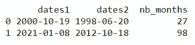
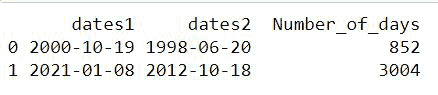
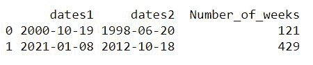
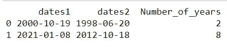

# 熊猫–两个日期之间的月数

> 原文:[https://www . geesforgeks . org/pandas-两个日期之间的月数/](https://www.geeksforgeeks.org/pandas-number-of-months-between-two-dates/)

在本文中，我们将使用 Python 查找熊猫两次约会之间的月数。

**例 1:**

我们将采用一个数据框架，并有两列的日期，我们希望得到两者之间的差异。使用 df.dates1-df.dates2 查找两个日期之间的差异，然后以月份的形式转换结果。转换为“int”数据类型，否则结果将是浮点形式。

## 蟒蛇 3

```py
# Importing required libraries
import pandas as pd
import numpy as np
import datetime

# Making a dataframe which will have two
# columns two store different dates
df = pd.DataFrame({'dates1': np.array(
  [datetime.datetime(2000, 10, 19), datetime.datetime(2021, 1, 8)]),
                   'dates2': np.array(
                     [datetime.datetime(1998, 6, 20),
                      datetime.datetime(2012, 10, 18)])})

# Used to convert the difference in terms of months
df['nb_months'] = ((df.dates1 - df.dates2)/np.timedelta64(1, 'M'))
df['nb_months'] = df['nb_months'].astype(int)
print(df)
```

**输出:**



**例 2:**

我们还可以通过稍微修改代码来获得两个日期之间的天数。如下所示:

## 蟒蛇 3

```py
# Importing required libraries
import pandas as pd
import numpy as np
import datetime

# Making a dataframe which will have
# two columns two store different dates
df = pd.DataFrame({'dates1': np.array(
  [datetime.datetime(2000, 10, 19), datetime.datetime(2021, 1, 8)]),
                   'dates2': np.array(
                     [datetime.datetime(1998, 6, 20),
                      datetime.datetime(2012, 10, 18)])})

# Used to convert the difference in terms of days
df['Number_of_days'] = ((df.dates1 - df.dates2)/np.timedelta64(1, 'D'))
df['Number_of_days'] = df['Number_of_days'].astype(int)
print(df)
```

**输出:**



**例 3:**

以类似的方式，我们也可以得到这两个日期在周方面的差异。

## 蟒蛇 3

```py
# Importing required libraries
import pandas as pd
import numpy as np
import datetime

# Making a dataframe which will
# have two columns two store different dates
df= pd.DataFrame({'dates1': np.array(
  [datetime.datetime(2000, 10, 19), datetime.datetime(2021, 1, 8)]),
                   'dates2': np.array(
                     [datetime.datetime(1998, 6, 20),
                      datetime.datetime(2012, 10, 18)] )})

# Used to convert the difference in terms of weeks
df['Number_of_weeks'] = ((df.dates1 - df.dates2)/np.timedelta64(1, 'W'))
df['Number_of_weeks'] = df['Number_of_weeks'].astype(int)
print(df)
```

**输出:**



**例 4:**

以类似的方式，我们也可以得到这两个日期在年份方面的差异。

## 蟒蛇 3

```py
# Importing required libraries
import pandas as pd
import numpy as np
import datetime

# Making a dataframe which will
# have two columns two store different dates
df = pd.DataFrame({'dates1': np.array(
  [datetime.datetime(2000, 10, 19), datetime.datetime(2021, 1, 8)]),
                   'dates2': np.array(
                     [datetime.datetime(1998, 6, 20),
                      datetime.datetime(2012, 10, 18)])})

# Used to convert the difference in terms of years
df['Number_of_years'] = ((df.dates1 - df.dates2)/np.timedelta64(1, 'Y'))
df['Number_of_years'] = df['Number_of_years'].astype(int)
print(df)
```

**输出:**

