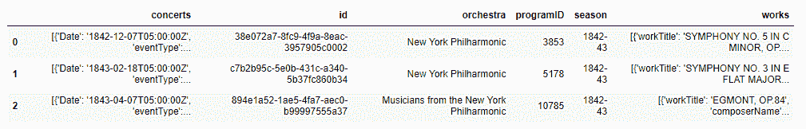
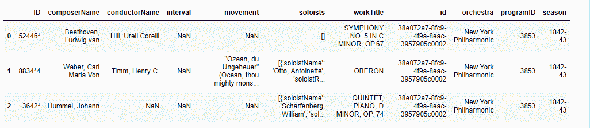
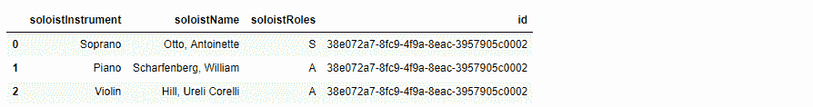

# 熊猫|解析 JSON 数据集

> 原文:[https://www.geeksforgeeks.org/pandas-parsing-json-dataset/](https://www.geeksforgeeks.org/pandas-parsing-json-dataset/)

使用熊猫解析 JSON 数据集要方便得多。Pandas 允许您将列表列表转换为数据框，并单独指定列名。

JSON 解析器将 JSON 文本转换成另一种表示，必须接受符合 JSON 语法的所有文本。它可能接受非 JSON 表单或扩展。实现可以设置以下内容:

*   对其接受的文本大小的限制，
*   对最大嵌套深度的限制，
*   对数字的范围和精度的限制，
*   设置字符串长度和字符内容的限制。

使用大型 JSON 数据集可能会变得越来越糟糕，尤其是当它们太大而无法放入内存时。在这种情况下，命令行工具和 Python 的结合可以成为探索和分析数据的有效方式。

**导入 JSON 文件:**

操纵 JSON 是使用 Python 数据分析库(称为熊猫)完成的。

```
import pandas as pd
```

现在，您可以使用命令`read_json`读取 JSON 并将其保存为熊猫数据结构。

> **pandas . read _ JSON**(path _ or _ buf =None，orient = None，typ='frame '，dtype=True，convert_axes=True，convert _ dates = True，keep _ default _ dates = True，numpy=False，precise_float=False，date_unit=None，编码= None，行数=False，chunksize=None，压缩= '推断')

```
import pandas as pd
# Creating Dataframe 
df = pd.DataFrame([['a', 'b'], ['c', 'd']],
                  index =['row 1', 'row 2'],
                  columns =['col 1', 'col 2'])

# Indication of expected JSON string format
print(df.to_json(orient ='split'))

print(df.to_json(orient ='index'))
```

**Output:**

```
{"columns":["col 1", "col 2"],
 "index":["row 1", "row 2"],
 "data":[["a", "b"], ["c", "d"]]}

{"row 1":{"col 1":"a", "col 2":"b"},
 "row 2":{"col 1":"c", "col 2":"d"}}

```

**使用 [dataframe.to_json](https://pandas.pydata.org/pandas-docs/stable/reference/api/pandas.DataFrame.to_json.html) :** 将对象转换为 JSON 字符串

> **data frame . to _ JSON**(path _ or _ buf = None，orient=None，date_format=None，double_precision=10，force_ascii=True，date_unit='ms '，default_handler=None，lines = False，compression = ' infer '，index=True)

**直接从数据集读取 JSON 文件:**

```
import pandas as pd

data = pd.read_json('http://api.population.io/1.0/population/India/today-and-tomorrow/?format = json')
print(data)
```

**Output:**

```
total_population
0  {'date': '2019-03-18', 'population': 1369169250}
1  {'date': '2019-03-19', 'population': 1369211502}

```

**[嵌套 JSON 解析](https://pandas.pydata.org/pandas-docs/version/0.21/generated/pandas.io.json.json_normalize.html)带熊猫:**

嵌套的 JSON 文件可能很耗时，并且很难展平并加载到熊猫中。
我们使用嵌套的“' [raw_nyc_phil.json](https://raw.githubusercontent.com/a9k00r/python-test/master/raw_nyc_phil.json) 。"'要从一个嵌套数组中创建一个展平的 pandas 数据框，请打开一个深度嵌套的数组。

**代码#1:**
让我们将 works 列解包为一个独立的数据帧。我们还会抓住扁平的柱子。

```
import json 
import pandas as pd 
from pandas.io.json import json_normalize 

with open('https://github.com/a9k00r/python-test/blob/master/raw_nyc_phil.json') as f:
    d = json.load(f)

# lets put the data into a pandas df
# clicking on raw_nyc_phil.json under "Input Files"
# tells us parent node is 'programs'
nycphil = json_normalize(d['programs'])
nycphil.head(3)
```

**输出:**


**代码#2:**
让我们使用 [json_normaliz](http://pandas.pydata.org/pandas-docs/stable/reference/api/pandas.DataFrame.html) 将 works 列解包到一个独立的数据框中。

```
works_data = json_normalize(data = d['programs'],
                            record_path ='works', 
                            meta =['id', 'orchestra', 'programID', 'season'])
works_data.head(3)
```

**输出:**


**代码#3:**

让我们通过传递一个列表来展平“独奏家”的数据。因为独奏者是嵌套在作品中的。

```
soloist_data = json_normalize(data = d['programs'],
                              record_path =['works', 'soloists'],
                              meta =['id'])

soloist_data.head(3)
```

**输出:**
