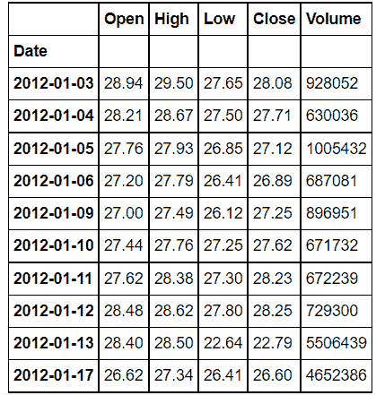
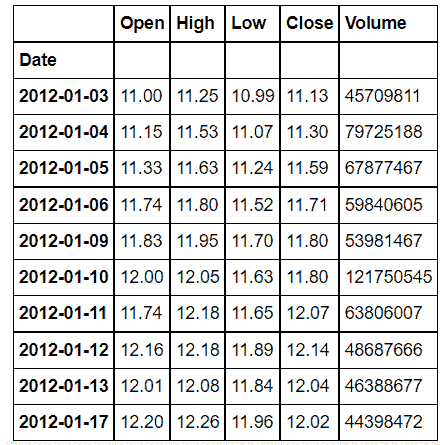
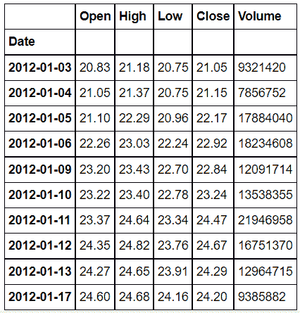
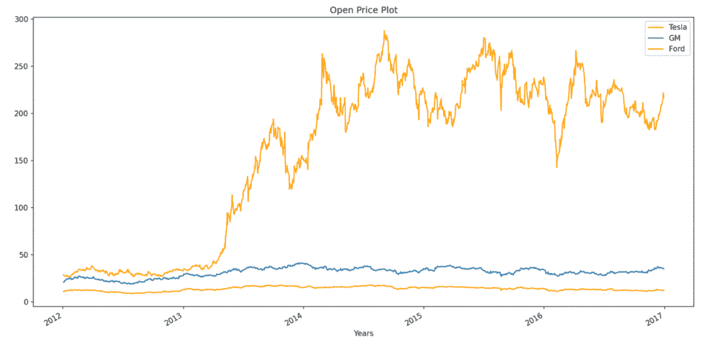
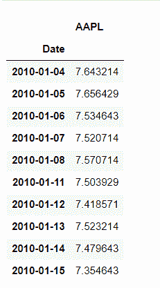
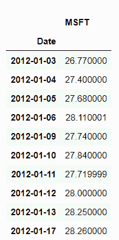
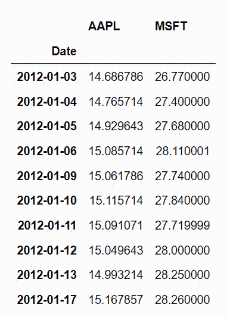
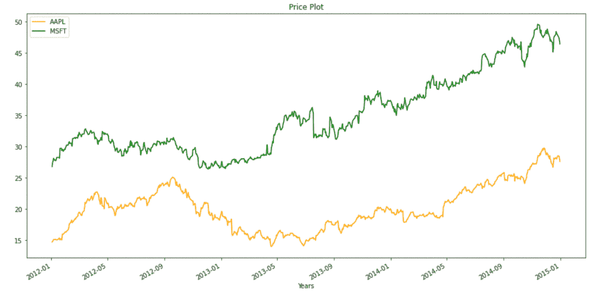
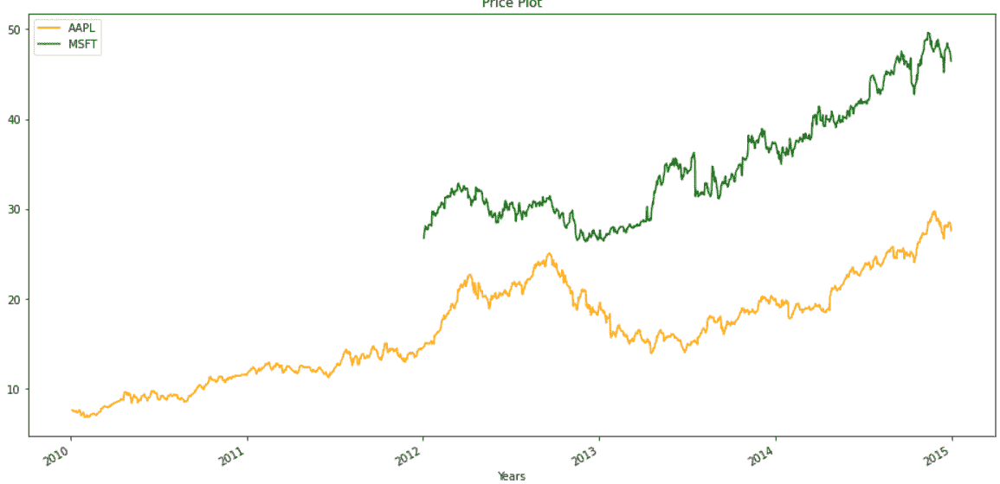

# 熊猫–将多个时间序列数据框绘制成单个图

> 原文:[https://www . geeksforgeeks . org/pandas-plot-multi-time-series-data frame-in-single-plot/](https://www.geeksforgeeks.org/pandas-plot-multiple-time-series-dataframe-into-a-single-plot/)

在本文中，我们将看到如何将多个时间序列数据框绘制成单个图。

如果单个数据帧中有多个时间序列，您仍然可以使用**绘图()**方法绘制所有时间序列的折线图。要将多个时间序列绘制成一个图，首先我们必须确保所有数据帧的索引是对齐的。让我们举两个例子，第一个例子是索引对齐，第二个例子是在绘图之前，我们必须对齐所有数据帧的索引。

## 绘制具有相同日期时间索引的数据帧:

### **步骤 1:导入库**

## 蟒蛇 3

```py
# importing Libraries

# import pandas as pd
import pandas as pd

# importing matplotlib module
import matplotlib.pyplot as plt
plt.style.use('default')

# %matplotlib inline: only draw static
# images in the notebook
%matplotlib inline
```

### **步骤 2:** 导入数据

我们将绘制特斯拉、福特和通用汽车三只股票的公开价格，你可以从[这里](https://media.geeksforgeeks.org/wp-content/cdn-uploads/20211004144446/dataFiles.zip)或 yfinance library 下载数据。

**特斯拉文件:**

## 蟒蛇 3

```py
# code
# importing Data
tesla = pd.read_csv('Tesla_Stock.csv',
                    index_col='Date', 
                    parse_dates=True)
tesla.head(10)
```

**输出:**



**福特 _ 股票:**

## 蟒蛇 3

```py
# code
# importing data
ford = pd.read_csv('Ford_Stock.csv',
                   index_col='Date', 
                   parse_dates=True)
ford.head(10)
```

**输出:**



**GM_Stock:**

## 蟒蛇 3

```py
# code
# importing data
gm = pd.read_csv('GM_Stock.csv',
                 index_col='Date',
                 parse_dates=True)
# printing 10 entries of the data
gm.head(10)
```

**输出:**



### 第三步:现在绘制股票的公开价格

## 蟒蛇 3

```py
# code
# Visualizing The Open Price of all the stocks

# to set the plot size
plt.figure(figsize=(16, 8), dpi=150)

# using plot method to plot open prices.
# in plot method we set the label and color of the curve.
tesla['Open'].plot(label='Tesla', color='orange')
gm['Open'].plot(label='GM')
ford['Open'].plot(label='Ford')

# adding title to the plot
plt.title('Open Price Plot')

# adding Label to the x-axis
plt.xlabel('Years')

# adding legend to the curve
plt.legend()
```

**输出:**



## **绘制不同日期时间索引的数据帧:**

在第二个例子中，我们将取苹果(AAPL)和微软(MSFT)不同时期的股价数据。我们在这里的第一个任务是重新索引任何一个数据框，使其与其他数据框对齐，然后我们可以在一个图中绘制它们。

### 步骤 1:导入库

## 蟒蛇 3

```py
# importing Libraries

# import pandas as pd
import pandas as pd

# importing matplotlib module
import matplotlib.pyplot as plt
plt.style.use('default')

# %matplotlib inline: only draw static images in the notebook
%matplotlib inline
```

### 步骤 2:导入数据

## 蟒蛇 3

```py
# code
aapl = pd.read_csv('aapl.csv',
                   index_col='Date',
                   parse_dates=True)
# printing 10 entries of the data
aapl.head(10)
```

**输出:**



**msft 文件:**

## 蟒蛇 3

```py
# importing Data
msft = pd.read_csv('msft.csv', 
                   index_col='Date',
                   parse_dates=True)
# printing 10 entries of the data
msft.head(10)
```

**输出:**



正如您可以清楚地看到的，两个数据帧的日期时间索引是不一样的，所以首先我们必须对齐它们。当我们将 msft 的 DateTime 索引设置为与所有索引相同时，那么在绘制之前，我们会有一些 2010-01-04 到 2012-01-02 期间的缺失值。移除缺失值非常重要。

## 蟒蛇 3

```py
# Aligning index
aapl["MSFT"] = msft.MSFT

# removing Missing Values
aapl.dropna(inplace=True)

aapl.head(10)
```

**输出:**



我们已经将两个数据帧合并成一个数据帧，现在我们可以简单地绘制它，

## 蟒蛇 3

```py
# Visualizing The Price of the stocks
# to set the plot size
plt.figure(figsize=(16, 8), dpi=150)

# using .plot method to plot stock prices.
# we have passed colors as a list
aapl.plot(label='aapl', color=['orange', 'green'])

# adding title
plt.title('Price Plot')

# adding label to x-axis
plt.xlabel('Years')

# adding legend.
plt.legend()
```

**输出:**



在某些情况下，我们不能丢失数据，因此我们也可以在不删除缺失值的情况下进行绘图，同样的绘图将如下所示:

