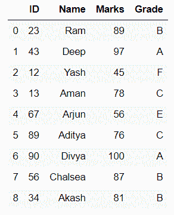
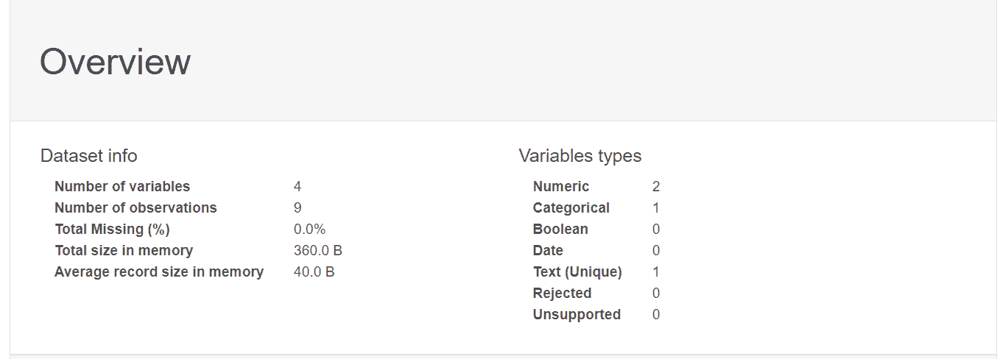
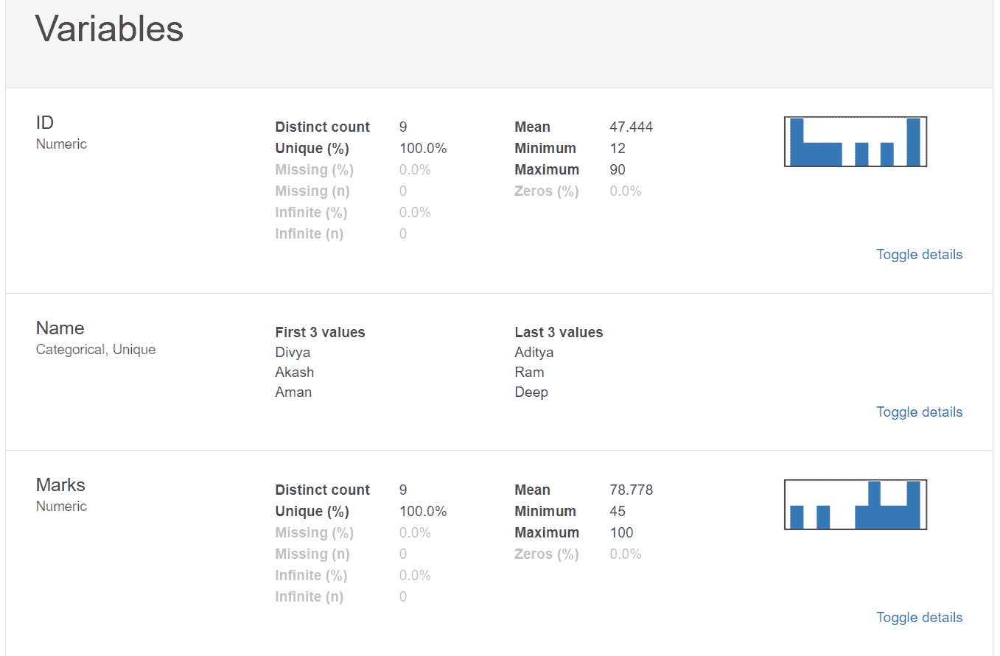
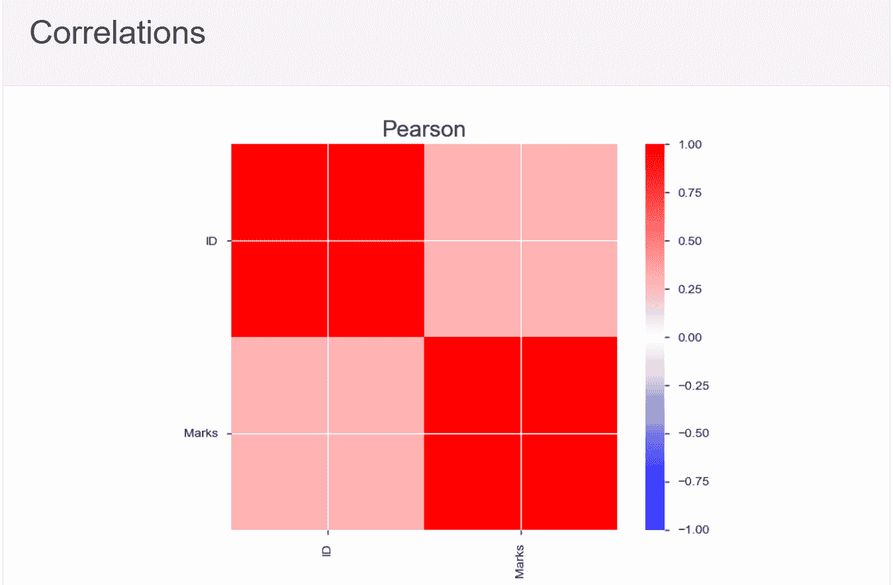
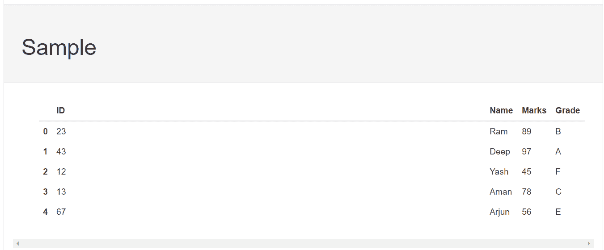

# 蟒蛇熊猫侧写

> 原文:[https://www.geeksforgeeks.org/pandas-profiling-in-python/](https://www.geeksforgeeks.org/pandas-profiling-in-python/)

Python 中的 pandas_profiling 库包括一个名为 ProfileReport()的方法，该方法在输入数据帧上生成一个基本报告。

该报告包括以下内容:

*   数据帧概述，
*   定义数据框的每个属性，
*   属性之间的相关性(皮尔逊相关和斯皮尔曼相关)，以及
*   数据帧的示例。

**语法:**

```
pandas_profiling.ProfileReport(df, **kwargs)
```

<figure class="table">

| 争论 | 类型 | 描述 |
| --- | --- | --- |
| df | 数据帧 | 要分析的数据 |
| 垃圾箱 | （同 Internationalorganizations）国际组织 | 直方图中的箱数。默认值为 10。 |
| 检查相关性 | 布尔 | 是否检查相关性。默认为“真”。 |
| 相关性阈值 | 漂浮物 | 确定变量对是否相关的阈值。默认值为 0.9。 |
| 相关性 _ 覆盖 | 目录 | 变量名不会因为相互关联而被拒绝。默认情况下，列表中没有变量(`无')。 |
| check _ recorded | 布尔 | 是否检查记录的相关性(内存大的特性)。因为这是一个昂贵的计算，它可以为小数据集激活。` check_correlation '必须为真，才能禁用此检查。默认为“假”。 |
| 池大小 | （同 Internationalorganizations）国际组织 | 线程池中的工作线程数。默认值等于 CPU 的数量。 |

</figure>

**示例:**

## 蟒蛇 3

```
# importing packages
import pandas as pd
import pandas_profiling as pp

# dictionary of data
dct = {'ID': {0: 23, 1: 43, 2: 12, 3: 13, 
              4: 67, 5: 89, 6: 90, 7: 56, 
              8: 34}, 
       'Name': {0: 'Ram', 1: 'Deep', 2: 'Yash',
                3: 'Aman', 4: 'Arjun', 5: 'Aditya',
                6: 'Divya', 7: 'Chalsea',
                8: 'Akash' }, 
       'Marks': {0: 89, 1: 97, 2: 45, 3: 78,
                 4: 56, 5: 76, 6: 100, 7: 87,
                 8: 81}, 
       'Grade': {0: 'B', 1: 'A', 2: 'F', 3: 'C',
                 4: 'E', 5: 'C', 6: 'A', 7: 'B',
                 8: 'B'}
      }

# forming dataframe and printing
data = pd.DataFrame(dct)
print(data)

# forming ProfileReport and save
# as output.html file
profile = pp.ProfileReport(data)
profile.to_file("output.html")
```

**输出:**

[](https://media.geeksforgeeks.org/wp-content/uploads/20200605145204/Screenshot81.png)

**【data frame】**

名为 output.html 的 html 文件如下:

   