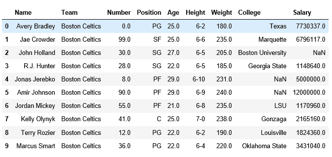
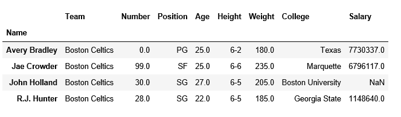

# 熊猫 read_table()功能

> 原文:[https://www.geeksforgeeks.org/pandas-read_table-function/](https://www.geeksforgeeks.org/pandas-read_table-function/)

熊猫是分析数据、数据探索和操作最常用的软件包之一。在分析真实世界的数据时，我们经常使用网址来执行不同的操作，熊猫为此提供了多种方法。其中一种方法是 **read_table()** 。

> **参数:**
> **read _ table**(filepath _ or _ buffer，sep=False，分隔符=None，标头= '推断'，名称=None，index_col=None，usecols=None，挤压=False，前缀=None，mangle _ dupe _ cols = True，dtype=None，引擎=None，转换器=None，true_values=None，false_values=None，skipinitialspace = False，skiprows = None，skipfooter=0，nrows=None，na _ name，lineterminator =无，quotechar= ' " '，quoting = 0，doublequote =真，escapechar =无，comment =无，编码=无，方言=无，tupleize _ cols =无，error _ bad _ lines =真，warn _ bad _ lines =真，delim _ 空白=假，low _ memory =真，memory _ map =假，float _ precision =无)
> 
> **返回:**以逗号('，')分隔的值文件(csv)作为带有标签轴的二维数据返回。

要获取文章中使用的 csv 文件的链接，[点击这里](https://media.geeksforgeeks.org/wp-content/uploads/nba.csv)。

**代码#1:** 显示文件的全部内容，各列用“，”分隔

```
# importing pandas
import pandas as pd

pd.read_table('nba.csv',delimiter=',')
```

**输出:**


**代码#2:** 跳过没有索引的行

```
# importing pandas
import pandas as pd

pd.read_table('nba.csv',delimiter=',',skiprows=4,index_col=0)
```

**输出:**


在上面的代码中，跳过了四行，显示了最后一个跳过的行。

**代码#3:** 跳过带索引的行

```
# importing pandas
import pandas as pd

pd.read_table('nba.csv',delimiter=',',skiprows=4)
```

**输出:**


**代码#4:** 如果是大文件，如果你想只读取几行，那么给**指定需要的行数**。

```
# importing pandas
import pandas as pd

pd.read_table('nba.csv',delimiter=',',index_col=0,nrows=4)
```

**输出:**


**代码#5:** 如果你想从文件底部跳过行，那么给**跳过器**所需的行数。

```
# importing pandas
import pandas as pd

pd.read_table('nba.csv',delimiter=',',index_col=0,
                     engine='python',skipfooter=5)
```

**输出:**


**代码#6:** 用作列名的行号，数据的开始出现在**标题**中给出的最后一个行号之后。

```
# importing pandas
import pandas as pd

pd.read_table('nba.csv',delimiter=',',index_col=0,header=[1,3,5])
```

**输出:**
