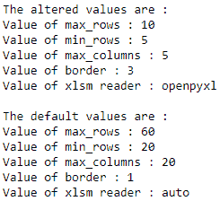

# Python 中 Pandas.reset_option()函数

> 原文:[https://www . geesforgeks . org/pandas-reset _ option-python 中的函数/](https://www.geeksforgeeks.org/pandas-reset_option-function-in-python/)

熊猫有一个选项系统，可以让我们定制它行为的某些方面，显示相关的选项是用户最有可能调整的。让我们看看如何将指定选项的值重置回默认值。

## reset_option()

> **语法:** pandas.reset_option(pat)
> 
> **参数:**
> 
> *   **pat :** Regexp，应该匹配单个选项。
> 
> **返回:**无

**示例 1 :** 我们将使用`pandas.get_option()`更改选项的值，然后使用`pandas.reset_option()`将其重置回默认值。

```
# importing the module
import pandas as pd

# setting the values
pd.set_option("display.max_rows", 10)
pd.set_option("display.min_rows", 2)
pd.set_option("display.max_columns", 5)
pd.set_option("display.html.border", 3)
pd.set_option("io.excel.xlsm.reader", "openpyxl")

# displaying the values
print("The altered values are : ")
print("Value of max_rows : " + 
      str(pd.get_option("display.max_rows")))

print("Value of min_rows : " + 
      str(pd.get_option("display.max_columns")))

print("Value of max_columns : " + 
      str(pd.get_option("display.max_columns")))

print("Value of border : " + 
      str(pd.get_option("display.html.border")))

print("Value of xlsm reader : " + 
      str(pd.get_option("io.excel.xlsm.reader")))

# resetting the values to default
pd.reset_option("display.max_rows")
pd.reset_option("display.min_rows")
pd.reset_option("display.max_columns")
pd.reset_option("display.html.border")
pd.reset_option("io.excel.xlsm.reader")

# displaying the default values
print("\nThe default values are : ")

print("Value of max_rows : " + 
      str(pd.get_option("display.max_rows")))

print("Value of min_rows : " + 
      str(pd.get_option("display.max_columns")))

print("Value of max_columns : " + 
      str(pd.get_option("display.max_columns")))

print("Value of border : " + 
      str(pd.get_option("display.html.border")))

print("Value of xlsm reader : " + 
      str(pd.get_option("io.excel.xlsm.reader")))
```

**输出:**


**例 2 :** 我们可以通过在`pandas.reset_option()`函数中传递“all”作为参数，一次重置所有选项的值，而不是单独重置不同选项的值。

```
# importing the module
import pandas as pd

# setting the values
pd.set_option("display.max_rows", 10)
pd.set_option("display.min_rows", 2)
pd.set_option("display.max_columns", 5)
pd.set_option("display.html.border", 3)
pd.set_option("io.excel.xlsm.reader", "openpyxl")

# displaying the values
print("The altered values are : ")

print("Value of max_rows : " + 
      str(pd.get_option("display.max_rows")))

print("Value of min_rows : " + 
      str(pd.get_option("display.max_columns")))

print("Value of max_columns : " + 
      str(pd.get_option("display.max_columns")))

print("Value of border : " + 
      str(pd.get_option("display.html.border")))

print("Value of xlsm reader : " + 
      str(pd.get_option("io.excel.xlsm.reader")))

# resetting the values to default
pd.reset_option("all")

# displaying the default values
print("\nThe default values are : ")

print("Value of max_rows : " + 
      str(pd.get_option("display.max_rows")))

print("Value of min_rows : " + 
      str(pd.get_option("display.max_columns")))

print("Value of max_columns : " + 
      str(pd.get_option("display.max_columns")))

print("Value of border : " + 
      str(pd.get_option("display.html.border")))

print("Value of xlsm reader : " + 
      str(pd.get_option("io.excel.xlsm.reader")))
```

**输出:**
