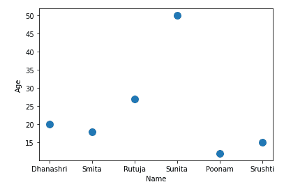

# 熊猫散点图–数据框.图.散点()

> 原文:[https://www . geesforgeks . org/pandas-散点图-data frame-plot-散点图/](https://www.geeksforgeeks.org/pandas-scatter-plot-dataframe-plot-scatter/)

散点图是一种显示两个数值变量之间关系的数据可视化技术。对于使用熊猫绘制散点图，有一个 DataFrame 类，该类有一个名为 plot 的成员。在绘图成员上调用散点图()方法，在两个变量或两列熊猫数据框之间绘制一个绘图。

> **语法:** DataFrame.plot.scatter(x，y，s =无，c =无)
> 
> **参数:**
> 
> **x:** 列名用作每个点的水平坐标
> **y:** 列名用作每个点的垂直坐标
> **s:** 点的大小
> **c:** 点的颜色

### 步骤:

*   导入必要的库。
*   准备数据
*   将准备好的数据转换为数据帧
*   绘制散点图

**示例 1:** 在本例中，我们将使用数据框绘制散点图，这里我们将创建数据框并使用不同的列绘制散点图。

## 蟒蛇 3

```py
# Program to draw scatter plot using Dataframe.plot
# Import libraries
import pandas as pd

# Prepare data
data={'Name':['Dhanashri', 'Smita', 'Rutuja',
              'Sunita', 'Poonam', 'Srushti'],
      'Age':[20, 18, 27, 50, 12, 15]}

# Load data into DataFrame
df = pd.DataFrame(data = data);

# Draw a scatter plot
df.plot.scatter(x = 'Name', y = 'Age', s = 100);
```

**输出:**



**示例 2:** 这里我们将创建数据框，并使用不同的列和样式数据点绘制散点图。

## 蟒蛇 3

```py
# Program to draw scatter plot using Dataframe.plot
# Import libraries
import pandas as pd

# Prepare data
data={'Name':['Dhanashri', 'Smita', 'Rutuja',
              'Sunita', 'Poonam', 'Srushti'],
      'Age':[ 20, 18, 27, 50, 12, 15]}

# Load data into DataFrame
df = pd.DataFrame(data = data);

# Draw a scatter plot and here size of dots determined by age of person
df.plot.scatter(x = 'Name', y = 'Age', s = 'Age', c = 'red');
```

**输出:**

