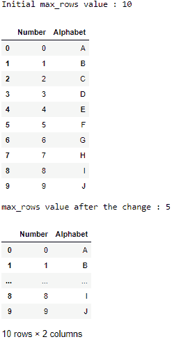
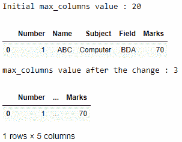

# Python 中 Pandas.set_option()函数

> 原文:[https://www . geesforgeks . org/pandas-set _ option-python 中的函数/](https://www.geeksforgeeks.org/pandas-set_option-function-in-python/)

熊猫有一个选项系统，可以让你定制它行为的某些方面，显示相关的选项是用户最有可能调整的。让我们看看如何设置指定选项的值。

## set_option()

> **语法:** pandas.set_option(pat，value)
> 
> **参数:**
> 
> *   **pat :** Regexp，应该匹配单个选项。
> *   **值:**期权的新值。
> 
> **返回:**无
> T3】加注:选项如果不存在该选项，则出现错误

**示例 1 :** 使用 `display.max_rows`更改要显示的行数。

```py
# importing the module
import pandas as pd

# creating the DataFrame
data = {"Number" : [0, 1, 2, 3, 4, 
                    5, 6, 7, 8, 9],
        "Alphabet" : ['A', 'B', 'C', 'D', 'E', 
                      'F', 'G', 'H', 'I', 'J']}
df = pd.DataFrame(data)

print("Initial max_rows value : " + 
      str(pd.options.display.max_rows))

# displaying the DataFrame
display(df)

# changing the max_rows value
pd.set_option("display.max_rows", 5)

print("max_rows value after the change : " + 
      str(pd.options.display.max_rows))

# displaying the DataFrame
display(df)
```

**输出:**


**示例 2 :** 使用 `display.max_columns`更改要显示的列数。

```py
# importing the module
import pandas as pd

# creating the DataFrame
data = {"Number" : 1,
        "Name" : ["ABC"],
        "Subject" : ["Computer"],
        "Field" : ["BDA"],
        "Marks" : 70}
df = pd.DataFrame(data)

print("Initial max_columns value : " + 
      str(pd.options.display.max_columns))

# displaying the DataFrame
display(df)

# changing the max_columns value
pd.set_option("display.max_columns", 3)

print("max_columns value after the change : " + 
      str(pd.options.display.max_columns))

# displaying the DataFrame
display(df)
```

**输出:**
