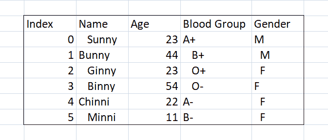
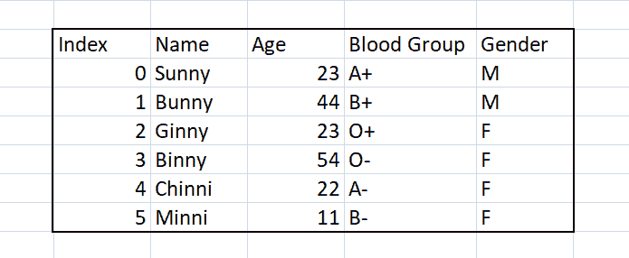

# 熊猫–从整个数据框中去除空白

> 原文:[https://www . geesforgeks . org/pandas-strip-white-from-all-data frame/](https://www.geeksforgeeks.org/pandas-strip-whitespace-from-entire-dataframe/)

“我们可以有数据而没有信息，但我们不能有信息而没有数据。”这句话多美啊。数据是数据科学家的支柱，根据一项调查，数据科学家花费大约 60%的时间来清理和组织数据，因此我们有责任让我们熟悉不同的技术，以更好的方式组织数据。在本文中，我们将了解从整个数据帧中移除额外空白的不同方法。这里使用的数据集如下所示:



在上图中，我们观察到在“姓名”、“年龄”、“血型”和“性别”列中，数据是不规则的。在特定列的大多数单元格中，额外的空白出现在值的前导部分。因此，我们的目标是移除所有多余的空白，并以系统的方式组织它。我们将使用不同的方法，这将有助于我们消除细胞的所有额外空间。不同的方法有:

```py
Using Strip() function
Using Skipinitialspace 
Using replace function 
Using Converters
```

## 去除多余空白的不同方法

**方法 1:使用 Strip()函数:**

熊猫提供预定义方法**“熊猫。Series.str.strip()"** 删除字符串中的空白。使用 strip 函数，我们可以很容易地从开头和结尾的空格中删除多余的空格。它返回对象的系列或索引。它采用我们想要从字符串的头部和尾部(前导和尾随字符)移除的一组字符。默认情况下，它是无，如果我们不传递任何字符，那么它将从字符串中删除前导和尾随空白。它返回对象的系列或索引。

> **语法:**熊猫。Series.str.strip(to_strip =无)
> 
> **说明:**取我们要从字符串头尾去掉的一组字符(前导和尾随字符)。
> 
> **参数:**默认为无，如果我们不传递任何字符，那么它将删除字符串的前导和尾随空白。它返回对象的序列或索引。

**示例:**

## 蟒蛇 3

```py
# importing library
import pandas as pd

# Creating dataframe
df = pd.DataFrame({'Names' : [' Sunny','Bunny','Ginny ',' Binny ',' Chinni','Minni'],
                    'Age' : [23,44,23,54,22,11],
                    'Blood Group' : [' A+',' B+','O+','O-',' A-','B-'],
                   'Gender' : [' M',' M','F','F','F',' F']
                  })

# As dataset having lot of extra spaces in cell so lets remove them using strip() function
df['Names'].str.strip()
df['Blood Group'].str.strip()
df['Gender'].str.strip()

# Printing dataframe
print(df)
```

**输出:**



**方法 2:使用 Skipinitialspace :**

它不是任何方法，但它是熊猫中 read_csv()方法中的参数之一。在 **pandas.read_csv()** 方法**中存在 skipinial space**参数，使用该参数我们可以跳过整个数据帧中存在的初始空间。默认情况下，它为假，将其设为真以删除额外空间。

> **语法:**pandas . read _ CSV(' path _ of _ CSV _ file '，**skipinialispace = True**)
> 
> #默认情况下，skipinitialspace 的值为 False，使用此参数时将其设为 True。

**示例:**

## 蟒蛇 3

```py
# importing library
import pandas as pd

# reading csv file and at a same time using skipinitial attribute which will remove extra space
df = pd.read_csv('\\student_data.csv', skipinitialspace = True)

# printing dataset
print(df)
```

**输出:**


**方法** **3:使用替换功能:**

使用 replace()函数，我们还可以从数据帧中移除额外的空白。熊猫提供预定义方法**“熊猫。Series.str.replace()"** 删除空白。它的程序将与 strip()方法程序相同，唯一的区别是，这里我们将在 strip()的地方使用 replace 函数。

```py
Syntax : pandas.Series.str.replace(' ', '')
```

**示例:**

## 蟒蛇 3

```py
# importing library
import pandas as pd

# Creating dataframe
df = pd.DataFrame({'Name' : [' Sunny','Bunny','Ginny ',' Binny ',' Chinni','Minni'],
                    'Age' : [23,44,23,54,22,11],
                    'Blood Group' : [' A+',' B+','O+','O-',' A-','B-'],
                   'Gender' : [' M',' M','F','F','F',' F']
                  })

# As dataset having lot of extra spaces in cell so lets remove them using strip() function
df['Names'].str.replace(' ', '')
df['Blood Group'].str.replace(' ', '')
df['Gender'].str.replace(' ', '')

# Printing dataframe
print(df)
```

**输出:**


**方法 4:使用转换器:**

它类似于 skipinitialspace，是熊猫预定义方法名“read_csv”中存在的参数之一。它用于在特定的列上应用不同的函数。我们必须在字典中传递函数。这里我们将直接传递 strip()函数，它将在读取 csv 文件时移除额外的空间。

> **语法:**PD . read _ CSV(“path _ of _ file”，converters = { ' column _ name ':function _ name })
> 
> #传递函数和列名的字典，其中列名作为唯一键，函数作为值。

**示例:**

## 蟒蛇 3

```py
# importing library
import pandas as pd

# reading csv file and at a same time using converters attribute which will remove extra space
df = pd.read_csv('\\student_data.csv', converters={'Name': str.strip(),
                                                'Blood Group' : str.strip(),
                                                'Gender' : str.strip() } )

# printing dataset
print(df)
```

**输出:**


**通过创建一些代码从整个数据帧中移除额外的空白:**

## 蟒蛇 3

```py
# Importing required libraries
import pandas as pd

# Creating DataFrame having 4 columns and but
# the data is in unregularized way.
df = pd.DataFrame({'Names': [' Sunny', 'Bunny', 'Ginny ',
                             ' Binny ', ' Chinni', 'Minni'],

                   'Age': [23, 44, 23, 54, 22, 11],

                   'Blood_Group': [' A+', ' B+', 'O+', 'O-',
                                   ' A-', 'B-'],

                   'Gender': [' M', ' M', 'F', 'F', 'F', ' F']
                   })

# Creating a function which will remove extra leading
# and tailing whitespace from the data.
# pass dataframe as a parameter here
def whitespace_remover(dataframe):

    # iterating over the columns
    for i in dataframe.columns:

        # checking datatype of each columns
        if dataframe[i].dtype == 'object':

            # applying strip function on column
            dataframe[i] = dataframe[i].map(str.strip)
        else:

            # if condn. is False then it will do nothing.
            pass

# applying whitespace_remover function on dataframe
whitespace_remover(df)

# printing dataframe
print(df)
```

在上面第一行的代码片段中，我们导入了所需的库，这里 pandas 用于对数据执行读、写和许多其他操作，然后我们使用 pandas 创建了一个数据框，该数据框具有 4 列**【姓名】、** **【年龄】**、**【血型】**和**【性别】**。几乎所有的列都有不规则的数据。现在主要部分从这里开始，我们创建了一个函数，它将从数据中移除额外的前导和尾随空白。该函数以数据帧为参数，检查每一列的数据类型，如果列的数据类型是“对象”，则在该列上应用 pandas 库中预定义的 strip 函数，否则它什么也不做。然后在下一行中，我们对 dataframe 应用空白 _remover()函数，该函数成功地从列中移除了多余的空白。

**输出:**

