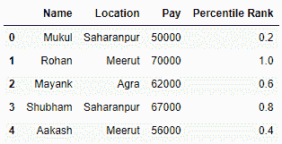
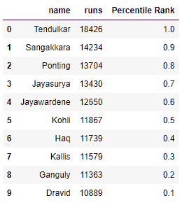

# 熊猫数据框中某列的百分位数等级

> 原文:[https://www . geeksforgeeks . org/percent-熊猫一栏排名-dataframe/](https://www.geeksforgeeks.org/percentile-rank-of-a-column-in-a-pandas-dataframe/)

让我们看看如何在熊猫数据框中找到一列的百分位数。我们将使用带有参数`pct = True`的`**[rank()](https://www.geeksforgeeks.org/python-pandas-dataframe-rank/)**`函数来找到百分位数。

**例 1 :**

```
# import the module
import pandas as pd 

# create a DataFrame 
data = {'Name': ['Mukul', 'Rohan', 'Mayank', 
                 'Shubham', 'Aakash'],
        'Location' : ['Saharanpur', 'Meerut', 'Agra', 
                      'Saharanpur', 'Meerut'],
        'Pay' : [50000, 70000, 62000, 67000, 56000]} 
df = pd.DataFrame(data)  

# create a new column of percentile rank
df['Percentile Rank'] = df.Pay.rank(pct = True)

# displaying the percentile rank
display(df) 
```

**输出:**


**例 2 :**

```
# import the module
import pandas as pd 

# create a DataFrame 
ODI_runs = {'name': ['Tendulkar', 'Sangakkara', 'Ponting', 
                      'Jayasurya', 'Jayawardene', 'Kohli', 
                      'Haq', 'Kallis', 'Ganguly', 'Dravid'], 
            'runs': [18426, 14234, 13704, 13430, 12650, 
                     11867, 11739, 11579, 11363, 10889]} 
df = pd.DataFrame(ODI_runs)  

# create a new column of percentile rank
df['Percentile Rank'] = df.runs.rank(pct = True)

# displaying the percentile rank
display(df) 
```

**输出:**
