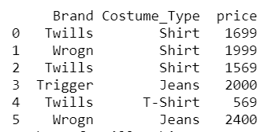
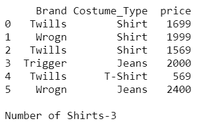
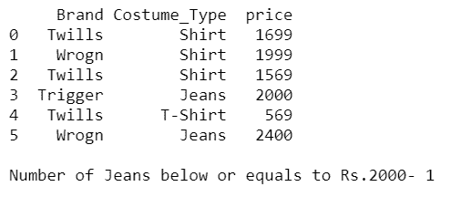

# 像蟒蛇熊猫里的 countifs 一样表演 Excel】

> 原文:[https://www . geesforgeks . org/performance-excel-like-countifs-in-python-pandas/](https://www.geeksforgeeks.org/performing-excel-like-countifs-in-python-pandas/)

在这篇文章中，我们在熊猫中表演了一个类似 excel 的 countifs。在 Excel 中，数据是表格的形式，所以我们可以执行许多算术运算，如值的总和、平均值和行数等。通过在指定的列上指定条件。同样，我们可以在 Python 中对熊猫数据帧执行所有这些操作。因为数据框还以表格格式维护数据。

## **计数器**

这是一种通过指定一个或多个条件(与在在线购物应用程序中应用过滤器相同)来查找行数以获得所需结果的操作。有一些类似的方法，如 count()，如 sum()，mean()，等。用于相应地求出数据的总和和数据的平均值。

**示例 1:** 在熊猫中执行类似 excel 的计数

## 蟒蛇 3

```
# import necessary packages
import pandas as pd

# create a dataframe
costumes = pd.DataFrame({'Brand': ['Twills', 'Wrogn',
                                   'Twills', 'Trigger',
                                   'Twills', 'Wrogn', ],
                         'Costume_Type': ['Shirt', 'Shirt',
                                          'Shirt', 'Jeans',
                                          'T-Shirt', 'Jeans'],
                         'price': [1699, 1999, 1569,
                                   2000, 569, 2400]})

# DataFrame
print(costumes)

# find count of Twills Shirts
twills_Shirt_Count = costumes.query('Brand=="Twills" \
& Costume_Type=="Shirt"')['Costume_Type'].count()

print('Number of Twills Shirts-', end="")
print(twills_Shirt_Count)
```

**输出:**

```
Number of Twills Shirts-2
```



**解释:**因为我们有 3 件 Twills 品牌的物品，但是在这 3 件物品中，我们有 2 件衣服的类型是衬衫，所以结果它返回了 2 件。

**示例 2:** 这里我们也使用上面相同的数据框，但是不查找 Twills 品牌衬衫的数量，而是查找任何品牌的衬衫数量。

## 蟒蛇 3

```
# import necessary packages
import pandas as pd

# create a dataframe
costumes = pd.DataFrame({'Brand': ['Twills', 'Wrogn', 
                                   'Twills', 'Trigger',
                                   'Twills', 'Wrogn', ],
                         'Costume_Type': ['Shirt', 'Shirt',
                                          'Shirt', 'Jeans', 
                                          'T-Shirt', 'Jeans'],
                         'price': [1699, 1999, 1569, 
                                   2000, 569, 2400]})

# DataFrame
print(costumes)

# find count of Twills Shirts
Shirt_Count = costumes.query('Costume_Type=="Shirt"')
['Costume_Type'].count()

print('\nNumber of Shirts-', end="")
print(Shirt_Count)
```

**输出:**



**例 3:** 使用上面的服装数据框找到价格小于等于 2000 的牛仔裤的数量

## 蟒蛇 3

```
# import necessary packages
import pandas as pd

# create a dataframe
costumes = pd.DataFrame({'Brand': ['Twills', 'Wrogn',
                                   'Twills', 'Trigger', 
                                   'Twills', 'Wrogn', ],
                         'Costume_Type': ['Shirt', 'Shirt', 
                                          'Shirt', 'Jeans', 
                                          'T-Shirt', 'Jeans'],
                         'price': [1699, 1999, 1569,
                                   2000, 569, 2400]})

# DataFrame
print(costumes)

# find count of Twills Shirts
Jeans_Count = costumes.query('Costume_Type=="Jeans" & price<=2000')[
    'Costume_Type'].count()

print('\nNumber of Jeans below or equals to Rs.2000-', end=" ")
print(Jeans_Count)
```

**输出:**

