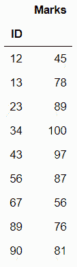
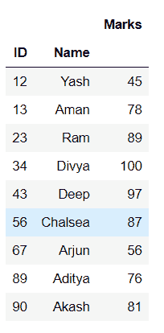
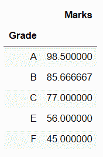

# 熊猫的数据透视表

> 原文:[https://www.geeksforgeeks.org/pivot-tables-in-pandas/](https://www.geeksforgeeks.org/pivot-tables-in-pandas/)

在本文中，我们将看到熊猫中的数据透视表。让我们讨论一些概念:

**Pandas :** Pandas 是一个开源库，建立在 NumPy 库之上。它是一个 Python 包，提供了各种数据结构和操作来操作数字数据和时间序列。它主要是流行的，因为导入和分析数据容易得多。熊猫速度快，对用户来说具有高性能&生产力。

**数据透视表:**数据透视表是一个统计表格，它汇总了更广泛的表格(例如来自数据库、电子表格或商业智能程序)的数据。该汇总可能包括总和、平均值或其他统计数据，数据透视表以有意义的方式将这些数据组合在一起。

### 所需步骤

*   导入库(熊猫)
*   导入/加载/创建数据。
*   对不同的变量使用 Pandas.pivot_table()方法。

在这里，我们将讨论下面所示的数据框上的透视表的一些变体:

## 蟒蛇 3

```py
# import packages
import pandas as pd

# create data
df = pd.DataFrame({'ID': {0: 23, 1: 43, 2: 12, 
                          3: 13, 4: 67, 5: 89,
                          6: 90, 7: 56, 8: 34},

                 'Name': {0: 'Ram', 1: 'Deep', 2: 'Yash',
                          3: 'Aman', 4: 'Arjun', 5: 'Aditya',
                          6: 'Akash', 7: 'Chalsea',
                          8: 'Divya'},

                 'Marks': {0: 89, 1: 97, 2: 45,
                           3: 78, 4: 56, 5: 76,
                           6: 81, 7: 87, 8: 100},

                 'Grade': {0: 'B', 1: 'A', 2: 'F',
                           3: 'C', 4: 'E', 5: 'C',
                           6: 'B', 7: 'B', 8: 'A'}})

# view data
display(df)
```

**输出:**


**例 pivot _ table()方法的简单使用。**

## 蟒蛇 3

```py
# import packages
import pandas as pd

# create data
df = pd.DataFrame({'ID': {0: 23, 1: 43, 2: 12, 
                          3: 13, 4: 67, 5: 89,
                          6: 90, 7: 56, 8: 34},

                 'Name': {0: 'Ram', 1: 'Deep', 2: 'Yash',
                          3: 'Aman', 4: 'Arjun', 5: 'Aditya',
                          6: 'Akash', 7: 'Chalsea',
                          8: 'Divya'},

                 'Marks': {0: 89, 1: 97, 2: 45,
                           3: 78, 4: 56, 5: 76,
                           6: 81, 7: 87, 8: 100},

                 'Grade': {0: 'B', 1: 'A', 2: 'F',
                           3: 'C', 4: 'E', 5: 'C',
                           6: 'B', 7: 'B', 8: 'A'}})

# simple use pivot_table() method
print(pd.pivot_table(df, index = ["ID"]))
```

**输出:**



**例 2:多列索引的透视表。**

## 蟒蛇 3

```py
# import packages
import pandas as pd

# create data
df = pd.DataFrame({'ID': {0: 23, 1: 43, 2: 12, 
                          3: 13, 4: 67, 5: 89,
                          6: 90, 7: 56, 8: 34},

                 'Name': {0: 'Ram', 1: 'Deep', 2: 'Yash',
                          3: 'Aman', 4: 'Arjun', 5: 'Aditya',
                          6: 'Akash', 7: 'Chalsea',
                          8: 'Divya'},

                 'Marks': {0: 89, 1: 97, 2: 45,
                           3: 78, 4: 56, 5: 76,
                           6: 81, 7: 87, 8: 100},

                 'Grade': {0: 'B', 1: 'A', 2: 'F',
                           3: 'C', 4: 'E', 5: 'C',
                           6: 'B', 7: 'B', 8: 'A'}})
# multiple columns with 
# pivot_table() method
display(pd.pivot_table(df, 
                     index = ["ID", "Name"]))
```

**输出:**



**示例 3:带有** **聚合函数的透视表。**

## 蟒蛇 3

```py
# import packages
import pandas as pd
import numpy as np

# create data
df = pd.DataFrame({'ID': {0: 23, 1: 43, 2: 12,
                          3: 13, 4: 67, 5: 89, 
                          6: 90, 7: 56, 8: 34},

                   'Name': {0: 'Ram', 1: 'Deep',
                            2: 'Yash', 3: 'Aman',
                            4: 'Arjun', 5: 'Aditya',
                            6: 'Akash',7: 'Chalsea',
                            8: 'Divya'},

                   'Marks': {0: 89, 1: 97, 2: 45, 
                             3: 78, 4: 56, 5: 76,
                             6: 81, 7: 87, 8: 100},

                   'Grade': {0: 'B', 1: 'A', 2: 'F', 3: 'C',
                             4: 'E', 5: 'C', 6: 'B', 7: 'B',
                             8: 'A'}})

# Pivot Table with mean 
# aggregate function on marks
display(pd.pivot_table(df,
                     index = ["Grade"],
                     values = ["Marks"],
                     aggfunc = np.mean))
```

**输出:**

