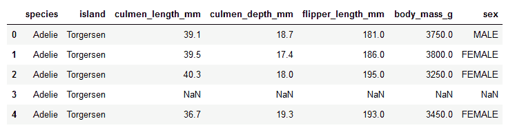
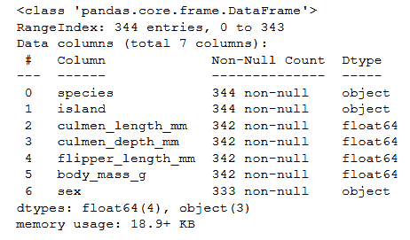
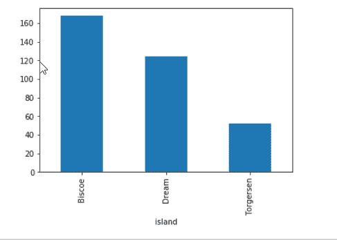
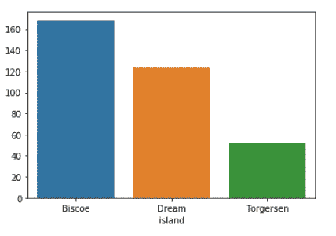

# 绘制熊猫中一组对象中每组的大小

> 原文:[https://www . geesforgeks . org/plot-每组中每组的大小-熊猫中的物体/](https://www.geeksforgeeks.org/plot-the-size-of-each-group-in-a-groupby-object-in-pandas/)

pandas[data frame . group by()](https://www.geeksforgeeks.org/python-pandas-dataframe-groupby/)函数是库中最有用的函数之一，它根据列/条件将数据分成组，然后应用一些操作，例如 size()，计算每个组中的条目/行数。groupby()也可以应用于系列。

> **语法:** DataFrame.groupby(by=None，axis=0，level=None，as_index=True，sort=True，group_keys=True，crush = False，**kwargs)
> **参数:**
> **by :** 映射、函数、str 或可迭代
> **axis :** int，缺省值 0
> **level :** 如果 axis multi index(分层)，则按特定级别或仅与数据帧输入相关。as_index=False 实际上是“SQL 风格”的分组输出
> **排序:**排序组键。关闭此功能可以获得更好的性能。请注意，这不会影响各组内的观察顺序。groupby 保留每个组中的行顺序。
> **group_keys :** 调用 apply 时，将组合键添加到索引中以识别片段
> **挤压:**如果可能，减少返回类型的维数，否则返回一致类型
> **返回:** GroupBy 对象

在下面的例子中，我们将使用两个库**海鸟**和**熊猫**，其中海鸟用于绘图，熊猫用于读取数据。我们将使用 seaborn 的 load_dataset()方法来加载企鹅. csv 数据集。

## 蟒蛇 3

```
# import the module
import seaborn as sns
dataset = sns.load_dataset('penguins')

# displaying the data
print(dataset.head())
```

**输出:**



数据集的前五行

使用 **info()** 方法获得更多关于数据集的信息

## 蟒蛇 3

```
# display the number of columns and their data types
dataset.info()
```

**输出:**



关于数据集的信息

我们将根据【T2 岛】使用 **groupby()** 方法对数据进行分组并绘制。

使用熊猫绘图:

## 蟒蛇 3

```
# apply groupby on the island column
# plotting
dataset.groupby(['island']).size().plot(kind = "bar")
```



使用熊猫绘制 groupby()大小的图

使用海鸟绘图

## 蟒蛇 3

```
# use the groupby() function to group island column
# and apply size() function
# size() is equivalent to counting the distinct rows
result = dataset.groupby(['island']).size()

# plot the result
sns.barplot(x = result.index, y = result.values)
```



使用
海底
绘制尺寸图