# 蟒蛇–熊猫的竹子库

> 原文:[https://www.geeksforgeeks.org/python-bamboolib-for-pandas/](https://www.geeksforgeeks.org/python-bamboolib-for-pandas/)

如果你是一个数据科学爱好者或数据科学家，你知道熊猫是一个不可或缺的库，允许你执行数据争论，在那里你可以读取你的数据，预处理你的数据，处理丢失的数据等。在建立机器学习模型之前。

熊猫确实让很多工作变得非常容易，并且非常强大，但是使用和掌握它是一个巨大的挑战。为了解决这个问题，让熊猫的使用更加方便，我们有一个 python 库，叫做**bambo lib 库**。

**Bubberlib:**这是熊猫数据框的图形用户界面扩展，便于数据探索和转换，使任何人都可以在 Jupyter 笔记本或 JupyterLab 中使用 Python。

让我们看看这个库的一些功能以及如何使用它们。

**注:**bambo lib 仅在 Kaggle 和 Binder 上免费提供，用于开放数据。你也可以在电脑上使用付费版本。

**安装 Bamboolib 库:**
开始之前我们需要先安装库。按照以下步骤正确安装库。

```py
#install bamboolib on linux or anaconda prompt
 pip install bamboolib

```

*   如果你想在 Kaggle 或 Binder 上使用库，你可以在这一步停止，否则继续-

安装完成后，运行以下命令:

```py
jupyter nbextension enable --py qgrid --sys-prefix
jupyter nbextension enable --py widgetsnbextension --sys-prefix
jupyter nbextension install --py bamboolib --sys-prefix
jupyter nbextension enable --py bamboolib --sys-prefix

```

如果你想在 Jupyter 笔记本上使用这个，那么你可以在这里停止，但是如果你也想在 JupyterLab 上使用这个，你可以继续按照步骤完成安装。
确保安装了`node.js`和`npm`。

```py
#install nodejs on anaconda prompt
 conda install -c conda-forge nodejs
#install npm on anaconda prompt
 pip install npm

```

Next run these commands:

```py
jupyter labextension install @jupyter-widgets/jupyterlab-manager --no-build
jupyter labextension install @8080labs/qgrid --no-build
jupyter labextension install plotlywidget --no-build
jupyter labextension install jupyterlab-plotly --no-build
jupyter labextension install bamboolib --no-build

jupyter lab build --minimize=False

```

现在安装完成了。

**如何使用 bambo lib:**
要了解如何使用这个库，我们将使用 Binder。为此浏览至 [github。](https://github.com/8080labs/bamboolib_binder_template/blob/master/create_your_own_binder.md)您也可以按照上面提到的步骤制作自己的活页夹笔记本，或者像我们在这里所做的那样使用已经可用的笔记本。
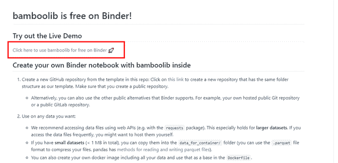
在你的笔记本打开后运行下面的代码来可视化数据:
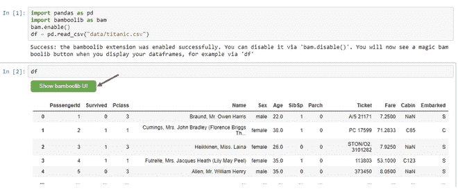
现在你可以使用 Show bamboolib UI 按钮来执行各种功能。

您主要可以看到 3 个选项:

1.  探索数据框
2.  创建绘图
3.  搜索转换

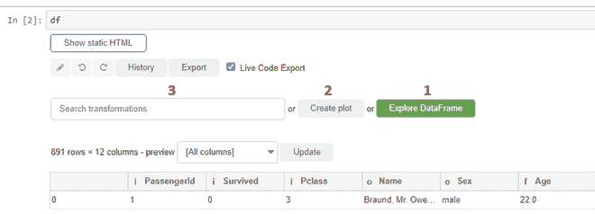

**1)探索数据框:**
您有 4 个选项可用，即:

1.  **惊鸿一瞥:**在这里，您可以获得数据集中各列的信息。您可以知道列的数据类型、唯一值的数量、一列中“n”行中缺少的值，这里 n=891。
    T3】
2.  **列:**提供每一列的信息。特定列的**概览**、**类别概览**–特定值在该列中出现的次数。
    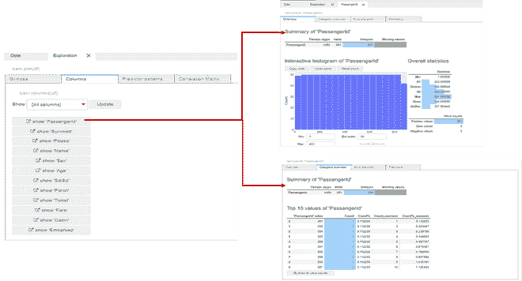
    这也提供了两列之间的**二元图**，以获得关于数据集的更多信息。
    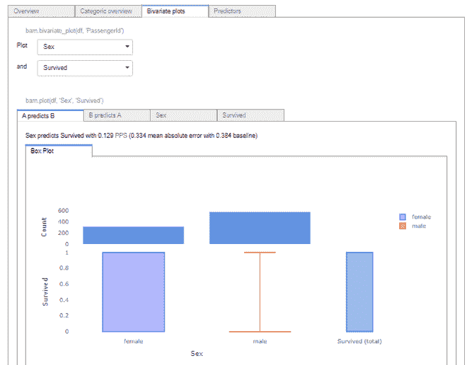
3.  **预测模式:**你可以通过点击热图的任意一个单元格来预测数据集的模式，从而得到各列之间的关系。
    T3】
4.  **相关矩阵:**可以得到任意一列之间的相关矩阵。
    T3】

**2)创建图:**
您可以创建任何图，如条形图、直方图、散点图等。并且可以添加不同的属性。熊猫开发剧情的代码也是可用的，你也可以复制粘贴得到同样的输出。
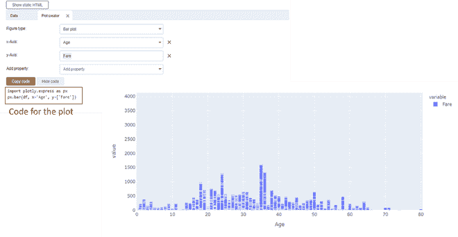

**3)搜索变换:**
可以对数据集进行各种变换。少数几个是:

**删除列:**因为在使用的数据集中，我们可以看到 Cabin 有大量的缺失值，所以我们可以从数据集中删除/删除该列。选择选择或删除列选项，填充字段，然后按执行。
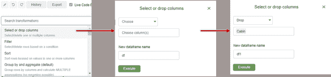
您会自动获得 pandas 代码，并为您执行的转换执行该代码。新的数据帧显示为输出。
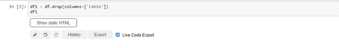
**过滤器:**使用此选项，您可以创建数据子集，以应用特定条件对其进行分析。这是在数据中获得有意义见解的最常用的技术。在这里，我们过滤了“年龄”列上的数据集，以访问年龄为> 25 的记录。
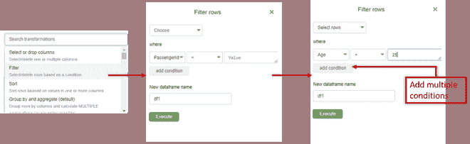
新数据帧显示为输出。

**排序:**您可以使用此转换对列上的数据集进行排序。也可以同时对多列进行排序。这里，我们已经按照升序对“名称”列中的数据进行了排序。
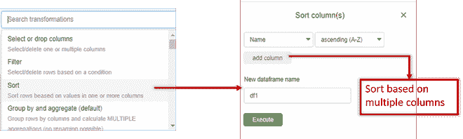
**注:**

*   要撤销或重做对数据帧执行的任何转换，您可以单击**历史按钮**。
*   要获取上一次转换的代码，请转到**导出**。如果选中了实时代码导出，那么您将自动获得代码。

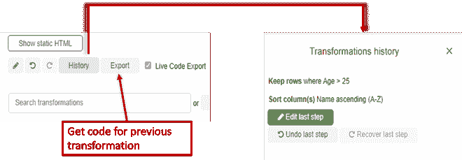
bambo lib 提供了许多其他转换选项，如**分组和聚合**、**重命名列**、**替换值**、更改列数据类型等。

**使用 Bamboolib 的好处:**
Bamboolib 是一个非常方便易用的工具。庞大数据框架的转换可以在短时间内完成。这对于组织来说是很棒的，因为几乎没有编程知识的员工也可以使用这个工具，而无需费力或查找语法来完成任务，并且可以在之后获得操作或转换的语法。这对程序员来说也很有帮助，因为他们可以处理数据并研究用户特定问题的语法，而不是查找不同的情况并试图提取所需的结果。

既然你已经学会了这个神奇的动手工具，那就自己试一试，探索一下你的数据所能提供的隐藏信息。如有任何疑问，请在下面留言。