# Python–使用虹膜数据集的熊猫基础知识

> 原文:[https://www . geesforgeks . org/python-熊猫基础知识-使用-iris-dataset/](https://www.geeksforgeeks.org/python-basics-of-pandas-using-iris-dataset/)

Python 语言是最流行的编程语言之一，因为它比其他语言更具动态性。Python 是一种简单的高级语言，也是一种用于通用编程的开源语言。它有许多开源库，熊猫就是其中之一。Pandas 是一个强大、快速、灵活的开源库，用于数据分析和数据框/数据集的操作。熊猫可以用来读写不同格式的数据，如 CSV(逗号分隔值)、txt、xls(微软 Excel)等。
在这篇文章中，你将学习 Python 中 Pandas 的各种特性，以及如何使用它来练习。
**先决条件:**Python 编码基础知识。
**安装:**
所以如果你是新手练熊猫，那么首先你应该在你的系统上安装熊猫。
进入命令提示符，以管理员身份运行。请确保您连接了互联网连接，以便在您的系统上下载并安装它。
然后输入“ **pip 安装熊猫**，然后按回车键。

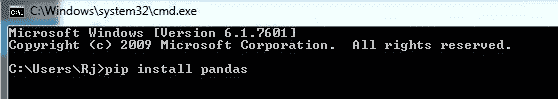

从[下载数据集**【Iris . CSV】**这里](https://datahub.io/machine-learning/iris)
**Iris 数据集**是数据科学的 Hello World，所以如果你已经开始了数据科学和机器学习的职业生涯，你将在这个著名的数据集上练习基本的 ML 算法。虹膜数据集包含花瓣长度、花瓣宽度、萼片长度、萼片宽度和物种类型五列。
鸢尾是一种开花植物，研究人员测量了不同鸢尾花的各种特征并进行数字化记录。

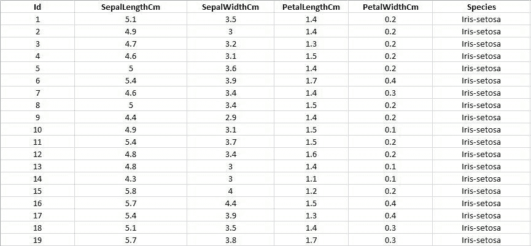

**熊猫入门:**
**代码:导入熊猫作为 pd 在我们的代码中使用。**

## 蟒蛇 3

```
import pandas as pd
```

**代码:读取数据集“Iris.csv”。**

## 蟒蛇 3

```
data = pd.read_csv("your downloaded dataset location ")
```

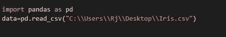

**代码:用列向上显示数据集的前几行**
函数 head()将显示数据集的前几行，这个函数的默认值是 5，也就是说，当没有参数给它时，它将显示前 5 行。

## 蟒蛇 3

```
data.head()
```

**输出:**

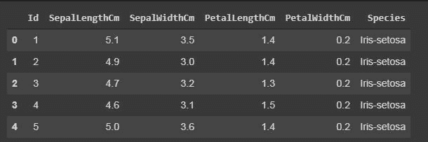

**随机显示行数。**
在 sample()函数中，它也会根据给定的参数显示行，但是会随机显示行。

## 蟒蛇 3

```
data.sample(10)
```

**输出:**

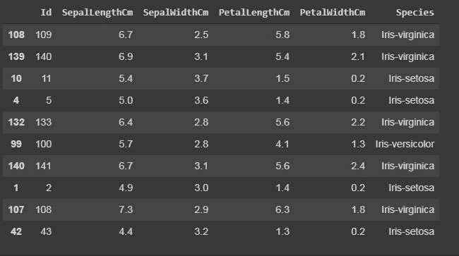

**代码:显示列数和列名。**
column()函数以列表形式打印数据集的所有列。

## 蟒蛇 3

```
data.columns
```

**输出:**

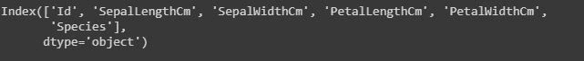

**代码:显示数据集的形状。**
数据集的形状意味着打印该特定数据集的总行数或条目数以及总列数或要素数。

## 蟒蛇 3

```
#The first one is the number of rows and
# the other one is the number of columns.
data.shape
```

**输出:**

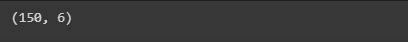

**代码:显示整个数据集**

## 蟒蛇 3

```
print(data)
```

**输出:**


**代码:切片行。**
切片是指如果你想打印或处理从第 10 行到第 20 行的一组特定行。

## 蟒蛇 3

```
#data[start:end]
#start is inclusive whereas end is exclusive
print(data[10:21])
# it will print the rows from 10 to 20.

# you can also save it in a variable for further use in analysis
sliced_data=data[10:21]
print(sliced_data)
```

**输出:**

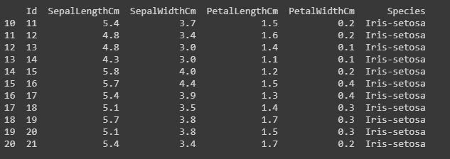

**代码:仅显示特定列。**
在任何数据集中，有时只需要处理特定的要素或列，因此我们可以通过以下代码来完成。

## 蟒蛇 3

```
#here in the case of Iris dataset
#we will save it in a another variable named "specific_data"

specific_data=data[["Id","Species"]]
#data[["column_name1","column_name2","column_name3"]]

#now we will print the first 10 columns of the specific_data dataframe.
print(specific_data.head(10))
```

**输出:**

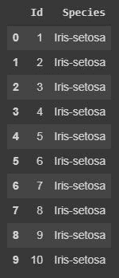

**过滤:使用“iloc”和“loc”功能显示特定行。**

“loc”函数使用行的索引名来显示数据集的特定行。
“iloc”函数使用行的索引整数，该整数给出关于该行的完整信息。
**代号:**

## 蟒蛇 3

```
#here we will use iloc

data.iloc[5]
#it will display records only with species "Iris-setosa".
data.loc[data["Species"] == "Iris-setosa"]
```

**输出:**

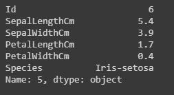

iloc（）[/caption]

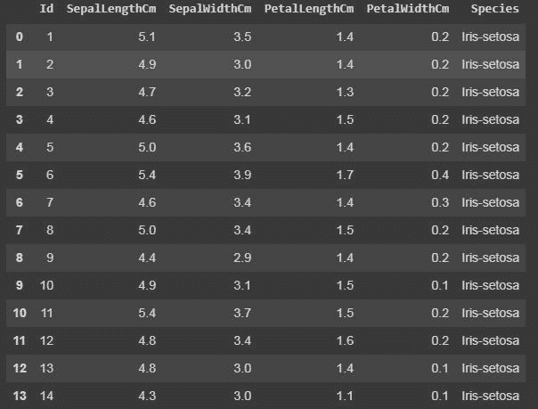

loc()

**代码:使用“value_counts()”统计唯一值的计数次数。**
value _ counts()函数计算特定实例或数据出现的次数。

## 蟒蛇 3

```
#In this dataset we will work on the Species column, it will count number of times a particular species has occurred.
data["Species"].value_counts()
#it will display in descending order.
```

**输出:**

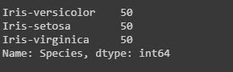

**计算特定列的总和、平均值和模式。**
我们还可以计算任意整数列的和、均值和模，就像我在下面的代码中所做的那样。

## 蟒蛇 3

```
# data["column_name"].sum()

sum_data = data["SepalLengthCm"].sum()
mean_data = data["SepalLengthCm"].mean()
median_data = data["SepalLengthCm"].median()

print("Sum:",sum_data, "\nMean:", mean_data, "\nMedian:",median_data)
```

**输出:**

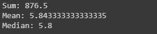

**代码:从一列中提取最小值和最大值。**
从特定的列或行中识别最小和最大整数也可以在数据集中完成。

## 蟒蛇 3

```
min_data=data["SepalLengthCm"].min()
max_data=data["SepalLengthCm"].max()

print("Minimum:",min_data, "\nMaximum:", max_data)
```

**输出:**

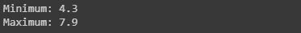

**代码:向数据集添加一列。**
如果想要在我们的数据集中添加一个新的列，就像我们在做任何计算或者从数据集中提取一些信息一样，并且如果想要保存它一个新的列。这可以通过下面的代码来实现，我们将所有列的所有整数值相加。

## 蟒蛇 3

```
# For example, if we want to add a column let say "total_values",
# that means if you want to add all the integer value of that particular
# row and get total answer in the new column "total_values".
# first we will extract the columns which have integer values.
cols = data.columns

# it will print the list of column names.
print(cols)

# we will take that columns which have integer values.
cols = cols[1:5]

# we will save it in the new dataframe variable
data1 = data[cols]

# now adding new column "total_values" to dataframe data.
data["total_values"]=data1[cols].sum(axis=1)

# here axis=1 means you are working in rows,
# whereas axis=0 means you are working in columns.
```

**输出:**

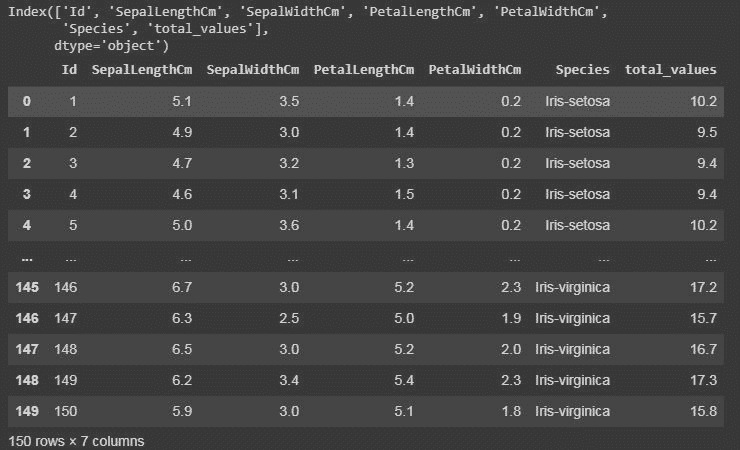

**代码:重命名列。**
在 python 熊猫库中也可以重命名我们的列名。我们使用了 rename()函数，在这里我们创建了一个字典“newcols”来更新我们的新列名。下面的代码说明了这一点。

## 蟒蛇 3

```
newcols={
"Id":"id",
"SepalLengthCm":"sepallength"
"SepalWidthCm":"sepalwidth"}

data.rename(columns=newcols,inplace=True)

print(data.head())
```

**输出:**

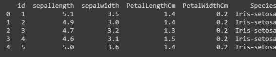

**格式和样式:**
通过使用 Dataframe.style 函数，可以将条件格式应用于您的数据帧。样式用于可视化数据，可视化数据集最方便的方式是表格形式。
这里我们将突出显示每行和每列的最小值和最大值。

## 蟒蛇 3

```
#this is an example of rendering a datagram,
which is not visualised by any styles.
data.style
```

**输出:**

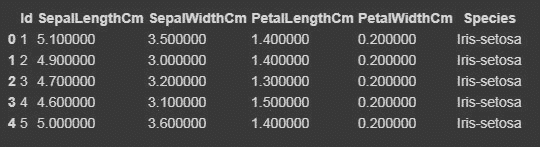

现在，我们将使用 Styler.apply 函数突出显示最大和最小列方向、行方向以及整个数据框方向。Styler.apply 函数根据关键字参数轴传递数据框的每一列或每一行。对于列方向的使用轴=0，行方向的使用轴=1，对于整个表格一次使用轴=无。

## 蟒蛇 3

```
# we will here print only the top 10 rows of the dataset,
# if you want to see the result of the whole dataset remove
#.head(10) from the below code

data.head(10).style.highlight_max(color='lightgreen', axis=0)

data.head(10).style.highlight_max(color='lightgreen', axis=1)

data.head(10).style.highlight_max(color='lightgreen', axis=None)
```

**输出:**

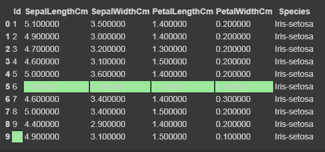

对于轴=0

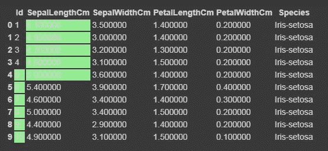

对于轴=1

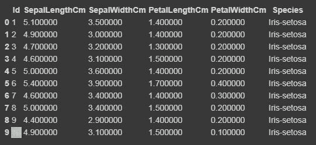

对于轴=无

**代码:清理和检测缺失值**
在这个数据集中，我们现在将尝试查找缺失值，即 NaN，这可能是由于几个原因造成的。

## 蟒蛇 3

```
data.isnull()
#if there is data is missing, it will display True else False.
```

**输出:**

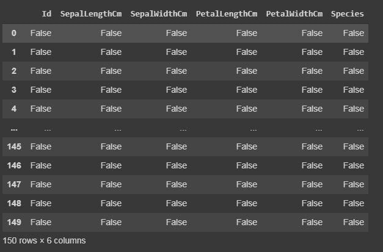

isnull()

**代码:汇总缺失值。**
我们将显示每列中有多少缺失值。

## 蟒蛇 3

```
data.isnull.sum()
```

**输出:**

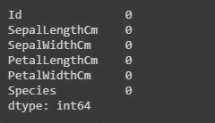

**热图:导入海底**
热图是一种数据可视化技术，用于将数据集分析为二维颜色。基本上，它显示了数据集中所有数值变量之间的相关性。热图是西伯恩图书馆的一个属性。
**代码:**

## 蟒蛇 3

```
import seaborn as sns

iris = sns.load_dataset("iris")
sns.heatmap(iris.corr(),camp = "YlGnBu", linecolor = 'white', linewidths = 1)
```

**输出:**

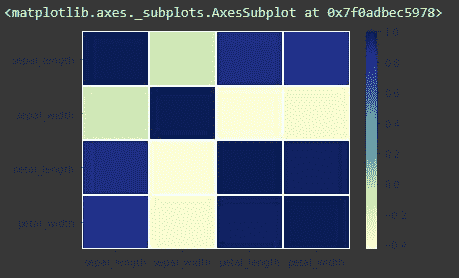

**代码:使用整数格式**
用数值标注每个单元格

## 蟒蛇 3

```
sns.heatmap(iris.corr(),camp = "YlGnBu", linecolor = 'white', linewidths = 1, annot = True )
```

**输出:**

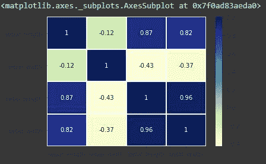

带注释的热图=真

**熊猫数据帧相关性:**
熊猫相关性用于确定数据集所有列的成对相关性。在 dataframe.corr()中，缺失的值被排除，非数字列也被忽略。
**代码:**

## 蟒蛇 3

```
data.corr(method='pearson')
```

**输出:**

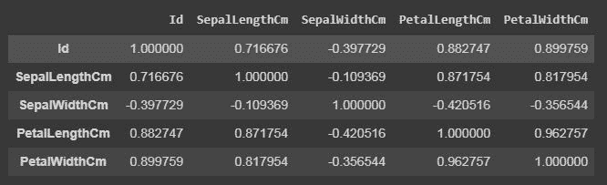

data.corr()

输出数据框可以看作对于任何单元格，行变量与列变量的相关性就是单元格的值。一个变量与其自身的相关性为 1。因此，所有对角线值都是 1.00。
**多元分析:**
配对图用于可视化每类列变量之间的关系。只用一行代码实现，如下:
**代码:**

## 蟒蛇 3

```
g = sns.pairplot(data,hue="Species")
```

**输出:**

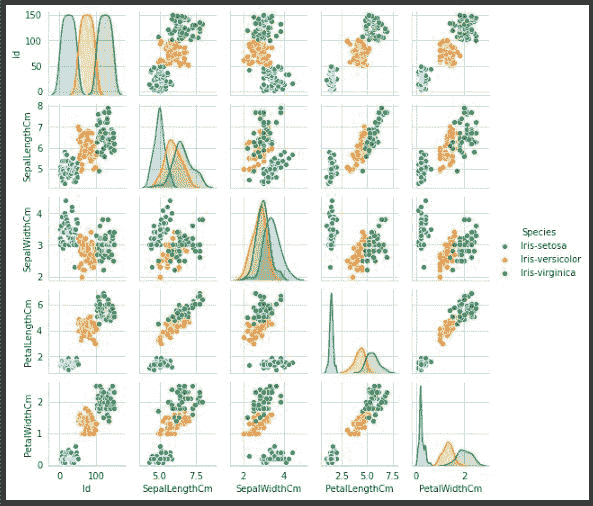

变量“物种”的配对图，使其更容易理解。