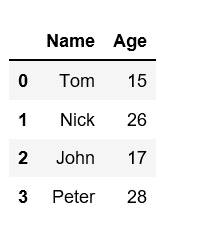
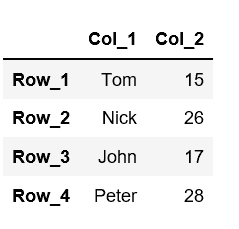
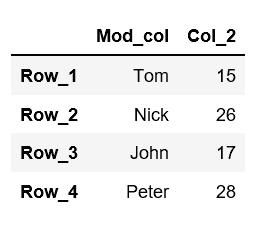
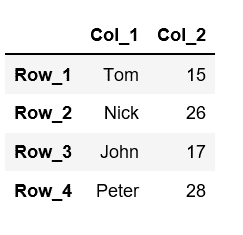
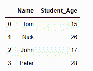
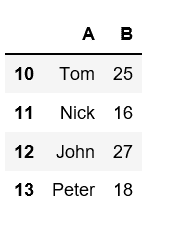
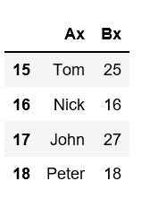

# Python |更改 Pandas DataFrame 中的列名和行索引

> 原文:[https://www . geesforgeks . org/python-change-column-name-and-row-indexes-in-pandas-data frame/](https://www.geeksforgeeks.org/python-change-column-names-and-row-indexes-in-pandas-dataframe/)

给定一个 Pandas DataFrame，让我们看看如何更改它的列名和行索引。

**关于熊猫数据框**
熊猫数据框是用来存储数据的矩形网格。当数据存储在数据框中时，很容易可视化和处理数据。

*   它由行和列组成。
*   每行是某个实例的度量，而列是包含某个特定属性/变量的数据的向量。
*   每个数据框列在任何特定列中都有同类数据，但数据框行在任何特定行中都可以包含同类或异类数据。
*   与二维数组不同，熊猫的数据框轴是有标签的。

Pandas Dataframe 类型有两个称为“列”和“索引”的属性，可用于更改列名和行索引。

**使用字典创建数据框。**

```py
# first import the libraries
import pandas as pd

# Create a dataFrame using dictionary
df=pd.DataFrame({"Name":['Tom','Nick','John','Peter'],
                 "Age":[15,26,17,28]})

# Creates a dataFrame with
# 2 columns and 4 rows
df
```



1.  **Method #1:** Changing the column name and row index using `df.columns` and `df.index` attribute.

    为了更改列名，我们提供了一个包含列名`df.columns= ['First_col', 'Second_col', 'Third_col', .....]`的 Python 列表。
    为了改变行索引，我们还提供了一个 python 列表给它`df.index=['row1', 'row2', 'row3', ......]`。

    ```py
    # Let's rename already created dataFrame.

    # Check the current column names
    # using "columns" attribute.
    # df.columns

    # Change the column names
    df.columns =['Col_1', 'Col_2']

    # Change the row indexes
    df.index = ['Row_1', 'Row_2', 'Row_3', 'Row_4']

    # printing the data frame
    df
    ```

    

2.  **Method #2:** Using `**rename()**` function with dictionary to change a single column

    ```py
    # let's change the first column name
    # from "A" to "a" using rename() function
    df = df.rename(columns = {"Col_1":"Mod_col"})

    df
    ```

    

    同时更改多个列名–

    ```py
    # We can change multiple column names by 
    # passing a dictionary of old names and 
    # new names, to the rename() function.
    df = df.rename({"Mod_col":"Col_1","B":"Col_2"}, axis='columns')

    df
    ```

    

3.  **Method #3:** Using Lambda Function to rename the columns.

    lambda 函数是一个小型匿名函数，可以接受任意数量的参数，但只能有一个表达式。使用 lambda 函数，我们可以一次修改所有的列名。让我们使用 lambda 函数在每个列名的末尾添加“x”

    ```py
    df = df.rename(columns=lambda x: x+'x')

    # this will modify all the column names
    df
    ```

    

4.  **Method #4 :** Using `values` attribute to rename the columns.

    我们可以直接在要更改名称的列上使用 values 属性。

    ```py
    df.columns.values[1] = 'Student_Age'

    # this will modify the name of the first column
    df
    ```

    

    让我们使用 Lambda 函数更改行索引。

    ```py
    # To change the row indexes
    df = pd.DataFrame({"A":['Tom','Nick','John','Peter'],
                       "B":[25,16,27,18]})

    # this will increase the row index value by 10 for each row
    df = df.rename(index = lambda x: x + 10)

    df
    ```

    

    现在，如果我们想同时更改行索引和列名，那么可以使用`rename()`函数并同时传递列和索引属性作为参数来实现。

    ```py
    df = df.rename(index = lambda x: x + 5,
                   columns = lambda x: x +'x')

    # increase all the row index label by value 5
    # append a value 'x' at the end of each column name. 
    df
    ```

    