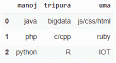
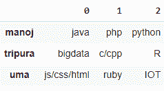

# Python–将列表字典转换为熊猫数据框

> 原文:[https://www . geesforgeks . org/python-convert-dict-of-list-to-pandas-data frame/](https://www.geeksforgeeks.org/python-convert-dict-of-list-to-pandas-dataframe/)

在这篇文章中，我们将讨论如何将列表字典转换成熊猫数据框架。

## 方法 1:使用数据框架 from_dict()

我们将使用 from_dict 方法。该方法将从类似数组或字典的字典中构造数据帧。

**语法**:

```py
pandas.DataFrame.from_dict(dictionary)
```

其中字典是输入字典

**示例:**程序以学生词典为输入，显示科目数据，然后存储在熊猫数据框中

## 蟒蛇 3

```py
# import pandas module
import pandas as pd

# create a dictionary for three subjects with list
# of three subjects for each student
data = {
    'manoj': ["java", "php", "python"],
    'tripura': ["bigdata", "c/cpp", "R"],
    'uma': ["js/css/html", "ruby", "IOT"]
}

# convert to dataframe using from_dict method
pd.DataFrame.from_dict(data)
```

**输出**:



假设如果我们想获得以键作为行名的数据帧，那么我们必须使用 orient 参数

**语法**:

```py
pd.DataFrame.from_dict(data,orient='index')
```

**示例:**

## 蟒蛇 3

```py
# import pandas module
import pandas as pd

# create a dictionary for three subjects with list
# of three subjects for each student
data = {
    'manoj': ["java", "php", "python"],
    'tripura': ["bigdata", "c/cpp", "R"],
    'uma': ["js/css/html", "ruby", "IOT"]
}

# convert to dataframe using from_dict method
# with orient
pd.DataFrame.from_dict(data, orient='index')
```

**输出**:



## 方法二:使用 [pd。系列()](https://www.geeksforgeeks.org/python-pandas-series/)

这里，我们使用 items()方法在 dataframe 方法中使用 Series 数据结构

**语法:**

```py
pd.DataFrame({ key: pd.Series(val) for key, val in dictionary.items() })
```

在哪里

*   dictionary.items()是从字典中获取项的方法
*   警局。Series(val)将从 items()方法中获取一系列值

**示例:**

## 蟒蛇 3

```py
# import pandas module
import pandas as pd

# create a dictionary for three subjects with list
# of three subjects for each student
data = {
    'manoj': ["java", "php", "python"],
    'tripura': ["bigdata", "c/cpp", "R"],
    'uma': ["js/css/html", "ruby", "IOT"]
}

# convert to dataframe using series with items() method
pd.DataFrame({key: pd.Series(val) for key, val in data.items()})
```

**输出**:

