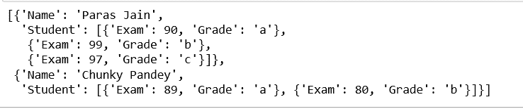
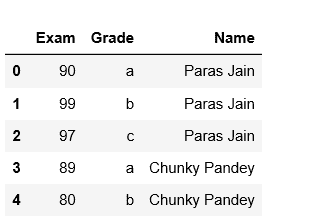
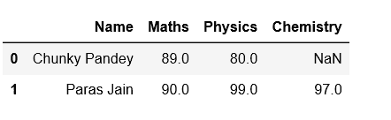

# Python |将嵌套字典列表转换为熊猫数据帧

> 原文:[https://www . geesforgeks . org/python-convert-list-of-nested-dictionary-to-pandas-data frame/](https://www.geeksforgeeks.org/python-convert-list-of-nested-dictionary-into-pandas-dataframe/)

给定一个嵌套字典列表，编写一个 Python 程序，使用它创建一个 Pandas 数据框架。让我们了解使用嵌套字典列表创建熊猫数据帧的分步过程。

**步骤#1:** 创建嵌套字典列表。

```py
# importing pandas
import pandas as pd

# List of nested dictionary initialization
list = [
        {
        "Student": [{"Exam": 90, "Grade": "a"},
                    {"Exam": 99, "Grade": "b"},
                    {"Exam": 97, "Grade": "c"},
                   ],
        "Name": "Paras Jain"
        },
        {
        "Student": [{"Exam": 89, "Grade": "a"},
                    {"Exam": 80, "Grade": "b"}
                   ],
        "Name": "Chunky Pandey"
        }
       ]

#print(list)
```

**输出:**


**步骤 2:** 向行中添加字典值。

```py
# rows list initialization
rows = []

# appending rows
for data in list:
    data_row = data['Student']
    time = data['Name']

    for row in data_row:
        row['Name']= time
        rows.append(row)

# using data frame
df = pd.DataFrame(rows)

# print(df)
```

**输出:**


**步骤#3:** 旋转数据框并分配列名。

```py
# using pivot_table
df = df.pivot_table(index ='Name', columns =['Grade'],
                        values =['Exam']).reset_index()

# Defining columns
df.columns =['Name', 'Maths', 'Physics', 'Chemistry']

# print dataframe
print(df)
```

**输出:**


下面是完整的代码:

```py
# Python program to convert list of nested 
# dictionary into Pandas dataframe

# importing pandas
import pandas as pd

# List of list of dictionary initialization
list = [
        {
        "Student": [{"Exam": 90, "Grade": "a"},
                    {"Exam": 99, "Grade": "b"},
                    {"Exam": 97, "Grade": "c"},
                   ],
        "Name": "Paras Jain"
        },
        {
        "Student": [{"Exam": 89, "Grade": "a"},
                    {"Exam": 80, "Grade": "b"}
                  ],
        "Name": "Chunky Pandey"
        }
       ]

# rows list initialization
rows = []

# appending rows
for data in list:
    data_row = data['Student']
    time = data['Name']

    for row in data_row:
        row['Name']= time
        rows.append(row)

# using data frame
df = pd.DataFrame(rows)

# using pivot_table
df = df.pivot_table(index ='Name', columns =['Grade'],
                        values =['Exam']).reset_index()

# Defining columns
df.columns =['Name', 'Maths', 'Physics', 'Chemistry']

# print dataframe
print(df)
```

**输出:**

```py
            Name  Maths  Physics  Chemistry
0  Chunky Pandey     89       80        NaN
1     Paras Jain     90       99         97
```