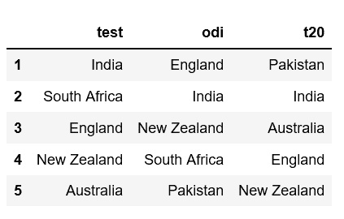
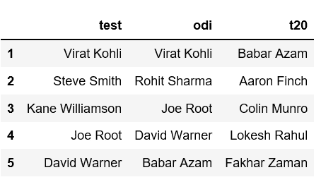

# Python |从一组等长列表中创建熊猫数据框

> 原文:[https://www . geesforgeks . org/python-create-a-pandas-data frame-from-a-dict-of-a-等长列表/](https://www.geeksforgeeks.org/python-create-a-pandas-dataframe-from-a-dict-of-equal-length-lists/)

给定一个等长列表的字典，任务是从中创建一个熊猫数据帧。

在熊猫中创建[数据帧](https://www.geeksforgeeks.org/python-pandas-dataframe/)有多种方法。一种方法是转换包含长度相等的值列表的字典。让我们通过例子来讨论如何从一组等长的列表中创建熊猫数据帧。

**示例#1:** 给定一个字典，该字典包含板球格式为*键*和前五名球队列表为*值*。

```py
# Import pandas package 
import pandas as pd

# Define a dictionary containing ICC rankings
rankings = {'test': ['India', 'South Africa', 'England',
                            'New Zealand', 'Australia'],
              'odi': ['England', 'India', 'New Zealand',
                            'South Africa', 'Pakistan'],
               't20': ['Pakistan', 'India', 'Australia', 
                              'England', 'New Zealand']}

# Convert the dictionary into DataFrame
rankings_pd = pd.DataFrame(rankings)

# Increment the index so that index 
# starts at 1 (starts at 0 by default) 
rankings_pd.index += 1

rankings_pd
```

**输出:**


**例 2:** 给出了三个列表`test_batsmen`、`odi_batsmen`、`t20_batsmen`。所以我们首先需要把这个数据转换成字典，然后把字典转换成 DataFrame。

```py
# Import pandas package 
import pandas as pd

# Lists of top 5 batsmen for each format
test_batsmen = ['Virat Kohli', 'Steve Smith', 'Kane Williamson',
                                     'Joe Root', 'David Warner']
odi_batsmen = ['Virat Kohli', 'Rohit Sharma', 'Joe Root',
                            'David Warner', 'Babar Azam']
t20_batsmen = ['Babar Azam', 'Aaron Finch', 'Colin Munro',
                           'Lokesh Rahul', 'Fakhar Zaman']

# Define a dictionary containing ICC rankings for batsmen
rankings_batsmen = {'test': test_batsmen,
                      'odi': odi_batsmen,
                      't20': t20_batsmen}

# Convert the dictionary into DataFrame
rankings_batsmen_pd = pd.DataFrame(rankings_batsmen)

# Increment the index so that index
# starts at 1 (starts at 0 by default) 
rankings_batsmen_pd.index += 1

rankings_batsmen_pd
```

**输出:**
