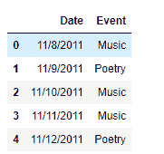
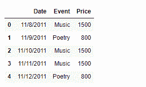
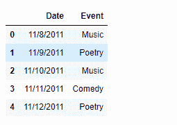
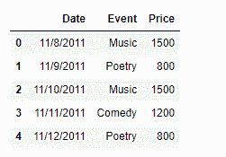

# Python |基于给定条件创建熊猫数据框列

> 原文:[https://www . geesforgeks . org/python-creating-a-pandas-data frame-column-based-on-a-condition/](https://www.geeksforgeeks.org/python-creating-a-pandas-dataframe-column-based-on-a-given-condition/)

在对数据进行操作时，可能会出现这样的情况:我们希望基于某种条件添加一个列。不存在任何库函数来直接实现这个任务，所以我们要看看我们可以通过什么方式来实现这个目标。

**问题:**给定一个包含文化活动数据的数据框架，添加一个名为“价格”的列，该列包含特定日期的票价，该票价基于该特定日期将进行的活动类型。

**解决方案#1 :** 我们可以使用 Python 的列表理解技巧来实现这个任务。列表理解大多比其他方法快。

```
# importing pandas as pd
import pandas as pd

# Creating the dataframe
df = pd.DataFrame({'Date' : ['11/8/2011', '11/9/2011', '11/10/2011',
                                        '11/11/2011', '11/12/2011'],
                'Event' : ['Music', 'Poetry', 'Music', 'Music', 'Poetry']})

# Print the dataframe
print(df)
```

**输出:**



现在，我们将向数据框中添加一个名为“价格”的新列。为此，我们将使用列表理解技术。如果“活动”是“音乐”800，请将价格设置为 1500。

```
# Add a new column named 'Price'
df['Price'] = [1500 if x =='Music' else 800 for x in df['Event']]

# Print the DataFrame
print(df)
```

**输出:**

正如我们在输出中看到的，我们已经成功地基于某种条件向数据框添加了一个新列。

**解决方案#2 :** 我们可以使用`DataFrame.apply()`功能来实现目标。可能会出现我们有两个以上值的情况，在这种情况下，我们可以使用字典将新值映射到键上。当我们有大量的类别要为新添加的列分配不同的值时，这确实提供了很大的灵活性。

```
# importing pandas as pd
import pandas as pd

# Creating the dataframe
df = pd.DataFrame({'Date' : ['11/8/2011', '11/9/2011', '11/10/2011',
                                        '11/11/2011', '11/12/2011'],
                'Event' : ['Music', 'Poetry', 'Music', 'Comedy', 'Poetry']})

# Print the dataframe
print(df)
```

**输出:**


现在，我们将向数据框中添加一个名为“价格”的新列。为此，我们将使用`DataFrame.apply()`函数来实现目标。如果“事件”是“音乐”，请将价格设置为 1500；如果“事件”是“喜剧”，请设置为 1200；如果“事件”是“诗歌”，请设置为 800。

```
# Define a function to map the values
def set_value(row_number, assigned_value):
    return assigned_value[row_number]

# Create the dictionary
event_dictionary ={'Music' : 1500, 'Poetry' : 800, 'Comedy' : 1200}

# Add a new column named 'Price'
df['Price'] = df['Event'].apply(set_value, args =(event_dictionary, ))

# Print the DataFrame
print(df)
```

**输出:**

正如我们在输出中看到的，我们已经成功地基于某种条件向数据框添加了一个新列。

**解决方案#3 :** 我们可以使用`DataFrame.map()`功能来实现目标。这是一种非常直接的方法，我们使用字典简单地根据键将值映射到新添加的列。

```
# importing pandas as pd
import pandas as pd

# Creating the dataframe
df = pd.DataFrame({'Date' : ['11/8/2011', '11/9/2011', '11/10/2011',
                                        '11/11/2011', '11/12/2011'],
                'Event' : ['Music', 'Poetry', 'Music', 'Comedy', 'Poetry']})

# Print the dataframe
print(df)
```

**输出:**


现在，我们将向数据框中添加一个名为“价格”的新列。为此，我们将使用`DataFrame.map()`函数来实现目标。如果“事件”是“音乐”，请将价格设置为 1500；如果“事件”是“喜剧”，请设置为 1200；如果“事件”是“诗歌”，请设置为 800。

```
# Create the dictionary
event_dictionary ={'Music' : 1500, 'Poetry' : 800, 'Comedy' : 1200}

# Add a new column named 'Price'
df['Price'] = df['Event'].map(event_dictionary)

# Print the DataFrame
print(df)
```

**输出:**
