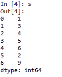
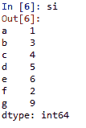
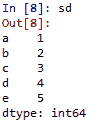
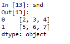
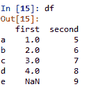
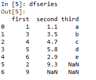
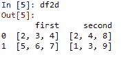

# 使用熊猫进行数据分析

> 原文:[https://www . geesforgeks . org/python-数据-分析-使用-pandas/](https://www.geeksforgeeks.org/python-data-analysis-using-pandas/)

***熊猫*** 是最受欢迎的用于数据分析的 python 库。它提供了高度优化的性能，后端源代码纯粹是用 ***C*** 或 ***Python*** 编写的。

```py
We can analyze data in pandas with:

1.  **系列**2.  **数据帧** 
```

### 系列:

***系列*** 是熊猫中定义的一维(一维)数组，可以用来存储任何数据类型。

**代码#1: *创建系列***

```py
# Program to create series

# Import Panda Library
import pandas as pd  

# Create series with Data, and Index
a = pd.Series(Data, index = Index)  
```

在这里， ***数据*** 可以是:

1.  一个 ***标量值*** 可以是整数值，字符串
2.  一个 ***Python 字典*** 可以是键值对
3.  一**T1】恩达雷 T3】**

**注**:索引默认为 0、1、2、……(n-1)其中 n 为数据长度。

**代码#2: *当数据包含标量值时***

```py
# Program to Create series with scalar values 

# Numeric data
Data =[1, 3, 4, 5, 6, 2, 9]  

# Creating series with default index values
s = pd.Series(Data)    

# predefined index values
Index =['a', 'b', 'c', 'd', 'e', 'f', 'g'] 

# Creating series with predefined index values
si = pd.Series(Data, Index) 
```

**输出**:

```py


带有默认索引的标量数据



带索引的标量数据

```

**代码#3: *当数据包含字典***

```py
# Program to Create Dictionary series
dictionary ={'a':1, 'b':2, 'c':3, 'd':4, 'e':5} 

# Creating series of Dictionary type
sd = pd.Series(dictionary) 
```

**输出**:

```py


字典类型数据

```

**代码#4: *当数据包含数据时*T3】**

```py
# Program to Create ndarray series

# Defining 2darray
Data =[[2, 3, 4], [5, 6, 7]]  

# Creating series of 2darray
snd = pd.Series(Data)    
```

**输出**:

```py


数据为 Ndarray

```

### 数据帧：

**数据帧**是熊猫定义的二维(2-D)数据结构，由行和列组成。

**代码#1: *创建数据框***

```py
# Program to Create DataFrame

# Import Library
import pandas as pd   

# Create DataFrame with Data
a = pd.DataFrame(Data)  
```

在这里，数据可以是:

1.  一个或多个 ***词典***
2.  一个或多个 ***系列***
3.  ***【2d-numpy ndaarray】*T3】**

**代码#2:当数据是字典时**

```py
# Program to Create Data Frame with two dictionaries

# Define Dictionary 1
dict1 ={'a':1, 'b':2, 'c':3, 'd':4}   

# Define Dictionary 2     
dict2 ={'a':5, 'b':6, 'c':7, 'd':8, 'e':9} 

# Define Data with dict1 and dict2
Data = {'first':dict1, 'second':dict2} 

# Create DataFrame 
df = pd.DataFrame(Data)  
```

**输出**:

```py


带有两个字典的数据框

```

**代码#3:当数据为序列时**

```py
# Program to create Dataframe of three series 
import pandas as pd

# Define series 1
s1 = pd.Series([1, 3, 4, 5, 6, 2, 9])   

# Define series 2       
s2 = pd.Series([1.1, 3.5, 4.7, 5.8, 2.9, 9.3]) 

# Define series 3
s3 = pd.Series(['a', 'b', 'c', 'd', 'e'])     

# Define Data
Data ={'first':s1, 'second':s2, 'third':s3} 

# Create DataFrame
dfseries = pd.DataFrame(Data)              
```

**输出**:

```py


包含三个系列的数据框

```

**代码#4:当数据为 2D-numpy ndarray**
**注意**:创建 2D 数组的数据框时必须维护一个约束条件–2D 数组的维度必须相同。

```py
# Program to create DataFrame from 2D array

# Import Library
import pandas as pd 

# Define 2d array 1
d1 =[[2, 3, 4], [5, 6, 7]] 

# Define 2d array 2
d2 =[[2, 4, 8], [1, 3, 9]] 

# Define Data
Data ={'first': d1, 'second': d2}  

# Create DataFrame
df2d = pd.DataFrame(Data)    
```

**输出**:

```py


二维数组的数据帧

```