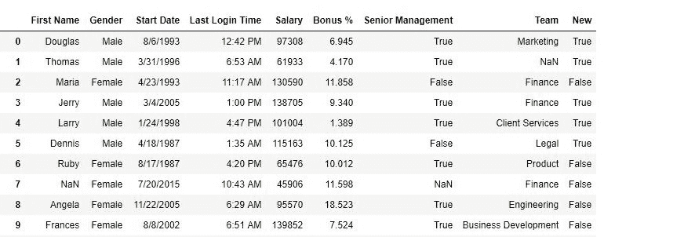
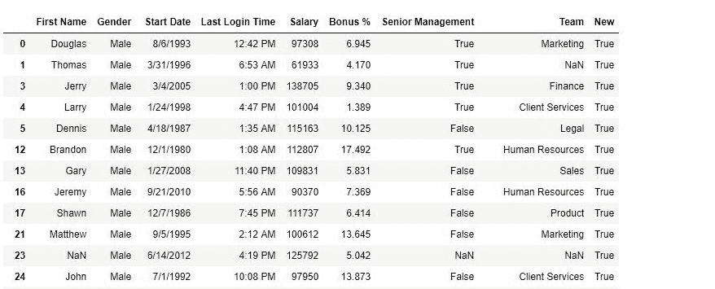

# Python |熊猫的数据比较和选择

> 原文:[https://www . geesforgeks . org/python-数据-熊猫中的比较和选择/](https://www.geeksforgeeks.org/python-data-comparison-and-selection-in-pandas/)

Python 是进行数据分析的优秀语言，主要是因为以数据为中心的 Python 包的奇妙生态系统。 ***【熊猫】*** 就是其中一个包，让导入和分析数据变得容易多了。

数据分析中最重要的事情是比较值并相应地选择数据。“==”运算符也适用于熊猫数据帧中的多个值。下面两个例子将展示如何从熊猫数据框中比较和选择数据。

要下载使用的 CSV 文件，点击这里[。](https://media.geeksforgeeks.org/wp-content/uploads/employees.csv)

**示例#1:** 比较数据
在以下示例中，数据帧由 csv 文件制成。在“性别”栏中，只有 3 种类型的值(“男”、“女”或“男”)。性别列的每一行都与“男性”进行比较，然后返回一个布尔序列。

```py
# importing pandas package
import pandas as pd

# making data frame from csv file
data = pd.read_csv("employees.csv")

# storing boolean series in new
new = data["Gender"] == "Male"

# inserting new series in data frame
data["New"]= new

# display
data
```

**输出:**
如输出图像所示，对于性别=“男”，新列中的值为真，对于“女”和 NaN 值为假。



**示例#2:** 选择数据
在以下示例中，布尔序列被传递给数据，并且仅返回具有性别=“男性”的行。

```py
# importing pandas package
import pandas as pd

# making data frame from csv file
data = pd.read_csv("employees.csv")

# storing boolean series in new
new = data["Gender"] != "Female"

# inserting new series in data frame
data["New"]= new

# display
data[new]

# OR 
# data[data["Gender"]=="Male"]
# Both are the same
```

**输出:**
如输出图像所示，返回性别=“男”的数据帧。



**注意:**对于 NaN 值，布尔值为 False。