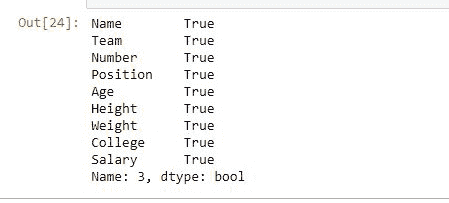
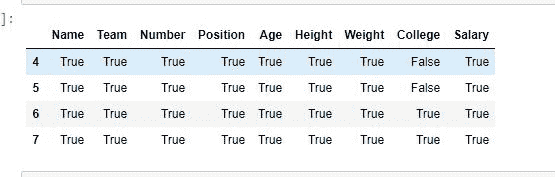

# Python |使用熊猫提取行。iloc[]

> 原文:[https://www . geesforgeks . org/python-提取-行-使用-pandas-iloc/](https://www.geeksforgeeks.org/python-extracting-rows-using-pandas-iloc/)

Python 是进行数据分析的优秀语言，主要是因为以数据为中心的 Python 包的奇妙生态系统。 ***【熊猫】*** 就是其中一个包，让导入和分析数据变得容易多了。

熊猫提供了一种从数据框中检索行的独特方法。 **`Dataframe.iloc[]`** 方法用于数据框的索引标签不是 0、1、2、3 的数字序列时。或者在用户不知道索引标签的情况下。可以使用在数据框中不可见的假想索引位置提取行。

> **语法:**熊猫。DataFrame.iloc[]
> 
> **参数:**
> **索引位置:**整数或整数列表中行的索引位置。
> 
> **返回类型:**数据帧或序列，取决于参数

要下载代码中使用的 CSV，点击这里的[。](https://media.geeksforgeeks.org/wp-content/uploads/nba.csv)

**例#1:** 提取单行并与比较。loc[]

在本例中，两者提取了相同的索引号行。iloc[]和. loc[]方法并进行比较。由于索引列默认为数字，因此索引标签也将是整数。

```
# importing pandas package
import pandas as pd

# making data frame from csv file 
data = pd.read_csv("nba.csv")

# retrieving rows by loc method 
row1 = data.loc[3]

# retrieving rows by iloc method
row2 = data.iloc[3]

# checking if values are equal
row1 == row2
```

**输出:**
如输出图像所示，两种方法返回的结果相同。


**示例#2:** 用索引提取多行

在本例中，首先通过传递一个列表来提取多行，然后通过传递整数来提取该范围内的行。之后，比较两个值。

```
# importing pandas package
import pandas as pd

# making data frame from csv file 
data = pd.read_csv("nba.csv")

# retrieving rows by loc method 
row1 = data.iloc[[4, 5, 6, 7]]

# retrieving rows by loc method 
row2 = data.iloc[4:8]

# comparing values
row1 == row2
```

**输出:**
如输出图像所示，两种方法返回的结果相同。除了学院列中的值之外，所有值都为真，因为这些值都是 NaN 值。

