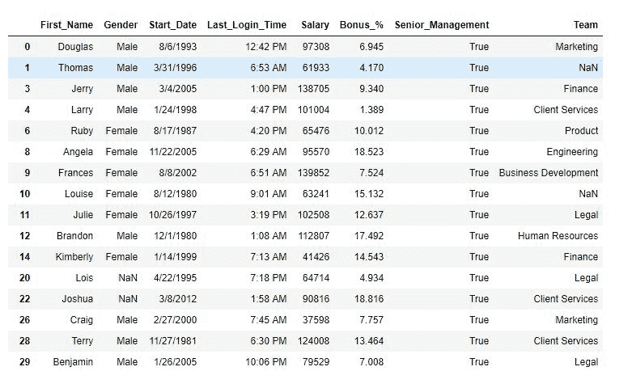
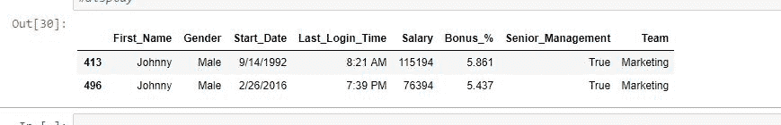

# Python |用熊猫过滤数据。查询()方法

> 原文:[https://www . geesforgeks . org/python-过滤-数据-带熊猫-查询-方法/](https://www.geeksforgeeks.org/python-filtering-data-with-pandas-query-method/)

Python 是进行数据分析的优秀语言，主要是因为以数据为中心的 Python 包的奇妙生态系统。 ***【熊猫】*** 就是那种让导入和分析数据变得容易得多的包之一。

分析数据需要大量的过滤操作。熊猫提供了许多过滤数据帧的方法，T2 就是其中之一。

> **语法:** DataFrame.query(expr，inplace=False，**kwargs)
> 
> **参数:**
> **表达式:**字符串形式的表达式过滤数据。
> **在位:**如果为真，则对原始数据框进行更改
> **kwargs:** 其他关键字参数。
> 
> **返回类型:**过滤数据帧

要下载使用的 CSV 文件，点击这里[。](https://media.geeksforgeeks.org/wp-content/uploads/employees.csv)

**注意:** `Dataframe.query()`方法只在列名没有空格的情况下有效。因此在应用该方法之前，列名中的空格被替换为“_”

**示例#1:** 单条件过滤

在本例中，数据是根据单个条件过滤的。在应用 query()方法之前，列名中的空格已被替换为“_”。

```py
# importing pandas package
import pandas as pd

# making data frame from csv file 
data = pd.read_csv("employees.csv")

# replacing blank spaces with '_' 
data.columns =[column.replace(" ", "_") for column in data.columns]

# filtering with query method
data.query('Senior_Management == True', inplace = True)

# display
data
```

**输出:**
如输出图像所示，数据现在只有高管为真的行。


**示例#2:** 多条件过滤

在这个例子中，数据帧已经在多个条件下被过滤。在应用 query()方法之前，列名中的空格已被替换为“_”。

```py
# importing pandas package
import pandas as pd

# making data frame from csv file 
data = pd.read_csv("employees.csv")

# replacing blank spaces with '_' 
data.columns =[column.replace(" ", "_") for column in data.columns]

# filtering with query method
data.query('Senior_Management == True 
            and Gender =="Male" and Team =="Marketing" 
            and First_Name =="Johnny"', inplace = True)

# display
data
```

**输出:**
如输出图像所示，根据应用的过滤器，只返回了两行。
