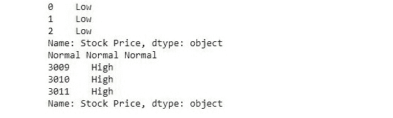

# Python | Pandas.apply()

> 原文:[https://www.geeksforgeeks.org/python-pandas-apply/](https://www.geeksforgeeks.org/python-pandas-apply/)

Pandas.apply 允许用户传递一个函数，并将其应用于 Pandas 系列的每个值。这对熊猫图书馆来说是一个巨大的进步，因为这个功能有助于根据所需的条件分离数据，从而有效地用于数据科学和机器学习。

**安装:**
使用终端上的以下命令将 Pandas 模块导入 python 文件:

```
pip install pandas

```

要读取 csv 文件并将其压缩成 pandas 系列，可使用以下命令:

```
import pandas as pd
s = pd.read_csv("stock.csv", squeeze=True)

```

**语法:**

```
s.apply(func, convert_dtype=True, args=())
```

**参数:**

> **功能:**。apply 接受一个函数，并将其应用于 pandas 系列的所有值。
> **convert_dtype:** 根据函数的操作转换 dtype。
> **args=():** 要传递给函数而不是序列的附加参数。
> **应用功能/操作后返回类型:**熊猫系列。

数据集点击[这里](https://drive.google.com/open?id=1jiJNeODlO76f6I0j5CNPzjCU1lOguWJ-)下载。

**示例#1:**

下面的示例传递一个函数，检查序列中每个元素的值，并相应地返回低、正常或高。

```
import pandas as pd

# reading csv
s = pd.read_csv("stock.csv", squeeze = True)

# defining function to check price
def fun(num):

    if num<200:
        return "Low"

    elif num>= 200 and num<400:
        return "Normal"

    else:
        return "High"

# passing function to apply and storing returned series in new
new = s.apply(fun)

# printing first 3 element
print(new.head(3))

# printing elements somewhere near the middle of series
print(new[1400], new[1500], new[1600])

# printing last 3 elements
print(new.tail(3))
```

**输出:**


**例 2:**

在下面的示例中，在中创建了一个临时匿名函数。使用 lambda 应用自身。它将序列中的每个值加 5，并返回一个新的序列。

```
import pandas as pd
s = pd.read_csv("stock.csv", squeeze = True)

# adding 5 to each value
new = s.apply(lambda num : num + 5)

# printing first 5 elements of old and new series
print(s.head(), '\n', new.head())

# printing last 5 elements of old and new series
print('\n\n', s.tail(), '\n', new.tail())
```

**输出:**

```
0    50.12
1    54.10
2    54.65
3    52.38
4    52.95
Name: Stock Price, dtype: float64 

0    55.12
1    59.10
2    59.65
3    57.38
4    57.95
Name: Stock Price, dtype: float64

3007    772.88
3008    771.07
3009    773.18
3010    771.61
3011    782.22
Name: Stock Price, dtype: float64

3007    777.88
3008    776.07
3009    778.18
3010    776.61
3011    787.22
Name: Stock Price, dtype: float64

```

正如观察到的，新值=旧值+ 5