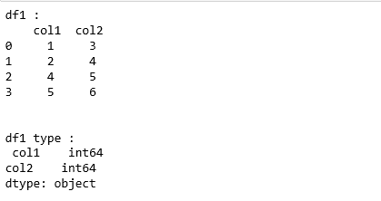
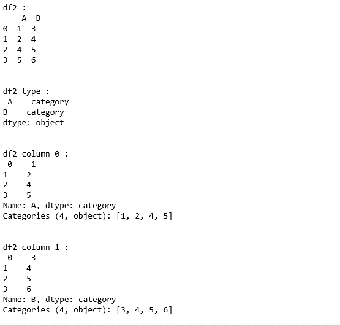
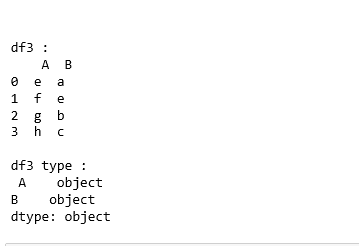

# Python |熊猫分类数据框创建

> 原文:[https://www . geesforgeks . org/python-pandas-classic-data frame-creation/](https://www.geeksforgeeks.org/python-pandas-categorical-dataframe-creation/)

**熊猫。DataFrame(dt type = " category "):**为了创建分类数据帧，data frame()方法将 dt type 属性设置为 category。
通过在数据框构造函数中指定 dtype =“category ”,数据框中的所有列都可以在构造期间或之后转换为分类。

**代码:**

```
# Python code explaining
# constructing categorical data frame

# importing libraries
import numpy as np
import pandas as pd

# Constructing dataframe 
data = {'col1': [1, 2, 4, 5], 'col2': [3, 4, 5, 6]}
df1 = pd.DataFrame(data = data)

print ("df1 : \n", df1)
print("\n\ndf1 type :\n", df1.dtypes)
```

**输出:**


```
# Converting dataframe to category
df2 = pd.DataFrame({'A': list('1245'), 'B': list('3456')}, dtype ="category")

print ("df2 : \n", df2)
print("\n\ndf2 type :\n", df2.dtypes)

print ("\n\ndf2 column 0 :\n", df2['A'])
print ("\n\ndf2 column 1 :\n", df2['B'])
```

**输出:**


```
# Conversion can be done using astype()
df3 = pd.DataFrame({'A': list('efgh'), 'B': list('aebc')})
print ("\n\ndf3 : \n", df3)
print("\ndf3 type :\n", df3.dtypes)

df4 = df3.astype('category')
print ("\n\ndf4 type:\n", df4.dtypes)
```

**输出:**
