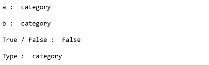
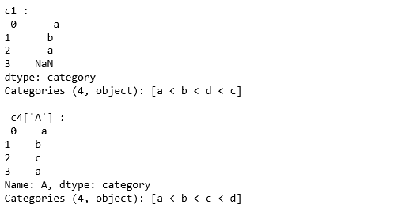

# 蟒蛇|熊猫。category type()

> 哎哎哎:1230〔https://www . geeksforgeeks . org/python 熊猫-categordtype/类别

**pandas . API . types . categoricaldtype(categories = None，ordered = None) :** 该类用于指定独立于值的分类数据的类型，具有类别和顺序。

> **`Parameters-`**
> **类别:**【类索引】类别的唯一分类。
> **有序:**【布尔】如果为假，则分类的被视为无序。
> 
> **`Return-`** 分类数据的类型规范

**代码:**

```py
# Python code explaining 
# numpy.pandas.CategoricalDtype()

# importing libraries
import numpy as np
import pandas as pd
from pandas.api.types import CategoricalDtype

a = CategoricalDtype(['a', 'b', 'c'], ordered=True)
print ("a : ", a)

b = CategoricalDtype(['a', 'b', 'c'])
print ("\nb : ", b)

print ("\nTrue / False : ", a == CategoricalDtype(['a', 'b', 'c'], 
                                                   ordered=False))

c = pd.api.types.CategoricalDtype(categories=["a","b","d","c"], ordered=True)
print ("\nType : ", c)
```



```py
c1 = pd.Series(['a', 'b', 'a', 'e'], dtype = c)
print ("c1 : \n", c1)

c2 = pd.DataFrame({'A': list('abca'), 'B': list('bccd')})

c3 = CategoricalDtype(categories=list('abcd'), ordered=True)

c4 = c2.astype(c3)

print ("\n c4['A'] : \n", c4['A'])
```

