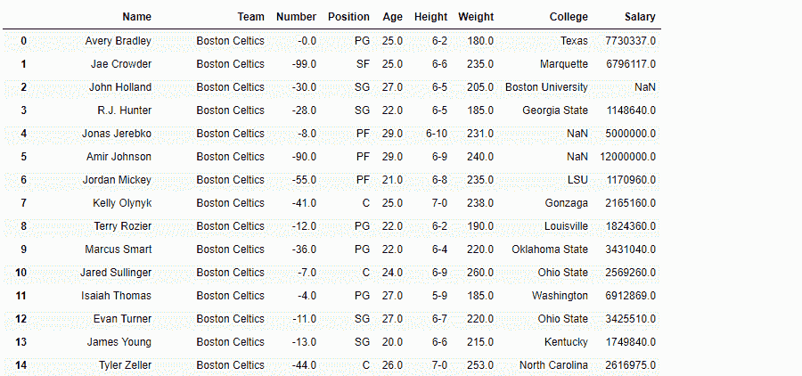
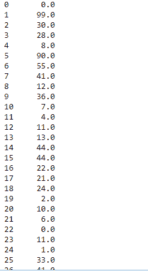
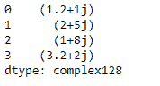
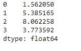

# python | pandas data frame . ABS()

> 哎哎哎:# t0]https://www . geeksforgeeks . org/python 熊猫 dataframe-abs/

Python 是进行数据分析的优秀语言，主要是因为以数据为中心的 python 包的奇妙生态系统。 ***【熊猫】*** 就是其中一个包，让导入和分析数据变得容易多了。

**`dataframe.abs()`** 是熊猫最简单的数据框功能之一。它返回一个取绝对值的对象，并且只适用于所有数值的对象。它也不适用于任何南值。`abs()`函数也可以和复数一起使用，求它们的绝对值。

对于复数，绝对值定义为:


```py
Syntax:  DataFrame.abs()
Returns: type of caller

```

有关代码中使用的 CSV 文件的链接，请单击此处的

**示例#1:** 在 nba.csv 文件中将球队“波士顿凯尔特人”替换为“欧米茄勇士”

```py
# importing pandas as pd
import pandas as pd

# Making data frame from the csv file
df = pd.read_csv("nba.csv")

# Printing the first 10 rows of the
# data frame for visualization
df[:10]
```


为了找到绝对值，我们还需要在数据框中有负值。因此，出于演示目的，让我们将一些值更改为负值。

```py
# This will set the Number column
# to be all negative.
df.Number = df.Number*(-1)
```

**输出:**


现在我们用 `abs()` 函数只求 Number 列的绝对值。

```py
# Applying abs() value on one column only
df.Number.abs()
```

**输出:**


**例 2:** 对复数数列应用`abs()`。

```py
# Importing pandas as pd
import pandas as pd

# Creating a series
ser = pd.Series([1.2 + 1j, 2 + 5j, 1 + 8j, 3.2 + 2j])

# let's print the values in ser
ser
```



```py
# Using abs() function to find the
# absolute value of the complex numbers
absolute_values = s.abs()

# Print the absolute values of all complex numbers
absolute_values
```

