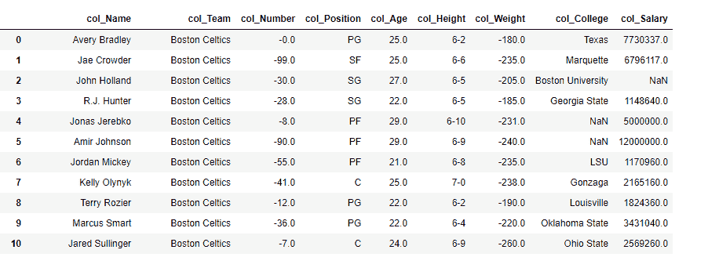
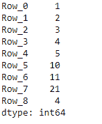

# Python | Pandas data frame . add _ prefix()

> 原文:[https://www . geesforgeks . org/python-pandas-data frame-add _ prefix/](https://www.geeksforgeeks.org/python-pandas-dataframe-add_prefix/)

Python 是进行数据分析的优秀语言，主要是因为以数据为中心的 python 包的奇妙生态系统。 ***【熊猫】*** 就是其中一个包，让导入和分析数据变得容易多了。

**`Dataframe.add_prefix()`** 功能既可用于系列，也可用于数据帧。

*   对于系列，行标签带有前缀。
*   对于数据框，列标签带有前缀。

```
Syntax:  DataFrame.add_prefix(prefix)

Parameters:
prefix : string

Returns: with_prefix: type of caller

```

有关代码中使用的 CSV 文件的链接，请单击此处的

**示例#1:** 在数据框的每一列中添加前缀`col_`

```
# importing pandas as pd
import pandas as pd

# Making data frame from the csv file
df = pd.read_csv("nba.csv")

# Printing the first 10 rows of the
# dataframe for visualization
df[:10]
```


```
# Using add_prefix() function 
# to add 'col_' in each column label
df = df.add_prefix('col_')

# Print the dataframe
df 
```

**输出:**


**例 2:** 用`add_prefix()`搭配熊猫系列

`add_prefix()`在序列的情况下改变行索引标签。

```
# importing pandas as pd
import pandas as pd

# Creating a Series 
df = pd.Series([1, 2, 3, 4, 5, 10, 11, 21, 4])

# This will prefix 'Row_' in 
# each row of the series
df = df.add_prefix('Row_')

# Print the Series
df
```

**输出:**

