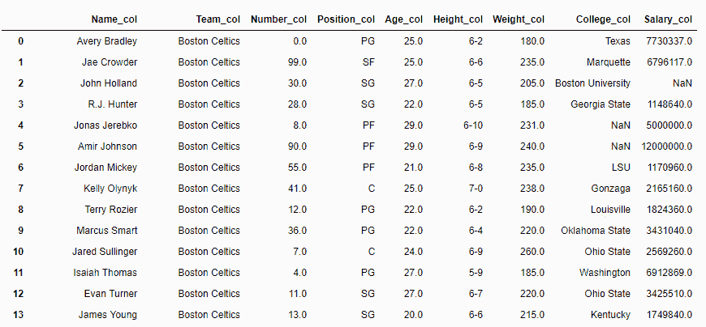
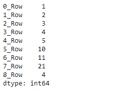

# Python | Pandas data frame . add _ 后缀()

> 原文:[https://www . geesforgeks . org/python-pandas-data frame-add _ 后缀/](https://www.geeksforgeeks.org/python-pandas-dataframe-add_suffix/)

Python 是进行数据分析的优秀语言，主要是因为以数据为中心的 python 包的奇妙生态系统。 ***【熊猫】*** 就是其中的一个包，让导入和分析数据变得更加容易。
**`Dataframe.add_suffix()`** 功能既可用于系列，也可用于数据帧。`add_suffix()`功能**将后缀字符串与面板项目名称**连接起来。

*   对于系列，行标签以后缀形式出现。
*   对于数据框，列标签以后缀形式出现。

```py
Syntax: DataFrame.add_suffix(suffix)

Parameters:
suffix : string

Returns:  with_suffix: type of caller

```

有关代码中使用的 CSV 文件的链接，请单击此处的

**示例#1:** 数据框中各列的后缀`_col` 。

```py
# importing pandas as pd
import pandas as pd

# Making data frame from the csv file
df = pd.read_csv("nba.csv")

# Printing the first 10 rows of
# the data frame for visualization
df[:10]
```


```py
# Using add_suffix() function to 
# add '_col' in each column label
df = df.add_suffix('_col')

# Print the dataframe
df 
```

**输出:**


**例 2:** 用`add_suffix()`搭配熊猫系列

`add_suffix()`在序列的情况下改变行索引标签。

```py
# importing pandas as pd
import pandas as pd

# Creating a Series 
df = pd.Series([1, 2, 3, 4, 5, 10, 11, 21, 4])

# This will suffix '_Row' in
# each row of the series
df = df.add_suffix('_Row')

# Print the Series
df
```

**输出:**
