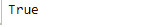
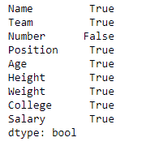
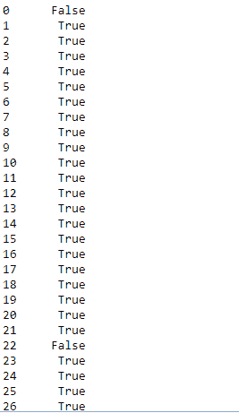
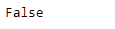

# Python | Pandas data frame . all()

> 原文:[https://www.geeksforgeeks.org/python-pandas-dataframe-all/](https://www.geeksforgeeks.org/python-pandas-dataframe-all/)

Python 是进行数据分析的优秀语言，主要是因为以数据为中心的 python 包的奇妙生态系统。 ***【熊猫】*** 就是其中一个包，让导入和分析数据变得容易多了。

**`DataFrame.all()`** 方法检查**是否所有元素都为真，可能在一个轴上。**如果一个系列内或沿数据框轴的所有元素都非零、不为空或不为假，则返回真。

> **语法:** DataFrame.all(axis=0，bool _ only =无，skipna =真，level =无，**kwargs)
> 
> **参数:**
> **轴:** {0 或‘索引’，1 或‘列’，无}，默认 0
> 表示应该减少哪个轴或哪些轴。
> 0/“index”:缩小索引，返回一个以原始列标签为索引的 Series。
> 1 /“列”:减少列，返回一个以原始索引为索引的 Series。
> 无:减少所有轴，返回一个标量。
> 
> **skipna :** 排除 NA/null 值。如果整行/整列为“无”，结果将为“无”。
> **级别:**如果轴是多索引(分层)，沿特定级别计数，折叠成系列。
> **仅布尔:**仅包含布尔列。如果无，将尝试使用所有内容，然后仅使用布尔数据。不适用于系列。
> ****kwargs :** 附加关键字没有影响，但可能会被接受以与 NumPy 兼容。
> 
> **返回:**全部:序列或数据帧(如果指定了级别)

**注意:** *南*值将被视为非空值，因此将被评估为真。

有关代码中使用的 CSV 文件的链接，请单击此处的

**示例#1:** 数据框中各列的后缀`_col` 。

```py
# importing pandas as pd
import pandas as pd

# Making data frame from the csv file
df = pd.read_csv("nba.csv")

# Printing the first 10 rows of the
# data frame for visualization
df[:10]
```


```py
# checking for 'Name' column
df.Name.all()
```

**输出:**


**实施例#2:** 评估柱态行为

**`dataframe.all()`** 默认行为检查列值是否都返回真。

```py
# Checking for all the columns in the dataframe
df.all()
```

**输出:**


**示例#3:** 检查逐行元素

指定轴=“列”以检查行方向的值是否都返回真。如果任何特定行中的所有值都评估为 true，则整个行都将评估为 true。

```py
# importing pandas as pd
import pandas as pd

# Making data frame from the csv file
df = pd.read_csv("nba.csv")

# Checking across the row
df.all(axis ='columns')
```

**输出:**


`all()` 计算数据框中所有行的所有值，并为每行输出一个布尔值。

**示例#4:** 检查数据框中的所有值

对于数据框中的每个值是否为真，指定轴=无。

```py
# importing pandas as pd
import pandas as pd

# Making data frame from the csv file
df = pd.read_csv("nba.csv")

# Checking across the row
df.all(axis = None)
```

**输出:**
