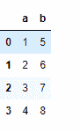
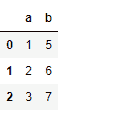
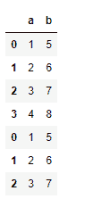
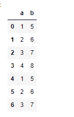
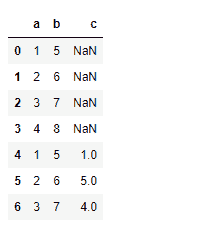

# python—熊猫 dataframe.append()

> 哎哎哎:# t0]https://www . geeksforgeeks . org/python 熊猫 dataframe-append/

Python 是进行数据分析的优秀语言，主要是因为以数据为中心的 python 包的奇妙生态系统。 ***【熊猫】*** 就是其中一个包，让导入和分析数据变得容易多了。

熊猫 `**dataframe.append()**`函数用于将其他数据帧的行追加到给定数据帧的末尾，返回一个新的数据帧对象。不在原始数据框中的列将作为新列添加，新单元格将填充`NaN`值。

> **语法:** DataFrame.append(other，ignore_index=False，verify_integrity=False，sort=None)
> 
> **参数:**
> **其他:**数据框或系列/类似字典的对象，或这些的列表
> **忽略 _ 索引:**如果为真，不要使用索引标签。
> **验证 _ 完整性:**如果为真，则在创建重复索引时引发值错误。
> **排序:**如果自身和其他的列没有对齐，则排序列。默认排序已被弃用，并将在熊猫的未来版本中更改为不排序。显式传递排序=True 以消除警告并排序。显式传递 sort=False 以消除警告并不排序。
> 
> **返回:**附加:数据帧

**示例#1:** 创建两个数据帧，并将第二个数据帧附加到第一个数据帧上。

```py
# Importing pandas as pd
import pandas as pd

# Creating the first Dataframe using dictionary
df1 = df = pd.DataFrame({"a":[1, 2, 3, 4],
                         "b":[5, 6, 7, 8]})

# Creating the Second Dataframe using dictionary
df2 = pd.DataFrame({"a":[1, 2, 3],
                    "b":[5, 6, 7]})

# Print df1
print(df1, "\n")

# Print df2
df2
```




现在在 df1 的末尾追加 df2。

```py
# to append df2 at the end of df1 dataframe
df1.append(df2)
```

**输出:**

注意第二个数据帧的索引值保持在追加的数据帧中。如果我们不希望它发生，那么我们可以设置 ignore_index=True。

```py
# A continuous index value will be maintained
# across the rows in the new appended data frame.
df1.append(df2, ignore_index = True)
```

**输出:**


**例 2:** 追加不同形状的数据帧。

对于数据框中不相等的列数，其中一个数据框中不存在的值将用`NaN`值填充。

```py
# Importing pandas as pd
import pandas as pd

# Creating the first Dataframe using dictionary
df1 = pd.DataFrame({"a":[1, 2, 3, 4],
                    "b":[5, 6, 7, 8]})

# Creating the Second Dataframe using dictionary
df2 = pd.DataFrame({"a":[1, 2, 3],
                    "b":[5, 6, 7], 
                    "c":[1, 5, 4]})

# for appending df2 at the end of df1
df1.append(df2, ignore_index = True)
```

**输出:**


请注意，新单元格中填充了`NaN`值。