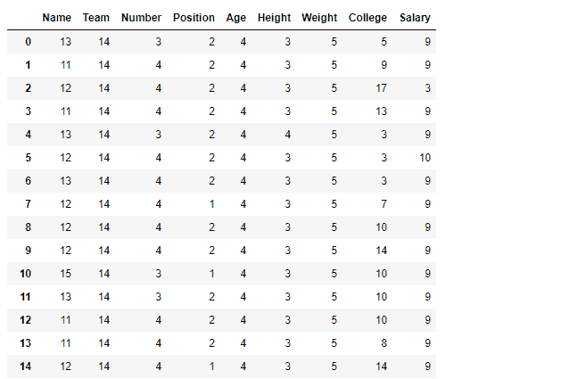
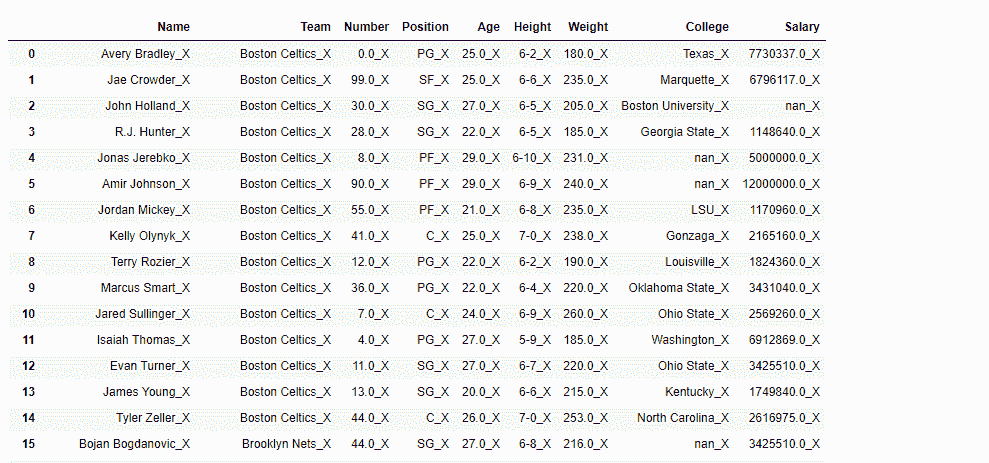

# python | pandas data frame . applymap()

> 哎哎哎:# t0]https://www . geeksforgeeks . org/python 熊猫数据文件-appliymap/

Python 是进行数据分析的优秀语言，主要是因为以数据为中心的 python 包的奇妙生态系统。 ***【熊猫】*** 就是其中一个包，让导入和分析数据变得容易多了。

**`Dataframe.applymap()`** 方法将接受并返回标量的函数应用于数据帧的每个元素。

```
Syntax: DataFrame.applymap(func)

Parameters:
func: Python function, returns a single value from a single value.

Returns: Transformed DataFrame.

```

有关代码中使用的 CSV 文件的链接，请单击此处的

**示例#1:** 对数据框应用`applymap()`功能，以查找所有单元格中的字符数。

```
# importing pandas as pd
import pandas as pd

# Making data frame from the csv file
df = pd.read_csv("nba.csv")

# Printing the first 10 rows of 
# the data frame for visualization
df[:10]
```


```
# Using lambda function we first convert all 
# the cell to a string value and then find
# its length using len() function
df.applymap(lambda x: len(str(x)))
```

**输出:**

注意所有 nan 值是如何转换成字符串 *nan* 的，它们的长度估计为 3。

**示例 2:** 使用`applymap()`功能在每个单元格中追加`_X` 。

为了在每个单元格中追加`_X` ，首先将每个单元格转换为字符串。

```
# importing pandas as pd
import pandas as pd

# Making data frame from the csv file
df = pd.read_csv("nba.csv")

# Using applymap() to append '_X'
# in each cell of the dataframe
df.applymap(lambda x: str(x) + '_X')
```

**输出:**
