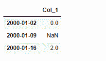
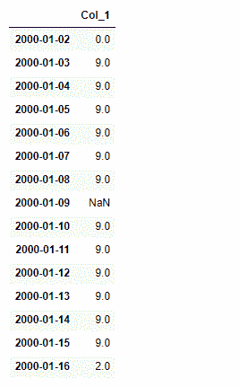
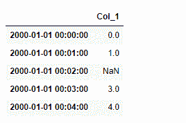
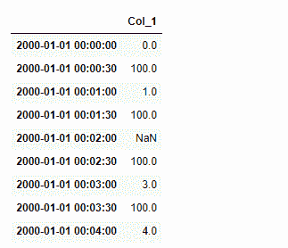

# python | pandas data frame . asfreq()

> 原文:[https://www . geesforgeks . org/python-pandas-data frame-as freq/](https://www.geeksforgeeks.org/python-pandas-dataframe-asfreq/)

Python 是进行数据分析的优秀语言，主要是因为以数据为中心的 python 包的奇妙生态系统。 ***【熊猫】*** 就是其中一个包，让导入和分析数据变得容易多了。

熊猫 `**dataframe.asfreq()**`功能用于将时间序列转换为指定频率。该功能可选地提供填充/回填缺失值的填充方法。它返回符合指定频率的新索引的原始数据。如果需要一个操作(如汇总)来表示新频率的数据，则重新采样更合适。

> **语法:** DataFrame.asfreq(freq，方法=无，how =无，normalize =假，fill _ value =无)
> 
> **参数:**
> **freq :** DateOffset 对象，或字符串
> **方法:**用于填充重新编制索引的系列中的孔的方法
> **如何:**仅对于周期索引，请参见 PeriodIndex.asfreq
> **规格化:**是否将输出索引重置为午夜
> **fill_value :** 用于缺失值的值，在上采样期间应用(注意，这不会填充已经存在的 NaNs
> 
> ***返回:*** 已转换:来电者类型

**示例#1:** 从周频率到日频率对时间序列数据进行非抽样

```
# importing pandas as pd
import pandas as pd

# Creating a date_time form index 
index_values = (pd.date_range('1/1/2000',
                   periods=3,freq='W'))

# Creating a series using 'index_values'
# Notice, one of the series value is nan value
series = (pd.Series([0.0,None,2.0],
              index=index_values))

# Creating dataframe using the series
df=pd.DataFrame({"Col_1":series})

# Print the Dataframe
df
```



现在将这个每周采样的数据解采样为每天采样的数据。默认情况下，新创建的媒体夹将具有 nan 值。因此，使用 ***fill_value*** 参数用提供的值填充所有新创建的箱。

```
# unsampling and providing a fill value = 9.0
df.asfreq(freq ='D', fill_value = 9.0)
```

**输出:**


**注意:**这不会填充采样前已经存在的 NaNs。

**示例#2:** 将一分钟时间标记的数据取消采样到 30s 箱中。首先创建一个带有 5 个一分钟时间戳的系列。

```
# importing pandas as pd
import pandas as pd

# Creating a date_time form index 
index_values = (pd.date_range('1/1/2000',
                     periods=5,freq='T'))

# Creating a series using 'index_values'
# Notice, one of the series value is nan value
series = (pd.Series([0.0,1.0,None,3.0,4.0],
                      index=index_values))

# Creating dataframe using the series
df=pd.DataFrame({"Col_1":series})

# Print the Dataframe
df
```



现在取消采样到 30 秒的容器中，并提供 100.0 的 fill_value

```
# unsampling and providing a fill value of 100.0
df.asfreq(freq ='30S', fill_value = 100.0)
```

**输出:**



**注意:**不填充未取样前存在的 Nan 值