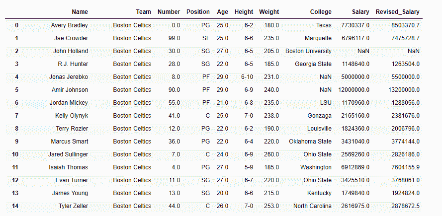
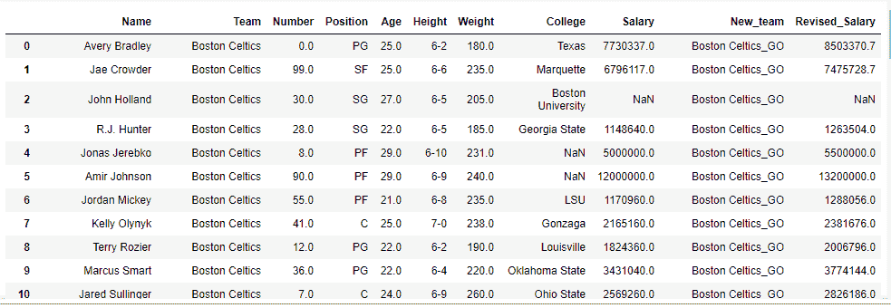

# Python | Pandas data frame . assign()

> 原文:[https://www . geesforgeks . org/python-pandas-data frame-assign/](https://www.geeksforgeeks.org/python-pandas-dataframe-assign/)

Python 是进行数据分析的优秀语言，主要是因为以数据为中心的 python 包的奇妙生态系统。 ***【熊猫】*** 就是其中一个包，让导入和分析数据变得容易多了。

**`Dataframe.assign()`** 方法为数据框分配新列，返回一个新对象(副本)，新列被添加到原始列中。重新分配的现有列将被覆盖。

新分配的列的长度必须与数据框中的行数相匹配。

> **语法:** DataFrame.assign(**kwargs)
> 
> **参数:**
> **kwargs :** 关键字是列名。如果这些值是可调用的，它们将在数据帧上计算并分配给新列。可调用的不能改变输入数据帧(尽管熊猫不会检查它)。如果值是不可调用的(例如，序列、标量或数组)，则简单地赋值。
> 
> **返回:**一个新的数据帧，除了所有现有的列之外，还有新的列。

有关代码中使用的 CSV 文件的链接，请单击此处的

**示例#1:** 分配一个名为`Revised_Salary` 的新列，增加原薪资的 10%。

```py
# importing pandas as pd
import pandas as pd

# Making data frame from the csv file
df = pd.read_csv("nba.csv")

# Printing the first 10 rows of
# the data frame for visualization
df[:10]
```


```py
# increase the salary by 10 % 
df.assign(Revised_Salary = lambda x: df['Salary']
                               + df['Salary']/10)
```

**输出:**


**示例 2:** 一次分配多个列

```py
# importing pandas as pd
import pandas as pd

# Making data frame from the csv file
df = pd.read_csv("nba.csv")

# First column ='New_Team', this column
# will append '_GO' at the end of each team name.
# Second column ='Revised_Salary' will increase 
# the salary of all employees by 10 % 
df.assign(New_team = lambda x: df['Team']+'_GO', 
          Revised_Salary = lambda x: df['Salary'] 
                             + df['Salary'] / 10)
```

**输出:**
