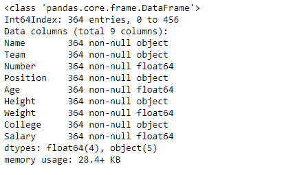
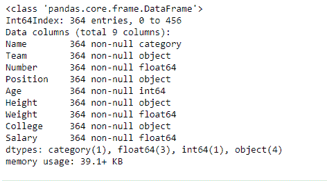
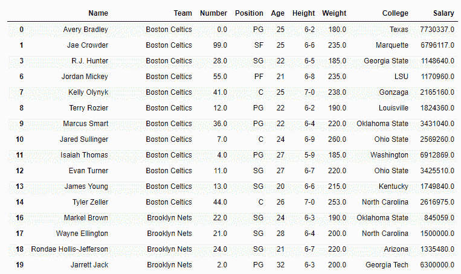

# python | pandas data frame . asttype()

> 原文:[https://www . geesforgeks . org/python-pandas-data frame-as type/](https://www.geeksforgeeks.org/python-pandas-dataframe-astype/)

Python 是进行数据分析的优秀语言，主要是因为以数据为中心的 python 包的奇妙生态系统。Pandas 就是其中之一，它让数据的导入和分析变得更加容易。

`**DataFrame.astype()**`方法用于将熊猫对象转换为指定的数据类型。`astype()`函数还提供将任何合适的现有列转换为分类类型的功能。

`**DataFrame.astype()**`当我们想要将一个特定的列数据类型区分为另一个数据类型时，函数非常方便。不仅如此，我们还可以使用 Python 字典输入一次更改多个列类型。字典中的键标签对应于列名，字典中的值标签对应于我们希望列属于的新数据类型。

> **语法:** DataFrame.astype(dtype，copy=True，errors='raise '，**kwargs)
> 
> **参数:**
> **数据类型:**使用`numpy.dtype` 或 Python 类型将整个熊猫对象转换为同一类型。或者，使用{col: dtype，…}，其中 col 是列标签，dtype 是`numpy.dtype`或 Python 类型，将一个或多个数据框的列转换为特定于列的类型。
> **副本:**当副本=真时返回副本(非常小心地设置副本=假，因为对值的更改可能会传播到其他熊猫对象)。
> 
> **错误:**控制对提供的数据类型的无效数据引发异常。
> 提升:允许提升异常
> 忽略:抑制异常。出错时返回原始对象
> 
> **kwargs :** 传递给构造函数的关键字参数
> 
> **返回:**预测:呼叫者类型

有关代码中使用的 CSV 文件的链接，请单击此处的

**示例#1:** 转换权重列数据类型。

```
# importing pandas as pd
import pandas as pd

# Making data frame from the csv file
df = pd.read_csv("nba.csv")

# Printing the first 10 rows of 
# the data frame for visualization

df[:10]
```


因为数据有一些“nan”值，所以为了避免任何错误，我们将删除所有包含任何`nan` 值的行。

```
# drop all those rows which 
# have any 'nan' value in it.
df.dropna(inplace = True)
```


```
# let's find out the data type of Weight column
before = type(df.Weight[0])

# Now we will convert it into 'int64' type.
df.Weight = df.Weight.astype('int64')

# let's find out the data type after casting
after = type(df.Weight[0])

# print the value of before
before

# print the value of after
after
```

**输出:**


```
# print the data frame and see
# what it looks like after the change
df
```


**示例#2:** 一次更改多列的数据类型

将`Name` 列改为分类类型，`Age` 列改为 int64 类型。

```
# importing pandas as pd
import pandas as pd

# Making data frame from the csv file
df = pd.read_csv("nba.csv")

# Drop the rows with 'nan' values
df = df.dropna()

# print the existing data type of each column
df.info()
```

**输出:**


现在让我们一次更改两个列的数据类型。

```
# Passed a dictionary to astype() function 
df = df.astype({"Name":'category', "Age":'int64'})

# Now print the data type 
# of all columns after change
df.info()
```

**输出:**


```
# print the data frame
# too after the change
df
```

**输出:**
