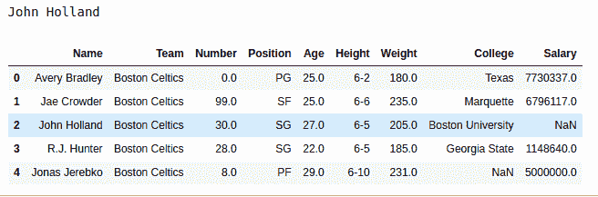

# Python | Pandas data frame . at[]

> 原文:[https://www.geeksforgeeks.org/python-pandas-dataframe-at/](https://www.geeksforgeeks.org/python-pandas-dataframe-at/)

Python 是进行数据分析的优秀语言，主要是因为以数据为中心的 Python 包的奇妙生态系统。 ***【熊猫】*** 就是其中一个包，让导入和分析数据变得容易多了。

位于[] 的熊猫**用于在经过的位置返回数据帧中的数据。传递的位置的格式为[位置，列名]。此方法的工作方式与 Pandas loc[ ]类似，但 at[ ]用于返回唯一的单个值，因此比它更快。**

> **语法:**数据框在【位置，标签】
> **参数:**
> **位置:**列中元素的位置
> **标签:**要使用的列名
> **返回类型:**单个元素在传递位置

要下载下例使用的数据集，点击这里的[。](https://media.geeksforgeeks.org/wp-content/uploads/nba.csv)

在下面的例子中，使用的数据框包含了一些 NBA 球员的数据。任何操作前的数据框图像附在下面。


**示例#1:**
在此示例中，通过将 csv 的 URL 传递给 Pandas 来创建数据帧。read_csv()方法。之后，使用返回“名称”列中的第二个值。at[ ]方法。

## 蟒蛇 3

```py
# importing pandas module 
import pandas as pd

# reading csv file from url 
data = pd.read_csv("https://media.geeksforgeeks.org/wp-content/uploads/nba.csv")

# creating position and label variables
position = 2
label = 'Name'

# calling .at[] method
output = data.at[position, label]

# display
print(output)
```

**输出:**
如输出图所示，可以对比输出，可以看到“名称”列第 2 位的 Value 与输出类似。



**注:**

*   不像，。loc[ ]，此方法仅返回单个值。因此，dataframe.at[3:6，label]将返回一个错误。
*   由于此方法仅适用于单个值，因此它比。loc[]方法。