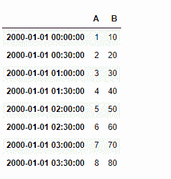

# Python | Pandas data frame . at _ time()

> 原文:[https://www . geesforgeks . org/python-pandas-data frame-at _ time/](https://www.geeksforgeeks.org/python-pandas-dataframe-at_time/)

Python 是进行数据分析的优秀语言，主要是因为以数据为中心的 python 包的奇妙生态系统。 ***【熊猫】*** 就是其中一个包，让导入和分析数据变得容易多了。
熊猫 **dataframe.at_time()** 功能用于选择一行中与当天输入时间对应的所有值。如果数据帧中不存在输入时间，则返回一个空的数据帧。

> **语法:** DataFrame.at_time(time，asof=False)
> **参数:**
> **时间:** datetime.time 或字符串
> **返回:** values_at_time:调用者类型

**注意:** at_time()函数在数据框的索引不是 DatetimeIndex
**时引发异常示例#1:** 创建一个 datetime 索引的数据框，并在任何特定时间检索值

## 蟒蛇 3

```
# importing pandas as pd
import pandas as pd

# Creating row index values for dataframe
# Taken time frequency to be of 12 hours interval

# Generating five index value using "period = 5" parameter
ind = pd.date_range('01/ 01/2000', periods = 5, freq ='12H')

# Creating a dataframe with 2 columns
# using "ind" as the index for our dataframe

df = pd.DataFrame({"A":[1, 2, 3, 4, 5],
                   "B":[10, 20, 30, 40, 50]},
                                 index = ind)

# Printing the dataframe
# for visualization
df
```


现在找出时间“12:00”
的数值

## 蟒蛇 3

```
df.at_time('12:00')
```

**输出:**


**示例#2:** 将 date_time 索引的频率设置为 30 分钟，并查询有效和无效时间(数据框中不存在)。

## 蟒蛇 3

```
# importing pandas as pd
import pandas as pd

# Creating row index values for our data frame
# We have taken time frequency to be of 30 minutes interval
# We are generating eight index value using "period = 8" parameter

ind = pd.date_range('01/01/2000', periods = 8, freq ='30T')

# Creating a dataframe with 2 columns
# using "ind" as the index for our dataframe
df = pd.DataFrame({"A":[1, 2, 3, 4, 5, 6, 7, 8],
                   "B":[10, 20, 30, 40, 50, 60, 70, 80]},
                                             index = ind)

# Printing the dataframe
df
```



现在我们来查询时间“02:00”

## 蟒蛇 3

```
# Find the row values at time "02:00"
df.at_time('02:00')
```

**输出:**

