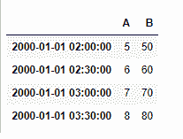
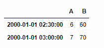

# Python | Pandas data frame . between _ time()

> 原文:[https://www . geesforgeks . org/python-pandas-data frame-between _ time/](https://www.geeksforgeeks.org/python-pandas-dataframe-between_time/)

Python 是进行数据分析的优秀语言，主要是因为以数据为中心的 python 包的奇妙生态系统。 ***【熊猫】*** 就是其中一个包，让导入和分析数据变得容易多了。

熊猫 `**dataframe.between_time()**`用于选择一天中特定时间(如上午 9:00-9:30)之间的数值。与`dataframe.at_time()`函数不同，该函数提取一定时间范围内的值。该函数仅用于时间序列数据。数据框的索引必须是日期时间索引，以便能够使用此功能。

> **语法:**data frame . between _ time(start _ time，end_time，include _ start =真，include _ end =真)
> 
> **参数:**
> **start _ time:**datetime . time 或 string
> **end _ time:**datetime . time 或 string
> **include _ start:**布尔值，默认为 True
> **include_end :** 布尔值，默认为 True
> 
> **返回:**值 _ 介于 _ 时间:调用者类型

**注意:** `between_time()`函数在数据帧的索引不是 DatetimeIndex 时引发异常

**示例#1:** 使用`between_time()`函数查找给定时间间隔之间的值。

```
# importing pandas as pd
import pandas as pd

# Creating row index values for dataframe
# Taken time frequency to be of 30 minutes interval
# Generating eight index value using "period = 8" parameter
ind = pd.date_range('01/01/2000', periods = 8, freq ='30T')

# Creating a dataframe with 2 columns
# using "ind" as the index for dataframe

df = pd.DataFrame({"A":[1, 2, 3, 4, 5, 6, 7, 8],
                   "B":[10, 20, 30, 40, 50, 60, 70, 80]},
                                             index = ind)

# Printing the dataframe
df
```


现在让我们查询“02:00”到“03:30”之间的时间

```
# Find the row values between time "02:00" to "03:30"
df.between_time('02:00', '03:30')
```

**输出:**


**示例 2:** 使用`between_time()`函数查找给定时间间隔之间的值，同时排除开始和结束时间。

```
# importing pandas as pd
import pandas as pd

# Creating row index values for our data frame
# Taken time frequency to be of 30 minutes interval
# Generating eight index value using "period = 8" parameter
ind = pd.date_range('01/01/2000', periods = 8, freq ='30T')

# Creating a dataframe with 2 columns
# using "ind" as the index for our dataframe

df = pd.DataFrame({"A":[1, 2, 3, 4, 5, 6, 7, 8],
                   "B":[10, 20, 30, 40, 50, 60, 70, 80]},
                                             index = ind)

# query for time between "02:00" to "03:30" with
# both the start and end time values being excluded
df.between_time('02:00', '03:30', include_start = False,
                                    include_end = False)
```

**输出:**


请注意，对应于开始时间和结束时间的值不包括在`between_time()`函数返回的数据帧中。