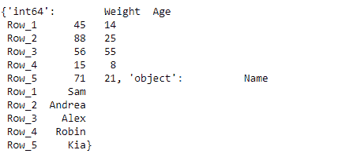
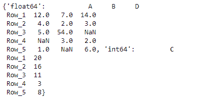

# Python |熊猫数据框块

> 原文:[https://www . geesforgeks . org/python-pandas-data frame-blocks/](https://www.geeksforgeeks.org/python-pandas-dataframe-blocks/)

Pandas DataFrame 是一个二维可变大小、潜在异构的表格数据结构，带有标记轴(行和列)。算术运算在行标签和列标签上对齐。它可以被认为是系列对象的类似字典的容器。这是熊猫的主要数据结构。

熊猫 `**DataFrame.blocks**`属性是`as_blocks()`功能的同义词。它基本上将框架转换成一个数据类型字典- >构造函数类型，每个类型都有一个同构的数据类型。

> **语法:**数据帧块
> 
> **参数:**无
> 
> **返回:**字典

**示例#1:** 使用`DataFrame.blocks`属性返回包含不同数据类型块中数据的字典。

```
# importing pandas as pd
import pandas as pd

# Creating the DataFrame
df = pd.DataFrame({'Weight':[45, 88, 56, 15, 71],
                   'Name':['Sam', 'Andrea', 'Alex', 'Robin', 'Kia'],
                   'Age':[14, 25, 55, 8, 21]})

# Create the index
index_ = ['Row_1', 'Row_2', 'Row_3', 'Row_4', 'Row_5']

# Set the index
df.index = index_

# Print the DataFrame
print(df)
```

**输出:**


现在我们将使用`DataFrame.blocks`属性返回给定数据帧的块表示。

```
# return a dictionary
result = df.blocks

# Print the result
print(result)
```

**输出:**



正如我们在输出中看到的那样，`DataFrame.blocks`属性已经成功地返回了包含数据帧数据的字典。同构列是同一个块中的位置。

**示例 2:** 使用`DataFrame.blocks`属性返回包含不同数据类型块中数据的字典。

```
# importing pandas as pd
import pandas as pd

# Creating the DataFrame
df = pd.DataFrame({"A":[12, 4, 5, None, 1], 
                   "B":[7, 2, 54, 3, None], 
                   "C":[20, 16, 11, 3, 8], 
                   "D":[14, 3, None, 2, 6]}) 

# Create the index
index_ = ['Row_1', 'Row_2', 'Row_3', 'Row_4', 'Row_5']

# Set the index
df.index = index_

# Print the DataFrame
print(df)
```

**输出:**


现在我们将使用`DataFrame.blocks`属性返回给定数据帧的块表示。

```
# return a dictionary
result = df.blocks

# Print the result
print(result)
```

**输出:**



正如我们在输出中看到的那样，`DataFrame.blocks`属性已经成功地返回了包含数据帧数据的字典。同构列是同一个块中的位置。